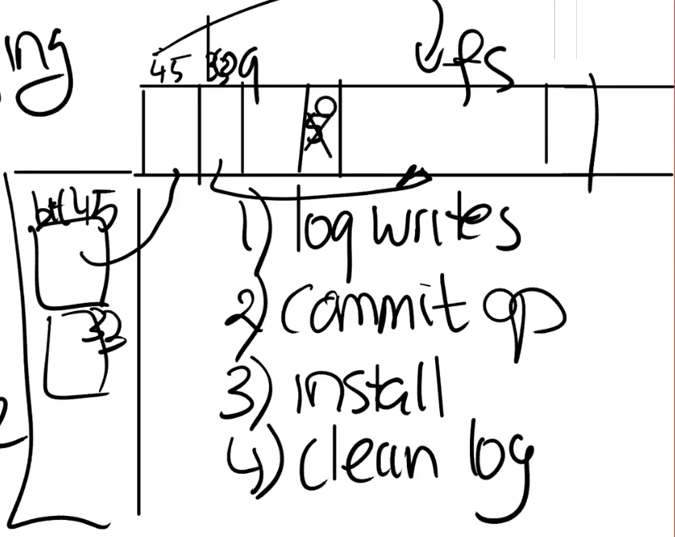
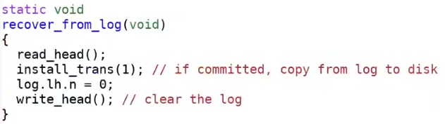

# File Systems

File System（文件系统）是除了Shell外最常见的user interface。

File System的特点：
* 文件具有用户友好的名字/路径。
* 可以在用户/进程之间共享文件。
* 文件系统是持久化的。

文件和目录都需要以某种形式在磁盘中存储（这样才能实现持久性保证）。

所以在磁盘上有一些数据结构表示了文件系统的结构或文件系统的内容。

同时文件系统需要具备良好的性能，而文件系统所在的存储设备（HDD、SSD）通常很慢，操作这种设备通常花费毫秒级的时间，所以文件系统通常会有block cache（块缓存，buffer cache），并且通常将数据结构设计为可并发操作。

`inode`是文件系统维护的一个结构，它是一个代表文件的对象，并且不依赖于文件名（这样才能实现`link()`和`unlink()`系统调用），实际上`inode`是通过自身的编号进行区分的，同时它维护一个link count，来跟踪这个`inode`有多少个文件名，可能还有一个openfd count，表示打开当前文件的文件描述符数量，一个文件（`inode`）只会在link count和openfd count都为`0`时被删除。

同磁盘文件的文件描述符（fd），维护了当前文件的offset（因为`write()`和`read()`系统调用并没有offset参数）。

*NOTE:大多数操作系统同时提供`pread()`和`pwrite()`系统调用，它们具有offset参数且只能用于磁盘文件的文件描述符。*

*NOTE:同时还提供`writev()`和`readv()`来进行聚合写与分散读操作，相应的带offset版本是`pwritev()`和`preadv()`。*

## Storage Layers

文件系统通常由几个层次组成：
* Disk - 磁盘是文件系统的最底层，这些设备负责提供持久的存储。
* Block Cache - 文件系统通常在内存中缓存磁盘的内容，尽量减少操作磁盘的开销，避免频繁地读写磁盘。
* Loggin - 负责提供崩溃安全（crash safety）的特性。
* Inode Cache - XV6中主要用来同步，因为多个inode会被打包在一个disk block中（inode的大小通常远小于disk block），所以提供单个inode的同步操作需要使用Inode Cache。
* Inode - 负责提供`read()`和`write()`的实现。
* Names/Fds - 用户接口。

常见的Storage Devices（存储设备）：
* SSD（固态硬盘） - 访问时间通常在`0.1 ~ 1 ms`之间。
* HDD（机械硬盘） - 访问时间通常在`10 ms`数量级。

Sector是磁盘驱动可以读写的最小单元，过去通常是`512`字节。

Block通常是操作系统或文件系统视角的数据，它由文件系统定义，在XV6中它是`1024`字节。

通常来说一个block对应了一个或多个sector。

*NOTE:有时人们把磁盘上的sector称为block。*

CPU通过读取/写入block（在此处意为sector）的方式（以block number为参数）与磁盘设备交互。

虽然HDD和SSD的工作方式完全不同，但是磁盘驱动抹消了它们的差异。

磁盘驱动通常会使用一些标准的协议，例如PCI、PCIE与磁盘交互。

磁盘是一个巨大的block数组，从`0`开始到磁盘的末尾。

## Disk Layout

一个简单的文件系统如下：

一般来说`block 0`要么没有使用，要么作为boot sector来启动操作系统，它包含了启动操作系统的代码。

`block 1`通常被称为super block（超级块），它描述了文件系统（例如该文件系统包含多少个Blocks），即存储了文件系统的metadata。

log blocks从`block 2`开始到`block 32`结束，log blocks的block数量是由super block决定的，这些blocks保存了write ahead log。

`block 32`到`block 45`之间是inode blocks，这些blocks存储了inode。

`block 46`是bitmap block，该block记录了data blocks是否为空。

在那之后就是data blocks，这些blocks保存了文件和目录的数据。

通常来说bitmap block、inode blocks和log blocks被统称为metadata blocks，它们不存储真正的数据，但是它们存储能帮助文件系统完成工作的信息。

当读取`inode`时，通过`inode`编号获取相应的inode block，读入内存中找到对应的`inode`。

<code>Inode offset = Inode blocks start point + $\frac{inodeNumber * inodeSize}{blockSize}$</code>

Inode Layout:
* Type - inode的类型。
* Nlink - 表示该文件对象有多少个link。
* Size - 表示文件数据共有多少字节。
* Block Numbers - 该文件所有的data block的numbers，其中某些blocks可能是indirect block（它们不保存文件的内容而是记录了data blocks的number，这使inode能够形成层次结构，允许更大的文件），在XV6中，inode保存13个block number，只有最后一个block number是indirect block，该block保存了256个data block number的block。

理论上XV6支持的最大文件大小为：`(256 + 12) * 1024 bytes = 268 KB`（非常小的文件长度）。

*NOTE:indirect block能够保存其他indirect block的number，这样inode就能构造出一种树结构，例如使用inode构造b+tree。*

<code>direct block offset = $\frac{offset}{blockSize}$</code>

Directory本质上是一个文件，这种文件的格式能够被文件系统理解。

每一个directory都是一个map，保存了文件名到inode的映射。

这种结构利用进行pathname lookup，例如要查找`"/y/x"`。

先从root directory的data blocks进行scan找到`"y"`的inode。

*NOTE:root directory总是有一个预先分配的inode编号。*

然后读取`"y"`的inode，对`"y"`的data blocks进行scan找到`"x"`的inode，返回它的inode编号。

*NOTE:inode的type字段能够标识这个inode是文件还是目录。*

*NOTE:真正的文件系统会在目录使用更复杂的数据结构，例如在目录的data blocks中构建树，来加速找查。*

由于XV6没有inode bitmap block，所以需要`type`来表示该inode是否被占用。

占用inode会导致一次写入。

因为磁盘操作需要很长的时间，并且我们希望打开中断，所以我们需要使用sleep lock。

## Block Cache

使用`bget()`和`brelease()`获取block cache。

|`bget()`|`brelease()`|
|-|-|
|||

*NOTE:必须保证block cache中的所有block都是唯一的，否则会产生灾难性后果（出现竟态条件）。*

*NOTE:当refcnt为`0`时，`brelease()`将cache移动到链表的头部（表示它最近刚使用过，与其他refcnt为`0`的caches相比它最不可能被evict，LRU Cache），只有refcnt为`0`的cache能被evict。*

|`bread()`|`bwrite()`|
|-|-|
|`bread()`先检查block cache中是否存在block，如果不存在分配一个新的cache，将从磁盘读入的数据放到该cache上。|在执行`bwrite()`时必须持有sleep lock，防止竟态条件出现，同时必须在cache上修改数据。|

`bpin()`可以在block被释放之后（refcnt为`0`）保证其不被evict。

除非`bunpin()`被调用。

|`bpin()`|`bunpin()`|
|-|-|
|||

## Crash Recovery

当crash和电力故障产生时，可能会导致磁盘上的文件系统处于不一致或不正确的状态中，例如：一个data block属于两个文件。

许多文件系统的操作都包含多个步骤，如果我们在多个步骤的错误的位置上崩溃，系统重启时文件系统就会处于一种不一致的状态。

对于这类问题，logging（Write ahead logging，预写日志）是一个很好的解决方案。

在写入到父目录的data block之前崩溃，我们可能会失去一个inode。

我们可能调整操作的顺序来避免失去inode，但是会出现另外一个问题：inode可能存在double use。

在写入文件的inode之前崩溃，可能会失去data block。

同样，调整顺序可以避免失去data block，但会存在double use。

要彻底解决这些问题，必须把多个步骤的操作原子化。

logging能提供如下保证：
* 保证文件系统调用是原子的。
* 支持快速恢复（fast recovery）。
* 可以被高效实现。

每一次写入，先写log，而不是直接写block。

当所有写入都进入log时，在log的commit记录写入属于同一个文件系统的操作个数（通常用占用log blocks的数量表示，对一个block的修改需要占用一个log block）。

当磁盘保存log blocks之后，我们执行install操作，在文件系统中执行log中记录的操作。

最后清除log，将log中记录的写入次数设置为`0`。

当重启时，文件系统查看log的commit记录，如果是`0`那就什么都不做。

如果非`0`那么某些操作需要被写入文件系统，我们重新执行install，然后清除log。

在XV6中，所有对文件系统的操作都以`begin_op()`开始，以`end_op()`结束。

`begin_op()`将开启一个事务（transaction）。

`end_op()`将执行commit操作，将数据写入log中。

必须通过`log_write()`而不是`bwrite()`对block进行写入。

`log_write()`首先查看block的block number是否已被记录，如果没有再写入block number到log中。

然后使用`bpin()`将该block固定在cache中，防止由于该block被evict导致更新丢失。

`end_op()`先查看有没有process在等待log，如果有则唤醒该process（该process不一定可以运行，可能的条件仍不满足它运行），然后什么都不做（减少操作磁盘的次数，由后面的process来commit，group commit）。

*NOTE:group commit必须按序进行，防止出现系统调用被重排的现象。*

如果没有，则进行commit。

`commit()`首先将cache中的block写入到log中，然后执行commit步骤，把log header（标记了有几个block）写入到log blocks的首个block中。

*NOTE:并且commit还需要唤醒其他process，告诉它们log有空间了。*

|`commit()`|`write_log()`|`write_head()`|`install_trans()`|
|-|-|-|-|
|||||

然后执行install操作，最后清除log。

*NOTE:只有当前不处在recovery阶段才需要`bunpin()`，因为recovery时，并没有pin住blocks。*

在启动XV6的过程中，`initlog()`会被调用。

*NOTE：XV6的实现并不高效，每次写入都需要write ahead log。*

实现logging的挑战：
* 当Block cahce满时，不能evict在cache中的block。
* 所有操作必须能放在log中，不能超过log的大小，否则事务可能被分割或拒绝。
* 并发文件系统调用，多个进程可能同时打开事务，这样很容易耗尽log的空间，并且不能提交任何事务，因为它们未完成，必须在启动事务前检查是否有足够的log block。

*NOTE:事务被分割（例如大写入）也是block cache不能evict且没有空间时panic的原因，因为我们不能从该调用中返回否则会破坏原子性，部分事务提交了但还有一部分没有。*

## File System Performance

## Fast Crash Recovery