# Interrupts

Page Fault和System Call都是中断（Interrupts）的一种。

中断可以由软件（通过System Call或Page Fault）或硬件引起（某个I/O操作完成了）。

*NOTE:软件引发的中断通常叫异常（Exception）。*

处理器通过平台级中断控制器（PLIC,Platform-Level Interrupt Controller）来管理来自外部设备的中断。

PLIC将寻找能处理中断的CPU Core，如果找到将中断路由（Route）给该Core处理，如果没找到，那么PLIC将会保留中断，直到有一个Core能处理中断。

同时CPU Core将在处理中断的过程中关闭中断。

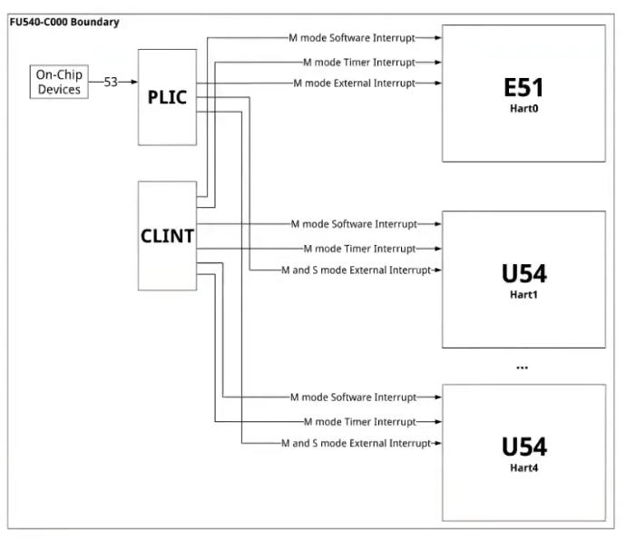

管理设备的软件称为驱动（Driver）。

Driver向上层提供I/O接口，下层通过interrupt handler处理中断。

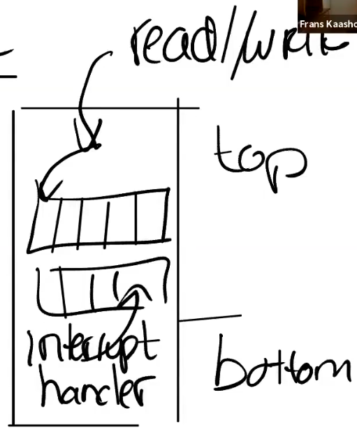

通常会维护一个队列，因为设备会被多个进程并发使用。

## Programming Devices

对设备的操作通常通过Memory Mapped I/O完成。

设备会出现在物理地址的固定区间内，kernel通过`load`和`store`指令对设备进行操作。

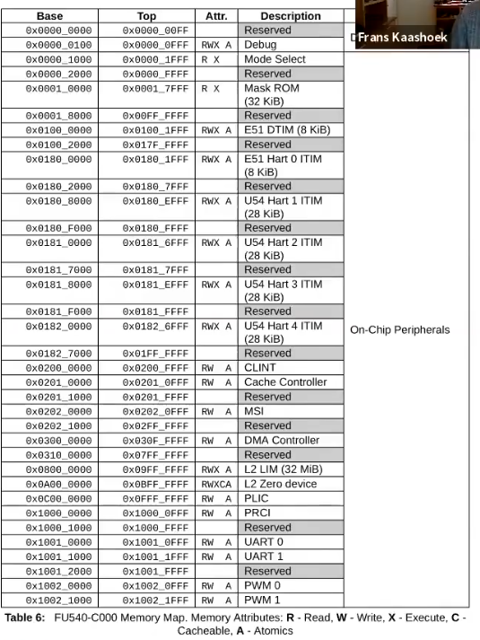

`load`和`store`某个设备的某个地址，代表了对设备的某个寄存器进行操作。

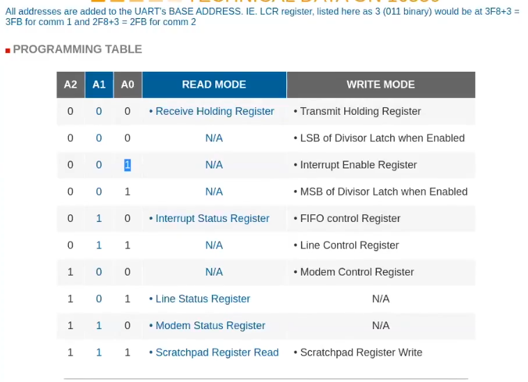

当写入字符到Console时，通过`store`将byte写入寄存器，当设备完成操作时，将产生一个中断告知处理器写入已经完成。

当User通过键盘输入时，将产生中断，告知处理器用户在键盘中输入了一些数据，然后interrupt handler会处理这些数据。

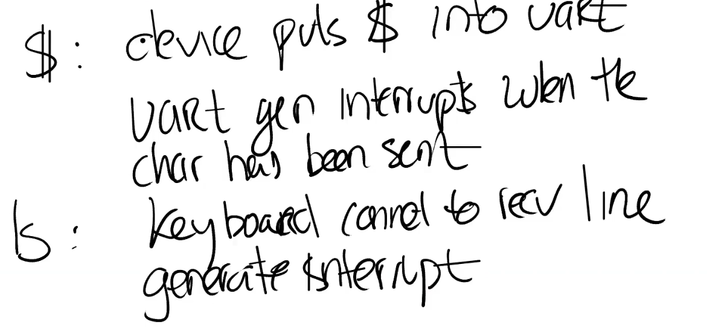

在`RISC-V`中，寄存器`SIE`（Supervisor Interrupt Enable）中`E` bit来标记是否启动外部硬件中断，`S` bit标记是否启动内部软件中断，`T` bit标记是否启动计时器中断。

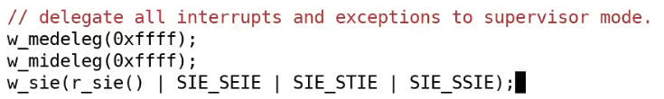

*NOTE:软件中断可能由一个`RISC-V` Core发送给另一个`RISC-V` Core的操作产生。*

同时，`SSTATUS`寄存器中有一个bit表示打开/关闭终端。

每一个CPU核都有独立的`SIE`和`SSTATUS`寄存器，除了通过`SIE`寄存器来单独控制特定的中断，还可以通过SSTATUS寄存器中的一个bit来控制所有的中断。

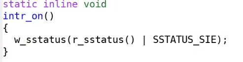

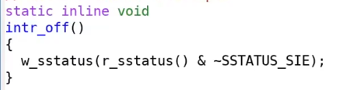

`SIP`寄存器存储了中断的类型，同时`SCAUSE`寄存器会被设置为中断对应的Exception Code，kernel必须先设置`STVEC`寄存器，保存trap handler地址。。

通过对特定地址的读写，给I/O设备编程。

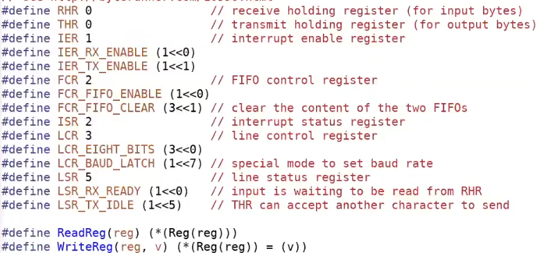

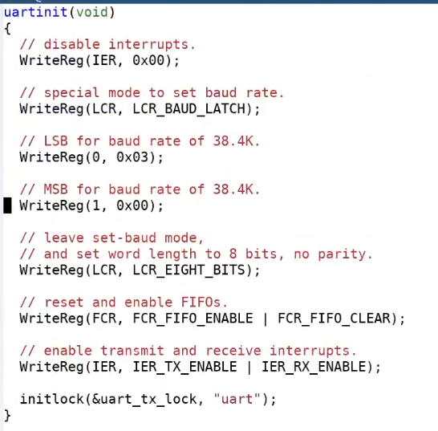

除了为I/O设备编程还需要给PLIC编程。

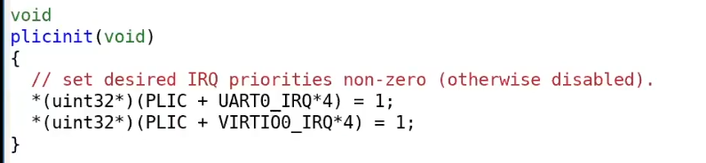

让PLIC能将中断路由到每一个Core。

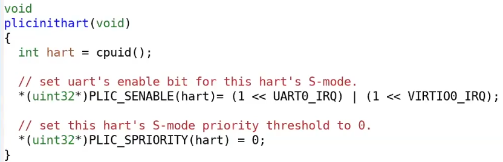

当执行`write()`时，先发送到kernel内部的buffer，如果内部buffer已满就等待I/O设备。

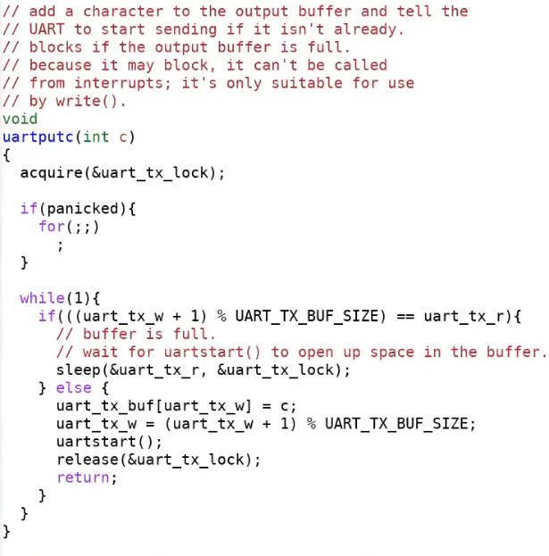

然后设置I/O设备的寄存器，发起I/O操作。

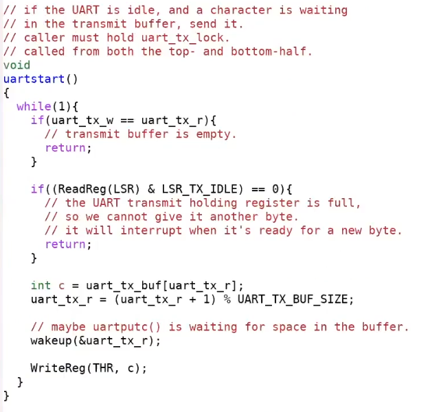

当I/O操作完成时，I/O设备将发起中断，kernel通过中断判断I/O调整buffer。

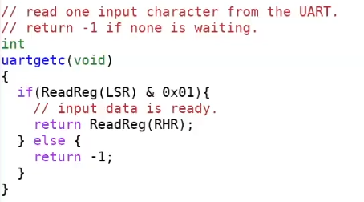

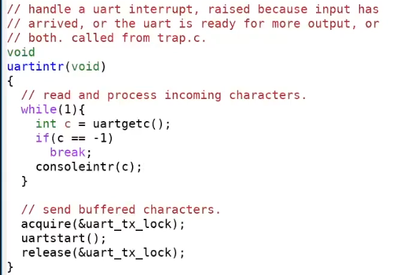

当执行`read()`时，首先尝试从kernel内部的buffer中读出，如果内部buffer是空的就等待I/O设备。

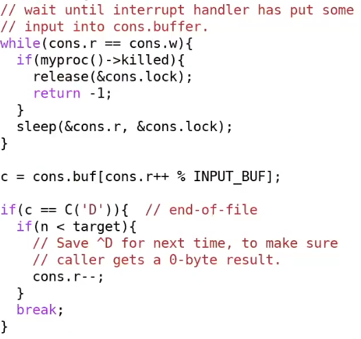

当输入产生时，设备将发起一个中断。

kernel通过中断将数据放入内部的buffer，并唤醒进程。

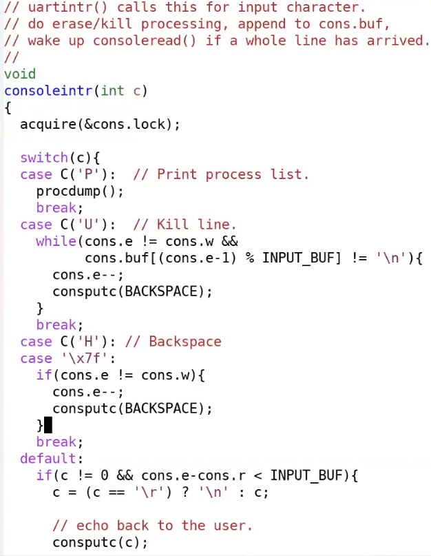

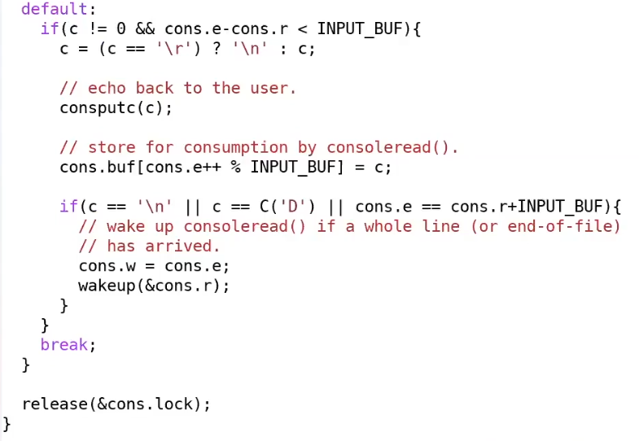

当CPU收到中断时，硬件将做以下操作：
1. 清除`SIE`寄存器，避免再次收到中断。
2. 保存当前`PC`到`SEPC`寄存器。
3. 保存当前mode。
4. 将mode切换为kernel mode。
5. 跳到`STVEC`寄存器指向的地址。

kernel需要通过PLIC获得中断号。

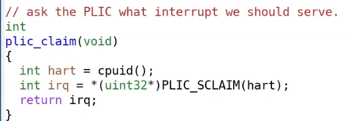

然后通过中断号，判断如何处理中断。

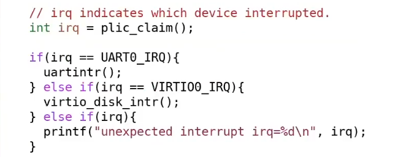

*NOTE:Unix 信号机制与中断很像，中断可以在kernel mode被接收，同时中断也需要注意“异步中断安全”，在不能被中断的代码上临时关闭中断。*

## Interrupt Evolution

在过去，中断处理得相对较快（特别是Unix刚被开发出来的时候）。

现在中断处理相对变慢了，如果一个设备高速地产生中断，处理器很难跟上，所以现代设备设计得比较复杂，以减少CPU的负担。

对于高速设备，CPU可以使用Polling（轮询）的老方式，处理I/O，这种情况下CPU不停读取某个I/O设备的寄存器，直到某个设备有数据产生（设备可读）或达成某种条件（例如设备可写）。

*NOTE:曾经中断设计出来就是为了代替Polling。*

对于一些精心设计的驱动，它们会在中断和轮询之间动态切换。