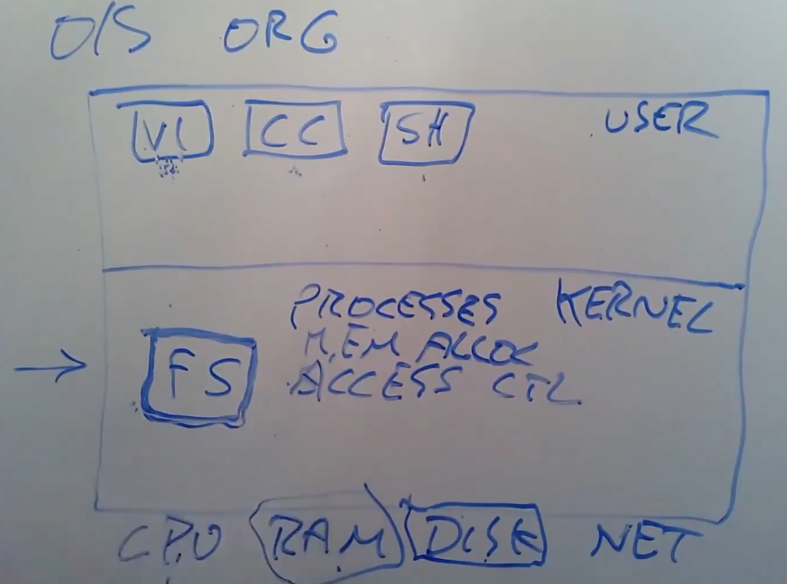
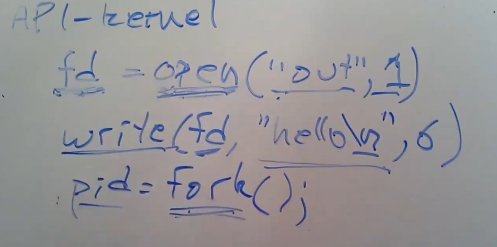

# Introduction

OS的设计目标：
1. Abstrcat the hardware（抽象硬件为其他应用提供接口）。
2. Multiples（在不同的应用中复用硬件）。
3. Isolation（隔离不同的应用，使它们不能影响对方）。
4. Sharing（在不同的users间共享资源）。
5. Security（保护user的资源）。
6. Performance（不要减低应用的性能）。
7. Range of uses（支持大范围的应用）。

OS设计的矛盾：
* Efficient vs Abstract（为了让程序有效率地运行，OS必须让程序贴近硬件，为了让硬件易用，OS又必须向程序提供抽象）。
* Powerful vs Simple Api（我们需要强大的OS服务，但也需要简单的系统接口向我们隐藏硬件细节）。
* Flexible vs Secure（向user提供灵活的interface同时保证用户的权限受到限制）。

