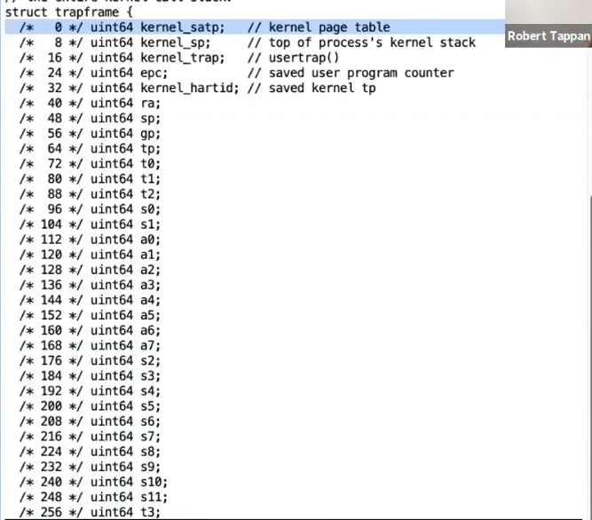
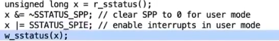

# Isolation and System Call Entry Exit

## Traps

用户空间和内核空间的转换通常被称为`trap`。

trap机制要尽量简单，这样有助于提高性能，system call和page fault以及中断都需要转换，过低的性能会影响OS的使用。

在`RISC-V`处理器中，`STVEC`寄存器指向了内核中处理`trap`指令的起始地址，同时`SEPC`在trap的过程中，保存原来的`PC`的值，`SSCRATCH`寄存器是kernel预留寄存器（因为kernel不能使用任何用户寄存器,通常使用`csrrw`指令来交换`SSCRATCH`与其他user registers的值）。

Kernel Mode的特权：
* 读/写 `STAP`、`STVEC`、`SEPC`、`SSRATCH`寄存器。
* 修改PTE的`PTE_U`，当该它为`1`时代表，只有user可以使用该PTE，kernel不能使用该PTE。

*NOTE:`ecall`不会切换地址空间，所以trap的跳转地址必须被映射到user address space中，这个page称为trampoline page。*

`ECALL`只做四件事：
1. 将mode切换成kernel mode。
2. 保存`PC`到`SEPC`（`PC`指向的是`ECALL`）。
3. 跳转到`STVEC`所指向的地址。
4. 关闭中断。

处理trap：
1. 进入kernel mode（由硬件完成）。
2. 保存`PC`到`SEPC`（由硬件完成）。
3. 跳转到`STVEC`所指向的地址（由硬件完成）。
4. 保存32个用户寄存器（XV6将寄存器保存到trapframe page中，这个page由kernel预置在user address space中）。

trapframe page会在kernel启动process之前设置一次。

5. 修改`sp`寄存器，使其指向kernel stack。
6. 从trapframe page中加载`tp`寄存器，获取当前的CPU id（XV6依赖这个id去进行一些操作）。 
7. 修改`STAP`寄存器，将用户地址空间切换成内核地址空间（这个时候不能再使用trapframe page了，但可以使用trampoline page，因为其在kernel address space中有相同的映射）。
8. 修改`STVEC`，使其指向Kernel Trap的地址（为后续打开中断做准备）。
9. 加载当前进程（XV6使用`tp`寄存器检查）。
10. 将`SEPC`保存到kernel 的process结构中（因为在处理syscall的过程中，可能会切换到其他进程，其他进程可能发起syscall）。
11. 检查中断的原因（`RISC-V`使用`SCAUSE`寄存器表示）。
12. 检查当前进程是否被其他进程kill了。
13. 调整process结构的pc到下一个指令（这样`sret`指令才能顺利返回，否则出现无限循环）。
14. 打开中断（中断会被`ECALL`关闭）这样能更快地处理中断。
15. 从系统调用表中查找相应的处理程序。
16. 执行系统调用处理程序。
17. 再次检查当前进程是否被其他进程kill了。
18. 关闭中断（因为要修改`STVEC`）。
19. 修改`STVEC`，使其指向User Trap的地址。
20. 设置trapframe page。
21. 设置`SSTATUS`寄存器，这个寄存器控制了`sret`的行为（`SSTATUS_SPP`表示`sret`返回到user mode，`SSTATUS_SPIE`表示`sret`返回后打开中断）。

22. 将process结构中的`SEPC`恢复到寄存器中。
23. 切换到user address space（切换代码必须在trampoline page中）。
24. 恢复32个用户寄存器（但是`a0`寄存器要从trapframe page恢复，因为这个`a0`保持了syscall的返回值）。
25. 执行`sret`返回到user mode，打开中断，并从`SEPC`恢复`PC`。

