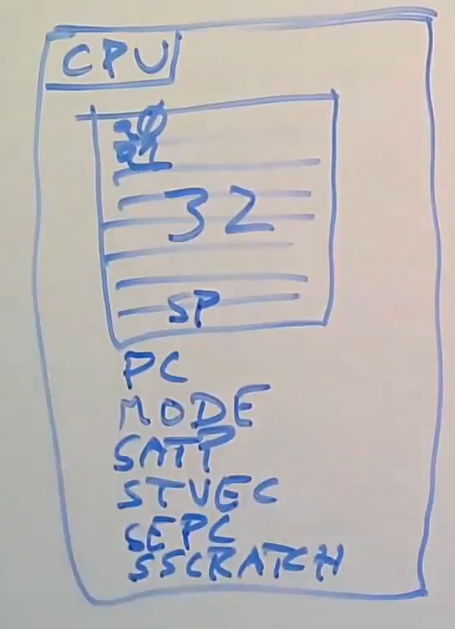

# Isolation and System Call Entry Exit

## Traps

用户空间和内核空间的转换通常被称为`trap`。

trap机制要尽量简单，这样有助于提高性能，system call和page fault以及中断都需要转换，过低的性能会影响OS的使用。

在`RISC-V`处理器中，`STVEC`寄存器指向了内核中处理`trap`指令的起始地址，同时`SEPC`在trap的过程中，保存原来的`PC`的值，`SSCRATCH`寄存器是kernel预留寄存器（因为kernel不能使用任何用户寄存器,通常使用`csrrw`指令来交换`SSCRATCH`与其他user registers的值）。

Kernel Mode的特权：
* 读/写 `STAP`、`STVEC`、`SEPC`、`SSRATCH`寄存器。
* 修改PTE的`PTE_U`，当该它为`1`时代表，只有user可以使用该PTE，kernel不能使用该PTE。

*NOTE:`ecall`不会切换地址空间，所以trap的跳转地址必须被映射到user address space中，这个page称为trampoline page。*

`ECALL`只做四件事：
1. 将mode切换成kernel mode。
2. 保存`PC`到`SEPC`（`PC`指向的是`ECALL`）。
3. 跳转到`STVEC`所指向的地址。
4. 关闭中断。

处理trap：
1. 进入kernel mode（由硬件完成）。
2. 保存`PC`到`SEPC`（由硬件完成）。
3. 跳转到`STVEC`所指向的地址（由硬件完成）。
4. 保存32个用户寄存器（XV6将寄存器保存到trapframe page中，这个page由kernel预置在user address space中）。


trapframe page会在kernel启动process之前设置一次。

5. 修改`sp`寄存器，使其指向kernel stack。
6. 从trapframe page中加载`tp`寄存器，获取当前的CPU id（XV6依赖这个id去进行一些操作）。
7. 修改`STAP`寄存器，将用户地址空间切换成内核地址空间（这个时候不能再使用trapframe page了，但可以使用trampoline page，因为其在kernel address space中有相同的映射）。
8. 修改`STVEC`，使其指向Kernel Trap的地址（为后续打开中断做准备）。
9. 加载当前进程（XV6使用`tp`寄存器检查）。
10. 将`SEPC`保存到kernel 的process结构中（因为在处理syscall的过程中，可能会切换到其他进程，其他进程可能发起syscall）。
11. 检查中断的原因（`RISC-V`使用`SCAUSE`寄存器表示）。
12. 检查当前进程是否被其他进程kill了。
13. 调整process结构的pc到下一个指令（这样`sret`指令才能顺利返回，否则出现无限循环）。
14. 打开中断（中断会被`ECALL`关闭）这样能更快地处理中断。
15. 从系统调用表中查找相应的处理程序。
16. 执行系统调用处理程序。
17. 再次检查当前进程是否被其他进程kill了。
18. 关闭中断（因为要修改`STVEC`）。
19. 修改`STVEC`，使其指向User Trap的地址。
20. 设置trapframe page。
21. 设置`SSTATUS`寄存器，这个寄存器控制了`sret`的行为（`SSTATUS_SPP`表示`sret`返回到user mode，`SSTATUS_SPIE`表示`sret`返回后打开中断）。


22. 将process结构中的`SEPC`恢复到寄存器中。
23. 切换到user address space（切换代码必须在trampoline page中）。
24. 恢复32个用户寄存器（但是`a0`寄存器要从trapframe page恢复，因为这个`a0`保持了syscall的返回值）。
25. 执行`sret`返回到user mode，打开中断，并从`SEPC`恢复`PC`。



## Return Function Code

```c
void
usertrapret(void)
{
  struct proc *p = myproc();

  // turn off interrupts, since we're switching
  // now from kerneltrap() to usertrap().
  intr_off();

  // send syscalls, interrupts, and exceptions to trampoline.S
  w_stvec(TRAMPOLINE + (uservec - trampoline));

  // set up trapframe values that uservec will need when
  // the process next re-enters the kernel.
  p->tf->kernel_satp = r_satp();         // kernel page table
  p->tf->kernel_sp = p->kstack + PGSIZE; // process's kernel stack
  p->tf->kernel_trap = (uint64)usertrap;
  p->tf->kernel_hartid = r_tp();         // hartid for cpuid()

  // set up the registers that trampoline.S's sret will use
  // to get to user space.

  // set S Previous Privilege mode to User.
  unsigned long x = r_sstatus();
  x &= ~SSTATUS_SPP; // clear SPP to 0 for user mode
  x |= SSTATUS_SPIE; // enable interrupts in user mode
  w_sstatus(x);

  // set S Exception Program Counter to the saved user pc.
  w_sepc(p->tf->epc);

  // tell trampoline.S the user page table to switch to.
  uint64 satp = MAKE_SATP(p->pagetable);

  // jump to trampoline.S at the top of memory, which
  // switches to the user page table, restores user registers,
  // and switches to user mode with sret.
  uint64 fn = TRAMPOLINE + (userret - trampoline);
  ((void (*)(uint64,uint64))fn)(TRAPFRAME, satp);
}
```

```asm
userret:
        # userret(TRAPFRAME, pagetable)
        # switch from kernel to user.
        # usertrapret() calls here.
        # a0: TRAPFRAME, in user page table.
        # a1: user page table, for satp.

        # switch to the user page table.
        csrw satp, a1
        sfence.vma zero, zero

        # put the saved user a0 in sscratch, so we
        # can swap it with our a0 (TRAPFRAME) in the last step.
        ld t0, 112(a0)
        csrw sscratch, t0

        # restore all but a0 from TRAPFRAME
        ld ra, 40(a0)
        ld sp, 48(a0)
        ld gp, 56(a0)
        ld tp, 64(a0)
        ld t0, 72(a0)
        ld t1, 80(a0)
        ld t2, 88(a0)
        ld s0, 96(a0)
        ld s1, 104(a0)
        ld a1, 120(a0)
        ld a2, 128(a0)
        ld a3, 136(a0)
        ld a4, 144(a0)
        ld a5, 152(a0)
        ld a6, 160(a0)
        ld a7, 168(a0)
        ld s2, 176(a0)
        ld s3, 184(a0)
        ld s4, 192(a0)
        ld s5, 200(a0)
        ld s6, 208(a0)
        ld s7, 216(a0)
        ld s8, 224(a0)
        ld s9, 232(a0)
        ld s10, 240(a0)
        ld s11, 248(a0)
        ld t3, 256(a0)
        ld t4, 264(a0)
        ld t5, 272(a0)
        ld t6, 280(a0)

        # restore user a0, and save TRAPFRAME in sscratch
        csrrw a0, sscratch, a0

        # return to user mode and user pc.
        # usertrapret() set up sstatus and sepc.
        sret
```