# Kernels And High-Level-Languages

许多kernel用`C`写成：
* Linux。
* Windows。
* *BSD。

用`C`编写Kernel的好处：
* 拥有对内存分配和释放的控制权。
* 几乎没有编译器产生的隐式的代码。
* 对内存的直接访问能力。
* 几乎不需要依赖。

但是编写安全的`C`代码非常困难：
* 缓冲区溢出。
* Use-After-Free错误。
* 在线程间共享动态内存。

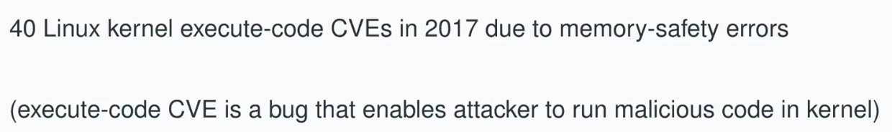

使用Hight-Level-Languages编写kernel的好处：
* 类型安全。
* 垃圾回收和自动内存管理。
* 语言提供的并发能力。
* 语言提供的抽象能力。

Hight-Level-Languages的代价（通常称为Hight-Level-Languages Tax，高级语言税）：
* 由于大量的边界检查（bounds-check）、转换检查（cast-check）、空指针检查（null-pointer-check）带来的低性能。
* 垃圾回收带来的性能开销。
* 没有直接内存访问。
* 没有手写汇编的能力。
* 受限的并发和并行性。

有许多kernel使用高级语言写成：

## Hight-Level-Languages Kernel

通过构建一个支持POSIX的HLL Kernel，并在上面允许nginx来进行测量。

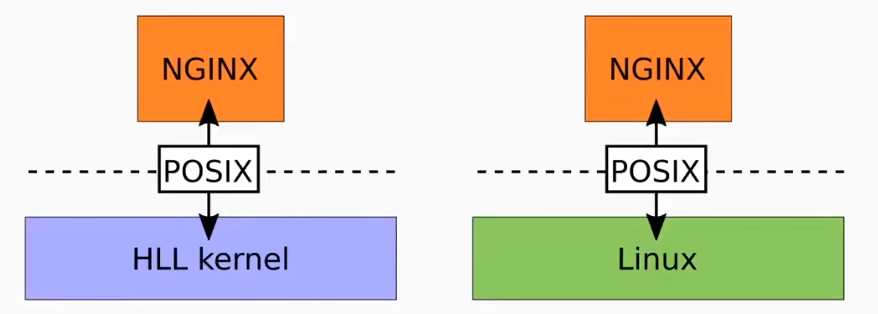

*NOTE:用来对比的HLL Kernel（Biscuit）使用Go写成。*

`Go`的优点：
* 容易调用汇编。
* 编译成机器码。
* 容易并发编程。
* 容易进行静态分析。
* 带有GC（concurrent mark and sweep）。

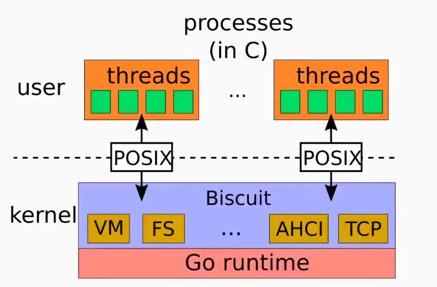

Kernel Thread使用goroutine实现，同时go runtime直接在裸硬件上运行。

Biscuit中有一些欺骗代码（shim层）让go runtime相信自己运行在OS上。

系统调用的工作方式基本与XV6相同。

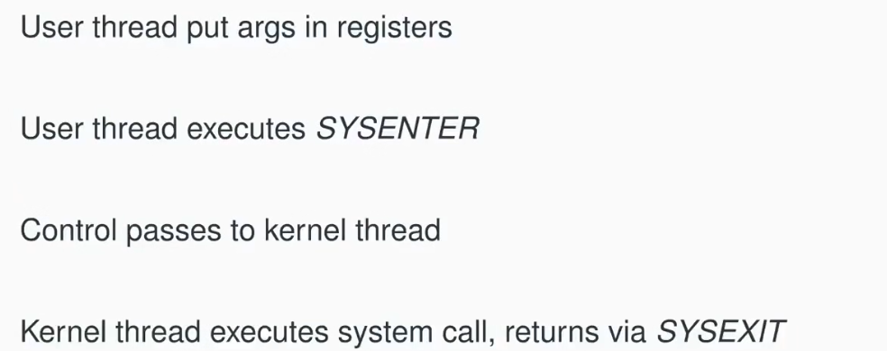

为了使用高级语言语言编写kernel，需要克服几个问题：
* 让runtime运行在裸硬件上。
* 使用goroutine运行不同的应用程序（only `Go`）。
* runtime临界区中的设备中断的问题。
* 最困难的问题：堆空间耗尽。

## Heap Exhaustion

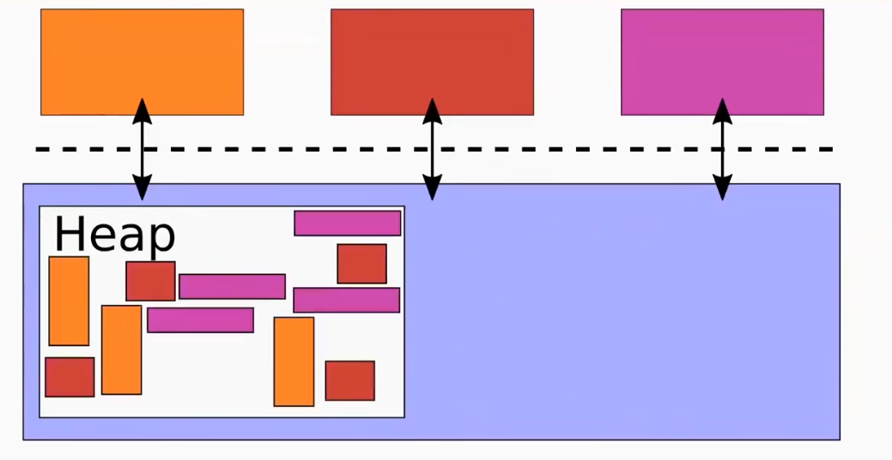

*NOTE:所有kernel都存在这个问题。*

Kernel的heap内存可能被耗尽。

解决方案：
* Panic（恐慌） - 不可取。
* 在allocator中等待，直到内存可用 - 可能产生deadlock。
* 检查、处理分配失败（like C language kernel） - 很难正确处理（例如可能需要回滚文件系统操作）、高级语言很可能没有这个能力（它们的`malloc`、`new`没有返回失败的选项）。

*NOTE：Linux结合使用了方案1和2，但仍然存在问题。*

biscuit的解决方案：在执行system call前使用`reserve()`去预留内存。

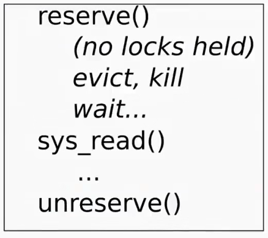

由于在`reserve()`中不持有lock，我们可以执行方案2。

当系统调用执行完后，调用`unreserve()`，将内存放回池中。

*NOTE:问题被转化成计算system call所需要的内存量（必须是最坏情况下的）。*

某些system call的分配数量是动态决定的，这时必须人为设置一个最大分配数量。

## Hight-Level-Languages Benefits

biscuit使用了大量高级语言特性。

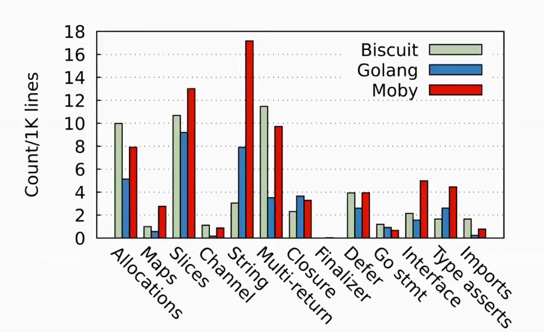

避免了大量的CVE。

GC使并发编程更简单了。

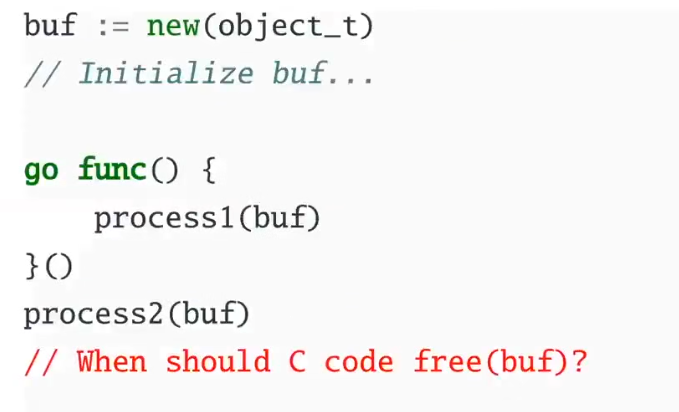

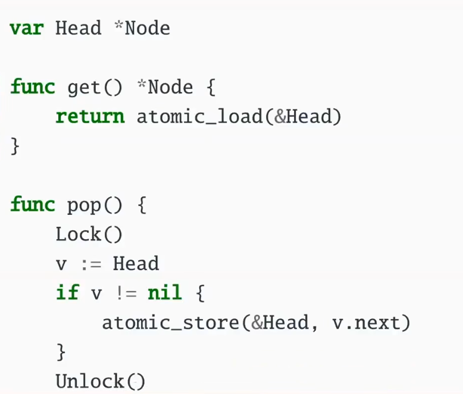

如果没有GC，需要使用EBR和RCU之类的技术来决定什么时候释放head。

## Hight-Level-Languages Cost

实验环境：
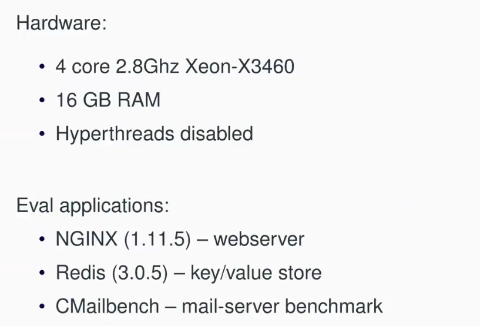

Benchmark：
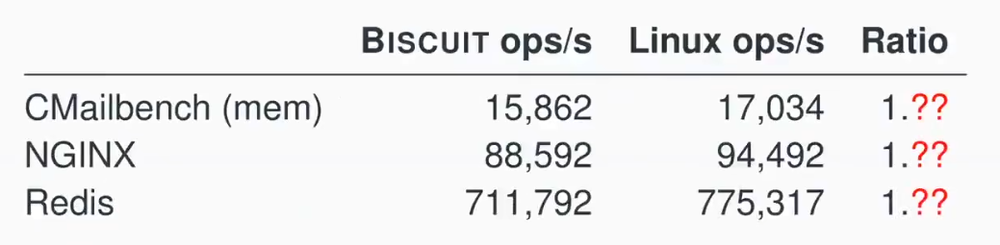

Profile：
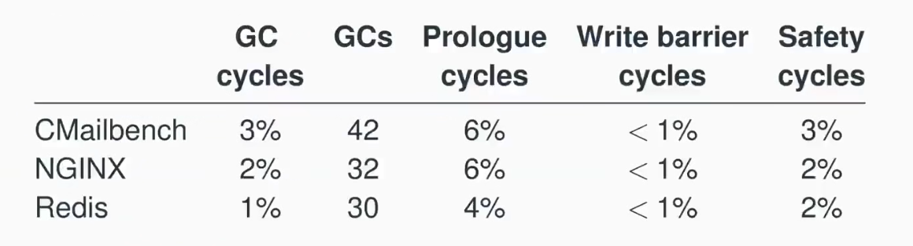

*NOTE:prologue中检查goroutine的stack是否需要增长（goroutine的stack是动态的）。*

*当heap的大小的三倍<=RAM的大小时，GC的占比小于10%。*

GC Pause Time：
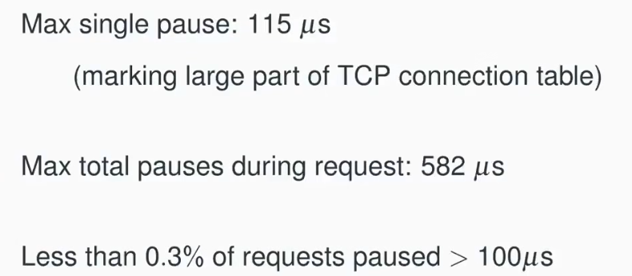

