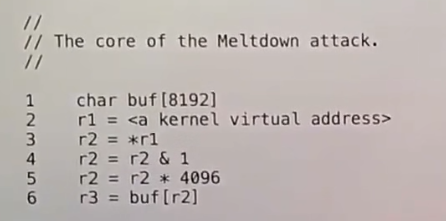
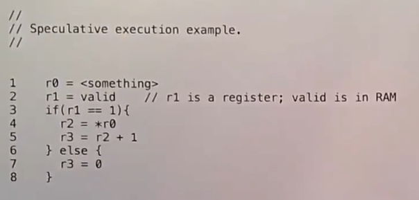
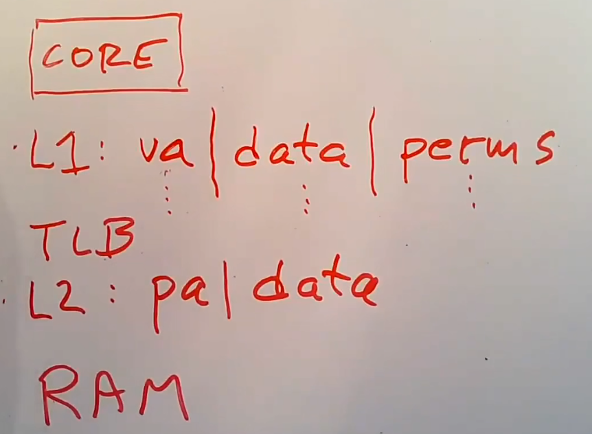
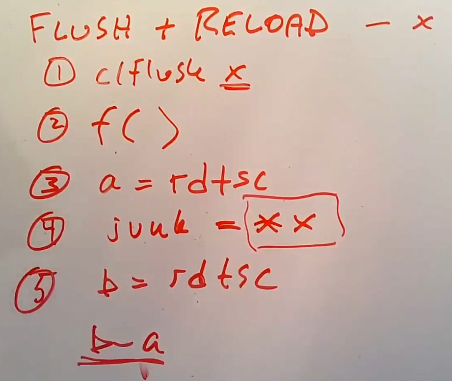
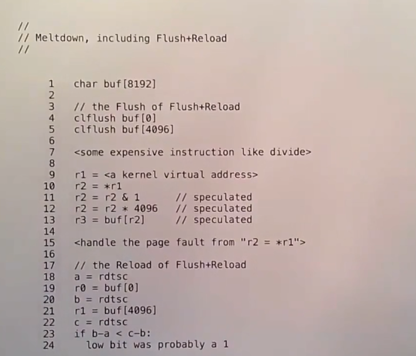
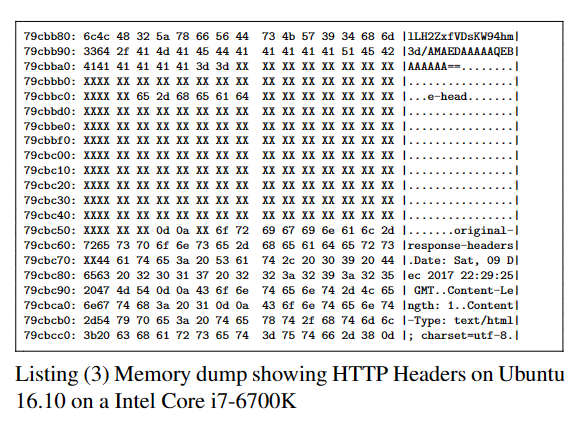
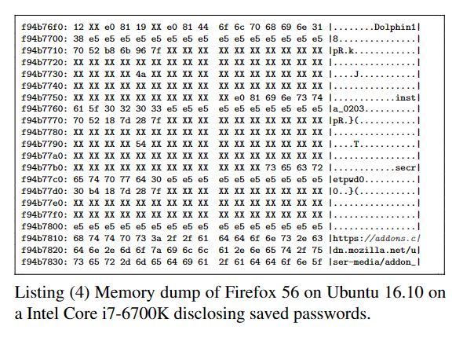

# Meltdown

Meltdown是一种微架构攻击（一种利用CPU内部隐藏细节的攻击），用于查看kernel的内存。

*NOTE:`r0`、`r1`、`r2`、`r3`和`r4`为寄存器。*

## Branch Speculation

在分支判断之前，CPU就预测一个分支（防止流水线阻塞）执行，如果CPU猜错了将消除执行产生的影响。

*NOTE:`r0`、`r1`、`r2`、`r3`为寄存器。*

在判断`r1`是否成立之前，CPU将预测一个分支执行，在预测时所有对寄存器的操作都将在一个影子寄存器中执行。

在预测的情况下执行`load`指令，CPU不会检查地址的合法性，除非指令retire。

*NOTE:AMD和较新（2017后）的Intel在预测时会检查地址的合法性。*

能判断预测是否正确的时间点称为retired point。

当一条指令满足以下条件时，它被retire：
* 它的上一条指令被retire。
* 它的执行已经完成。

当CPU经过retired point时，如果预测失败CPU将undo操作（因为存在影子寄存器，所以undo是可行的）。

CPU的Exception（异常）和Interrupt（中断）也采取类似的机制，假定中断不会发生，流水线继续执行。

## Caches

CPU的高速缓存用于加速内存的访问，访问在cache中的数据只需要非常短的时间（与访问RAM比较）。

每个cache有若干个cache line组成，使用virtual address或者physical address进行索引。

*NOTE:当cache硬件在MMU后面时使用physical address，否则使用virtual address。*

访问cache和内存所需的时间大致如下：
* L1 cache - 3 cycles。
* L2 cache - 11 cycles。
* L3 cache - 25 cycles。
* RAM - 100 cycles。

基于cache的特性，使用`Flush + Reload`方法，可以判断某个函数是否访问了某个地址：
* 先将caches中的该地址清空（使用`CLFLUSH`指令，或者使用`load`填满caches）。
* 执行该函数。
* 计算当前时间（`A`）。
* 访问该地址。
* 计算当前时间(`B`)。
* 计算`B - A`，查看这个值的数量级，如果数量级较大说明没有访问。

*NOTE:`A`和`B`需要尽可能精确，或者直接使用CPU的cycle数量（使用`RDTCS`指令）。*

## Meltdown Attack

在旧（出厂日期小于2017年）的Intel CPU中Caches并没有进行权限检查。

kernel通常将完整的内存映射到user address space中，这样能加速system call（通过避免切换page table的方式）。

*NOTE:切换page table时需要清除TLB，也要清除L1 Cache（该cache使用virtual address进行索引）。*

Meltdown攻击的步骤如下：
* 申请一个较大的buffer（通常为`8K`），该buffer必须跨越多个cache line并且不被硬件预取（prefetch）。
* 然后执行一个开销大的指令。
* 由于CPU的Speculation，在执行大开销指令的同时也在部分执行它后面的指令。
* 在后面的指令中访问kernel memory的一个bit，根据该bit访问buffer（为`1`则访问`buffer[4096]`，为`0`则访问`buffer[0]`），由于开销大的指令未retire，所以访问kernel memory不会导致page fault。
* 利用信号机制处理page fault。
* 使用Flush + Reload检查`buffer`被访问的位置（`buffer[0]`还是`buffer[4096]`）判断该bit的内容。

| | |
|-|-|
|||

修复方案：
* 软件方式 - 不把Kernel的内存映射到user address space（KAISER），会增加system call的开销。
* 硬件方式 - 在执行`load`指令时对cache进行权限检查，使Meltdown无法读出正确的kernel memory bit，会增加`load`指令的开销。