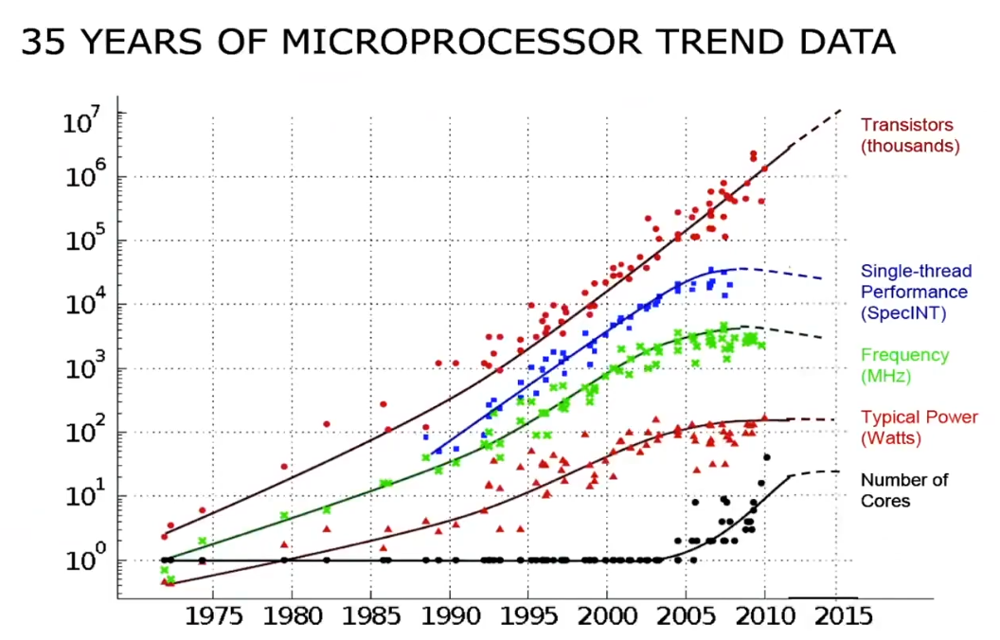
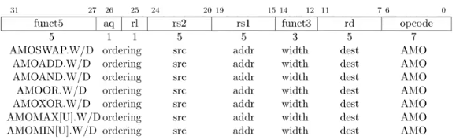
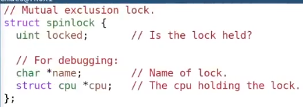
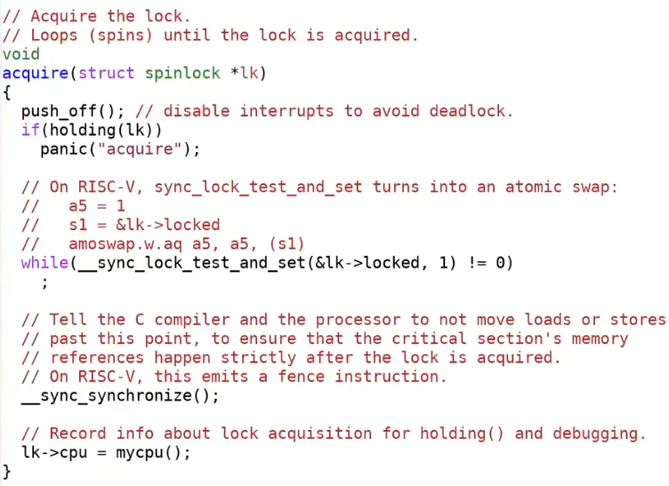
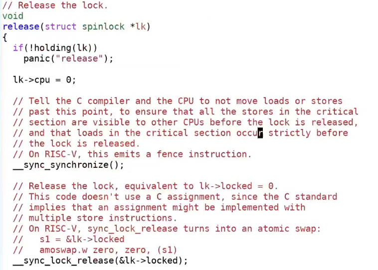
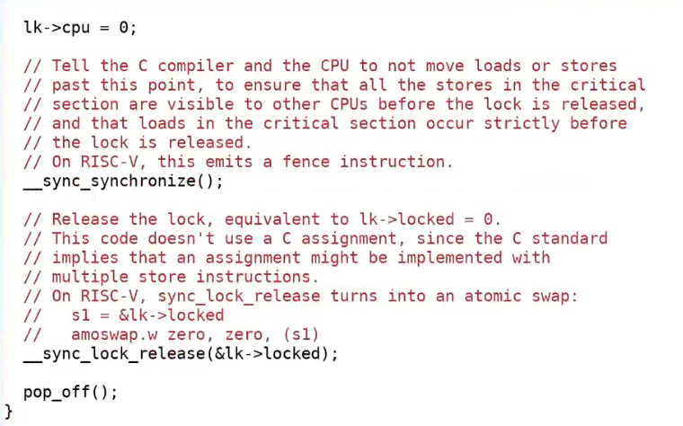

# Multiprocessors and Locks



为什么需要Locks：
* 应用需要使用多核获取更好的性能。
* Kernel需要能够处理并行的系统调用。
* 不同的CPU Core可能同时访问Kernel的共享数据结构，需要使用Locks保证共享数据结构的正确性。
* 如果没有锁，访问共享数据结构可能出现竟态条件（race condition）。

同时Locks也限制了性能，因为他会使并行的执行变成串行（即Locks限制了程序的Scalable（扩展性））。

## Locks

Lock抽象包含两个API:
* `acquire()` - 保证只有一个线程获得锁，在它之后的线程必须等待它执行`release()`。
* `release()` - 释放锁。

在`acquire()`和`release()`之间的代码称为临界区（critical section）。

kernel通常会有很多锁，这允许程序获得更好的并行性（parallelism）。

什么时候加锁：
* 2个或多个的processer会访问同一个共享数据结构，并且至少有一个processer执行写操作。
* 该数据结构非lock-free数据结构。

Locks的作用：
* Locks帮助避免更新丢失。
* Locks能使多步操作具有原子性。
* Locks能维护数据结构的不变式。

## Deadlock

```c
acquire(&lock);

acquire(&lock); // <-- deadlock

release(&lock);
```

*NOTE:acquire lock时，多个线程阻塞叫deadlock，如果不阻塞而是自旋则称livelock。*

因为重复获取一个lock导致了deadlock。

*NOTE:某些可重入锁不会出现这个问题。*

<table>
    <tr>
        <td>Processer 1</td>
        <td>Processer 2</td>
    </tr>
    <tr>
        <td>
            <code>
            acquire(&lock1);
            <br/>
            acquire(&lock2);
            <br/>
            release(&lock1);
            <br/>
            release(&lock2);
            </code>
        </td>
        <td>
            <code>
            acquire(&lock2);
            <br/>
            acquire(&lock1);
            <br/>
            release(&lock2);
            <br/>
            release(&lock1);
            </code>
        </td>
    </tr>
</table>

由于两个processer以不同的顺序加锁引发的deadlock。

解决方案：如果有多个locks，那么在加锁时对locks进行排序，所有的processer按相同的顺序加锁。

*NOTE:一个合理的顺序是利用lock的address，总是先获得address小的lock。*

但是这个方案需要，获得需要acquire的locks，这样才能给它们排序。

## Lock vs Performance

为了在使用lock时获得更好的性能，必须对数据结构进行拆分。

这种拆分通常不会简单，有时候甚至是困难的。

通常的开发流程：
1. 先使用粗粒度的lock。
2. 测量程序，查看是否能利用多核，性能是否足够。
3. 如果不能利用多核，性能不足，重新设计程序并尝试使用更细粒度的锁。

## Implment Locks

locks需要硬件的特殊指令支持，在`RISC-V`上，这个特殊指令是`amoswap`，它保证了test-and-set操作的原子性。

`amoswap`共有三个参数（`addr`、`r1`、`r2`）将执行以下操作：
1. Lock `addr`
2. 将`*addr`存储到`temp`。
3. 将`*addr`设置为`r1`。
4. 将`r2`设置为`tmp`。
5. Unlock `addr`。

*NOTE:硬件可能以不同的方式实现这个指令。*





为了防止临界区被中断打断（典型的问题是可能发生deadlock），还需要在acquire的同时关闭中断。



在release时，将中断的设置还原。





*NOTE:由于CPU Cache，`store`指令并不是原子的。*

*NOTE:使用原子的递增指令，可以实现公平的spin lock。*

## Memory Ordering

指令可能被处理器和编译器重排，以获得更好的性能。

在单个processer的环境下，这种重排是正确的。

但是在并发环境下，很可能引发问题。

```c
locked = 1;
x += 1;
locked = 0;
```
可能重排为：
```c
locked = 1;
locked = 0;
x += 1;
```

所以需要一个`fence`指令（`RISC-V`），保证在他前面的`load`和`store`不能被重排到他后面。

*NOTE:不同的硬件架构有不同的内存模型，所以`RISC-V`的memory order可能在`x86_64`无法使用。*

*NOTE:不同的语言有不同的内存模型，如果追求可移植的方法，应该仔细参考它的文档，选择合适的fence和memory order参数。*

*NOTE:如果你不确定，就总是使用约束性最强的memory order参数。*