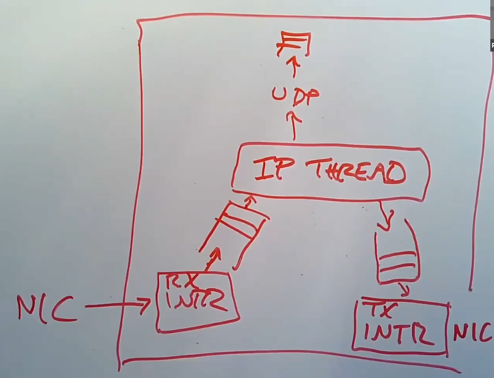

# Networking

LAN（Local Area Network）的基本结构：

* 一个以太网交换机。
* 多个host通过以太网交换机进行通信。

当通信对象不在同一个LAN中，则需要多个router进行转发。

*NOTE:在LAN中使用以太网协议，网际通信使用Internet Protocol。*

## Ethernet Protocol

Eth Frame的首部：

* `dhost` - 6字节目标host MAC地址。
* `shost` - 6字节源host MAC地址。
* `type` - frame的类型。

Payload（有效载荷）紧接着首部组成一个Eth Frame。

*NOTE:SFD和FCS用于硬件标记该packet的开始和结束。*

*NOTE:处理Preamble、SFD和FCS由硬件复杂，对kernel是透明的。*

在MAC（48bits）中，前24bits是NIC制造商，后24bits是制造商提供的任意数字（它们可能是连续的序列号）。

Eth交换机收到packet后，会广播到每一个LAN的host上。

*NOTE:`dhost`的`0xFFFFFFFFFFFF`代表all hosts。*

## Arp（Address Resolution Protocol） Packet

ARP packet由几个部分组成：
* `hrd` - 2字节硬件地址格式（通常是MAC）。
* `pro` - 2字节协议地址格式（通常是IP和IPv6）。
* `hln` - 1字节硬件地址长度。
* `pln` - 1字节硬件地址长度。
* `op` - 2字节操作类型。
* `sender address` - 发送者的硬件地址和协议地址。
* `target address` - 目标的硬件地址和协议地址。

总共有两种操作类型：
* Request - 请求某个协议地址的硬件地址。
* Reply - 对某个请求的回复。

*NOTE：当地址未知时，用`0`填充。*

## Internet Protocol（v4）

ip header（v4）由几个部分组成：
* ip version - 4bits IP协议版本恒定为`4`。
* header length - 4bits packet的header的长度。
* `tos` - 1字节，服务类型。
* `len` - packet的总长度。
* `id` - packet的标识符。
* flags - 3bits flags，第一位保留必须为`0`，第二位`DF`，表示不要分片，第三位`MF`表示当前packet是一个大数据包的分片，对于分段数据包，除最后一个分段外的所有分段都设置了`MF`，最后一个分片具有非零分片偏移量字段。
* `offset` - 13bits 片段相对于原始未分片 IP 数据包开头的偏移量。。
* `ttl` - 1字节time-to-live（TTL），表示还能经过多少个router。
* `p` - 1字节payload的协议（通常是TCP或UDP）。
* `sum` - 2字节检验和。
* `src` - 4字节源地址。
* `dst` - 4字节目标地址。

*NOTE:此处eth frame header中`dhost`的`0xFFFFFFFFFFFF`可能是qemu的bug。*

## User Datagram Protocol（UDP） Packet

UDP由几个部分组成：
* `sport` - 2字节源端口号。
* `dport` - 2字节目标端口号。
* `ulen` - 2字节udp packet的长度，最大长度为`65535`。
* `sum` - 2字节校验和。

*NOTE:ip packet header将一直保留，直到目标机器收到packet，而eth frame header将在离开LAN时剥离。*

## Network Stack On Host

应用使用`Socket API`与网络通信，内核中的Socket Layer负责提供`Socket API`。

Socket Layer维护一个table，记录fd与port之间的关系。

应用和Socket Layer组成了Application Layer（应用层）。

同时为每一个socket维护2个队列，一个用来存储接收到的bytes，一个用来存储需要发送的bytes。

在Socket Layer下面是UDP和TCP（即Transport Layer，传输层）。

在transport layer下面是IP（即Network Layer）。

在IP同级（非同层），还有ARP。

ARP与Ethernet Protocol组成Data Link Layer（数据链路层）。

最下面是一个或多个网卡驱动（NIC驱动），负责与NIC交互。

NIC属于Physical Layer（物理层）。

每一层中都有packet buffer，只有接收到一个完整的packet才向上传递。

因为NIC的内存有限，所以在interrupt handler中，我们需要尽快处理（典型的方式是放入到一个queue中然后返回）。

Kernel会使用一些threads或者process（每一层的每一个模块都存在），从queue中读取packet，然后处理packet（一种可能是传递到上一个layer）。

上层通过NIC发送时，需要先将packet放入一个queue。

当NIC就绪时，会有个写中断，这时将队列中的packet发送到NIC。

各个模块之间必须是解耦的（例如IP threads不知道中断）。

NIC不能同时是接收方和发送方（不能自己给自己发packet），如果需要连接多个网络就需要多个NIC。

## Network Interface Controller（NIC）

NIC负责将电信号解析为packet，然后传递给host上的驱动程序。

当packet到达时，NIC将packet存储在自身的内存中，然后向host发送读中断。

然后host将NIC上的packet拷贝到自己的memory队列中。

现代NIC通常通过DMA的方式完成copy。

kernel在内存中设置一个DMA Ring，里面存的是packet的指针，每一个指针指向一个packet buffer。

然后kernel会告诉NIC Ring的地址，这样NIC将会直接拷贝packet到指定的位置而不是等待驱动自己去拷贝。

*NOTE：DMA Ring是一个环形缓冲。*

当DMA传输完成后，将产生一个中断。

同时还会存在一个发送DMA Ring。

同时现代NIC更加智能：
* Monitor - 允许多个DMA Ring存在，NIC可以根据packet的特征选择要拷贝到哪个ring。
* TCP Handle - NIC硬件可以完成一些TCP协议的处理（例如计算校验和）。

## Receive Livelock Problem

使用两个NIC进行packet转发。

由于中断的原因，吞吐量在到底顶峰后急速下降（大量的CPU时间被用来处理中断），下降的曲线称为中断的Livelock。

Livelock不仅会因为CPU耗尽而发生，也可能是其他原因，比如说网卡的DMA耗尽了RAM的处理时间，那么网卡占据了RAM导致CPU不能使用RAM。

解决Livelock：
* interrupt handler在接收中断后唤醒处理packet的thread并关闭NIC的中断（让NIC即使有packet到达也不再产生中断）。
* 处理packet的thread使用循环从NIC中获取几个packet。
* 然后处理packet。
* 循环直到没有packet可读。
* 重新打开中断然后sleep。

