# OS Organization

## Isolation

为了提供Isolation，OS抽象硬件并对user提供这些抽象。

|Hardware|Abstraction|
|-|-|
|CPU Core|Process|
|Disk|File|
|Network Card|Socket|
|Physical Memory|Address Space|

Strong Isolation需要通过hardware实现。

hardware需要提供两个支持：
* User/Kernel Mode。
* Page Table(or Virtual Memory)。

处理器一般会有两种模式：
* User Mode（指令的执行受限制）。
* Kernel Mode（可以执行某些特权指令）。

*NOTE:RISC-V还有一种Machine Mode。*

*NOTE:BIOS将在OS启动前启动，由他负责启动OS。*

*NOTE:Kernel通常也会在app的address space中，方便user使用system call时，传递app address space的memory。*

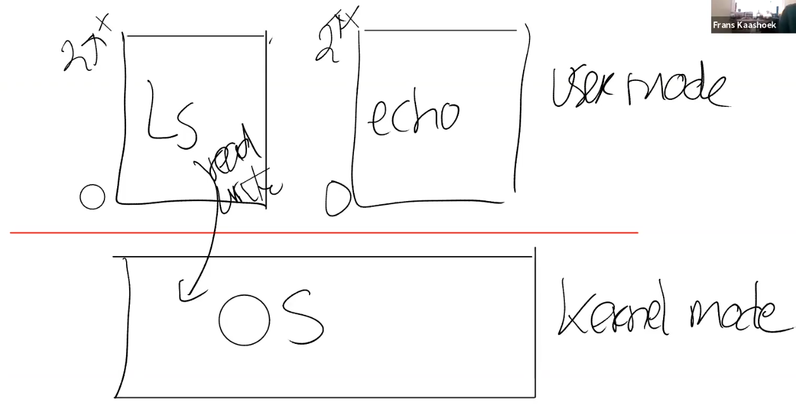

## System Call

System call是app将控制权交给kernel，并转化成kernel mode的方式。

在RISC-V这个指令是`ECALL`，接受一个number作为System Call Number。

例如，当调用`fork()`时，并不是真的执行`fork`的代码，而是将`SYS_FORK`放入参数寄存器`a0`使用`ECALL`指令。

`ECALL`将陷入kernel然后kernel通过检查`a0`寄存器，发现值`SYS_FORK`明白user想要新建一个process，调用相应的函数来完成`fork`。

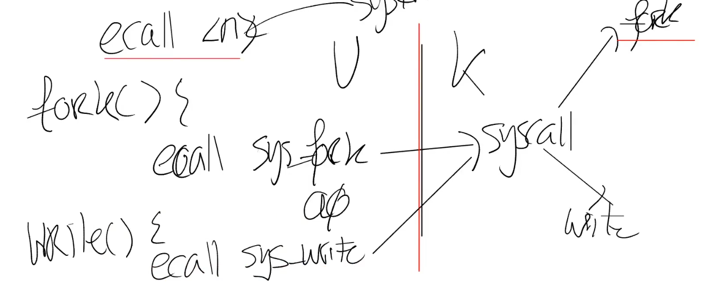

*NOTE:在x86、amd64这个指令是`TRAP`。*

在hardware上有个寄存器记录了`trap table（陷阱表）`的地址。

hardware将通过`trap table`来判断应该跳转到哪个System Call。

## Implmentation

Kernel主要有两种设计方式：
* Monolithic Kernel（宏内核）。
* Micro Kernel（微内核）。

## Monolithic Kernel

将所有Kernel Module都集成在一个kernel process中。

优点：System Call只需要一次kernel/user mode切换，性能好。

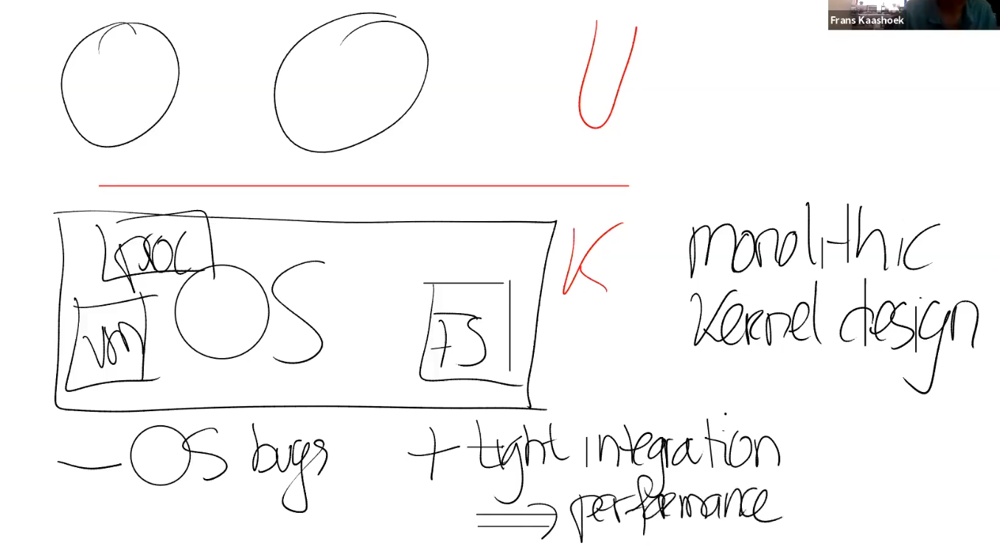

缺点：

* 代码量大，导致容易出kernel bug。
* kernel为通用目的设置，拖累了其在特殊场合的性能。
* 提供的高层接口，应用对kernel没有太多的干预能力。
* 可扩展性差，用户很难更新kernel。

宏内核通常提供强大的抽象接口。

## Micro Kernel

Kernel process只有最基础的几个模块（IPC及其他重要模块），其他模块都在user space中提供。

各个模块通过IPC来通信。

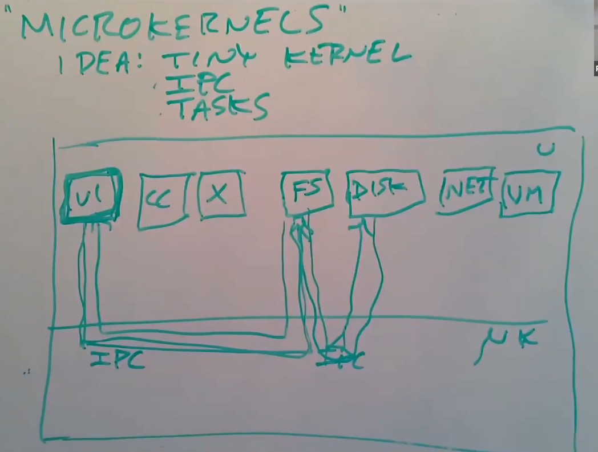

优点：

* 代码量小，kernel容易维护，不容易出bug，kernel更安全。
* 操作系统的组件更容易替换。
* 健壮性更强。

缺点：性能不佳，system call导致2次kernel/user mode切换，kernel模块之间不容易共享数据。

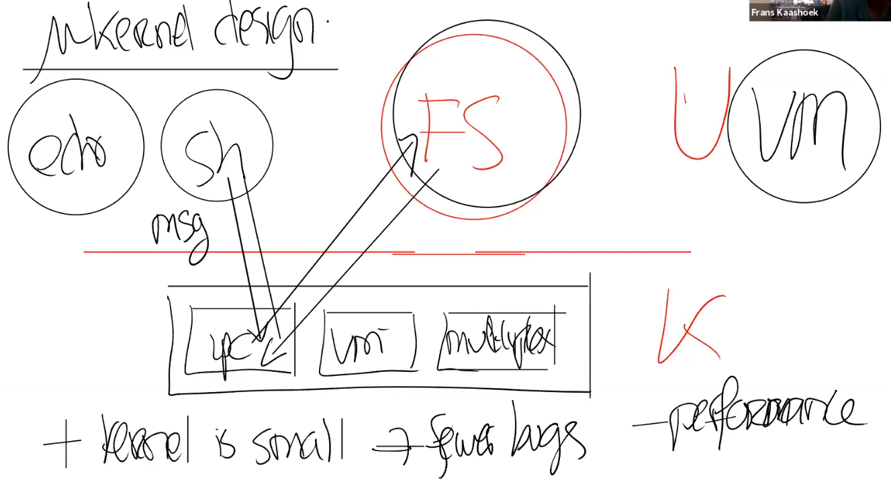

*NOTE:在嵌入式系统或专门为某些用途设计的系统中，微内核系统通常比宏内核好。*

## L4 Micro Kernel

L4只有7个System Call，大约`13000`行代码。

只有最少的基本抽象：
* Task - 对应其他系统的process，每个task可以有多个threads。
* IPC - 每个task都有一个标识符，task之间可以通过对方的标识符发送消息。

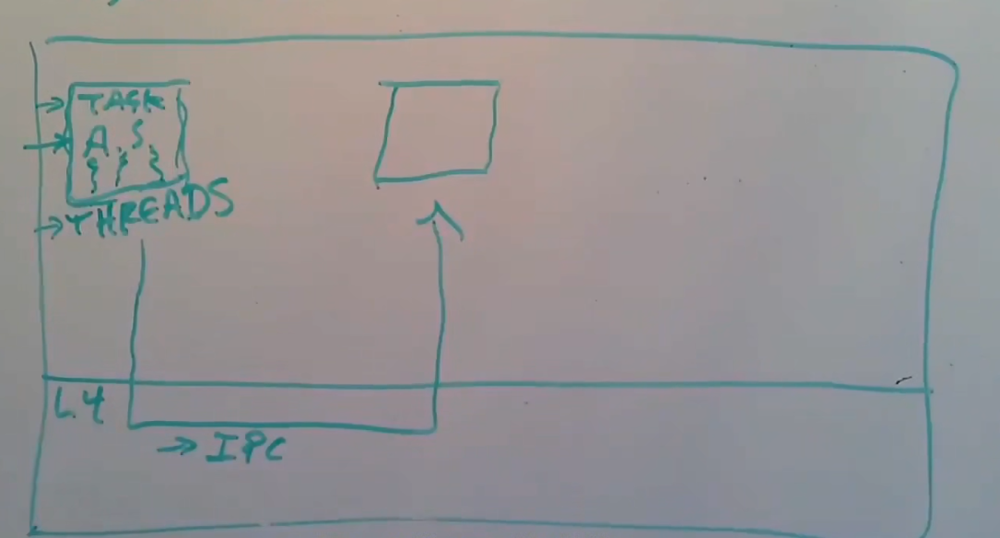

L4 System Call：
* `Thread Create` - 创建线程并分配到指定地址空间，如果地址空间不存在那么就产生一个新的task。
* `Send/Recv IPC` - 发送、接收IPC消息。
* `Mapping` - 修改任意task地址空间的映射（需要权限）。
* `Dev Access` - 特权task可以将设备的控制寄存器映射到地址空间中。
* `Intr` - 将指定中断转换成发送给task的IPC消息。
* `Page Fault` - 将某个task的page fault转换成发送给task的IPC消息。
* `Yield` - 让出CPU直到某个事件发生。

在Micro Kernel中，IPC需要尽可能地快，系统的许多模块依赖IPC。

### Unix Pipe

`P1`调用`send()`发送消息时，将消息复制到kernel的buffer中然后返回，当`P2`调用`recv()`时去kernel获取消息。

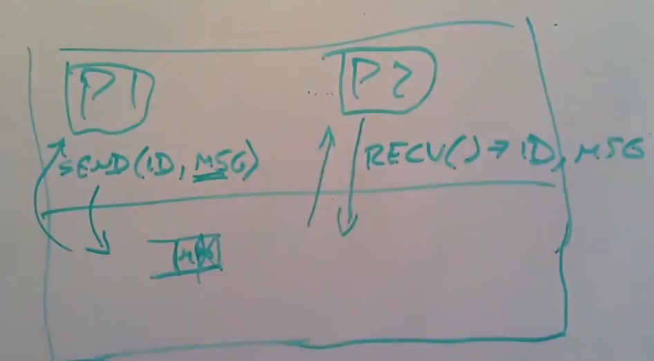

Asynchronize Buffered System（异步缓存系统）。

*NOTE:这种方式比较慢。*

### L4 Fast IPC

`P1`调用`send()`时将等待`P2`调用`recv()`，当`P1`、`P2`都进入kernel，就如同产生一次context switch，同时kernel将直接把数据从`P1`的address space拷贝到`P2`的address space。

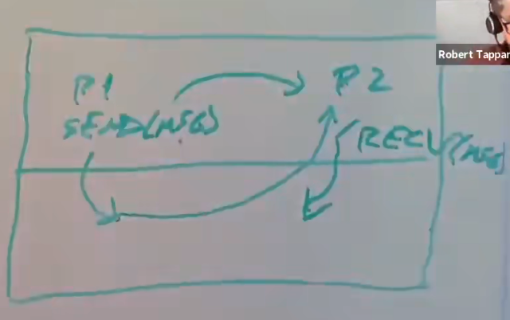

Synchronize Unbuffered System（同步非缓存系统）。

*NOTE：如果消息非常小，还可以通过寄存器传递，而不需要拷贝内存，称为Zero-Copy。*

*NOTE：对于长信息L4可以携带一个Page Mapping，将`P1`的内存映射到`P2`中。*

同时L4提供一个`call()`系统调用，将`send()`和`recv()`结合到一起，减少系统调用的开销。

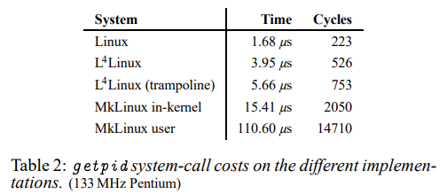

为了使micro kernel获得完整的宏内核功能，最直接的方式是修改宏内核系统，然后将其作为一个user level process运行。

将宏内核的进程映射为微内核的进程，然后让宏内核process处理其他进程的system call。

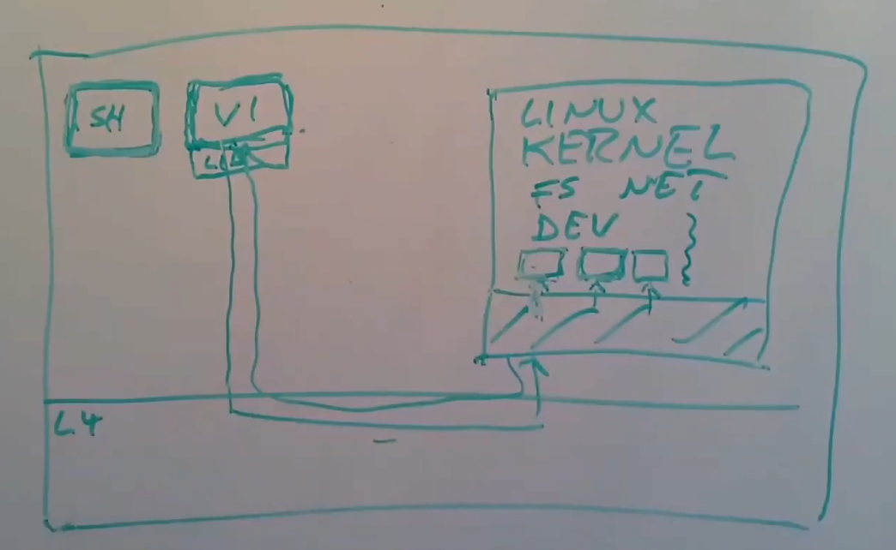

*NOTE:但是调度工作依旧由微内核完成。*

IPC在System Call的占比越小（例如文件操作），微内核的性能越好（因为IPC对System Call的影响不明显了）。

## Hyrid Kernel

混合内核将kernel的关键部分（例如虚拟内存、文件系统）使用宏内核的方式构建，其他部分（例如设备驱动程序）使用微内核的方式构建。

*NOTE:Windows、macOS都采用了这种方式。*

## Compile Process of Kernel

Compiler将C Source File编译成.S 汇编文件。

Assembler将.S 汇编文件编译成.O 二进制对象文件。

Linker将所有的.O链接到一起产生完整kernel可执行文件。

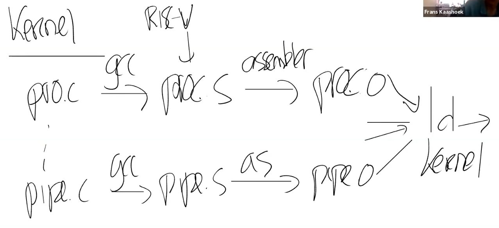

