# Page Faults

Virtual Memory的两个优点：
1. Isolation - 每个应用的内存彼此分离。
2. Provide a level of indirection - 提供了一个间接层，使kernel能提供更多的功能。

Kernel需要以下信息才能响应Page Faults：
* Faulting virtual address（发生page fault的虚拟地址） - 当产生page fault时硬件（RISC-V）会将faulting virtual address 放入 `STVAL`寄存器中，并产生中断，切换到kernel mode。
*  Type of the fault - 错误的类型（出错的原因） - 当产生中断时，硬件（RISC-V）会将中断的原因放在`SCAUSE`寄存器中。

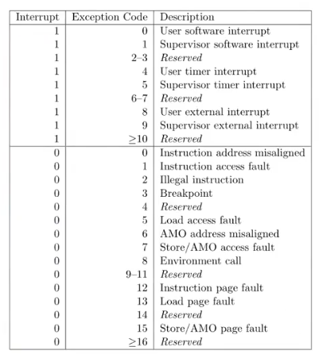

* 触发Page fault的指令的地址（以便我们处理之后重试这条指令） - 当产生中断时，硬件（RISC-V）会将中断的指令放在`SEPC`寄存器中。

## Lazy Allocation

`sbrk()`系统调用，用于扩大应用的堆内存。

kernel为每一个process维护一个指针（存储在process结构中），当`sbrk()`被调用时，对指针进行操作，并返回操作后的值。

通常使用`sbrk(0)`获得heap指针的地址。

使用`sbrk(N)`，扩大和缩小heap指针。

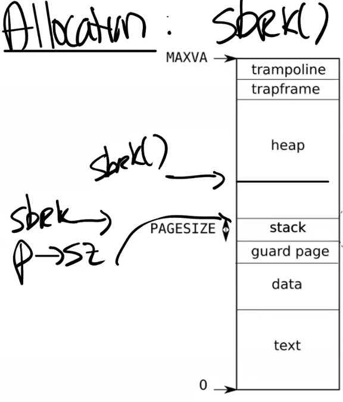

`sbrk()`的行为：

* Eager allocation - 当`sbrk()`被调用且heap扩大时，kernel分配一些物理内存然后映射到应用的虚拟内存中，将这些内存初始化为`0`，然后返回。
* Lazy allocation -  当`sbrk()`被调用时，kernel只调整heap指针然后返回，当page fault产生时，kernel再分配一些物理内存然后映射到应用的虚拟内存中，然后将这些内存初始化为`0`，最后重试page fault的指令。

`sbrk()`调整heap指针。

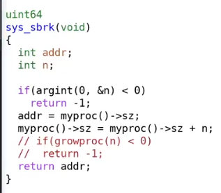

处理page fault中断：

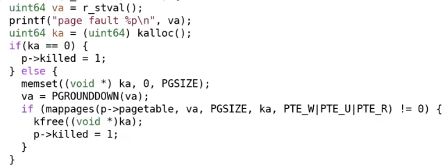

程序结束时释放所有内存：

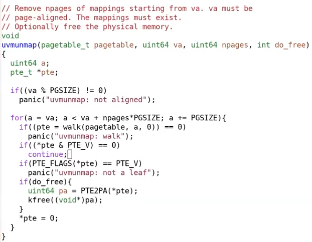

当多个page拥有相同的内容（例如程序的`BSS`段会被0初始化），可以使多个page指向一个相同的Read only page。

当该page产生store page fault时，再分配一个可写的page，更新PTE。

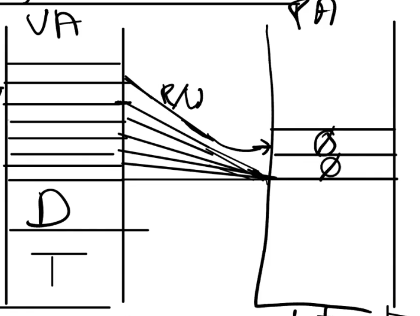

## Copy On Write Fork

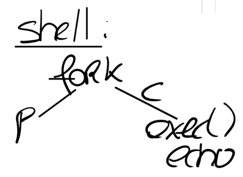

当`fork()`被调用时，子进程将共享父进程的page（PTE会被设置成read only），而不是copy父进程的page。

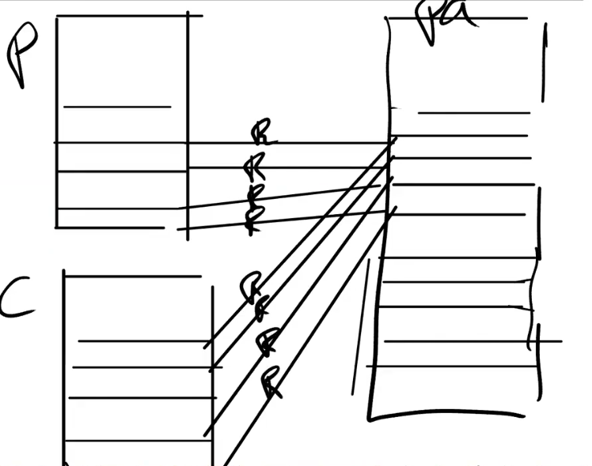

当父进程或者子进程对该page进行write时，才真正执行copy。

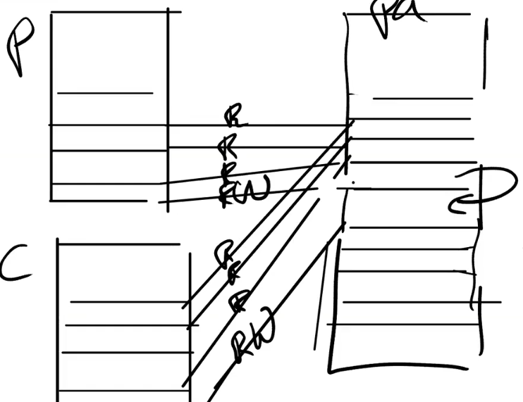

这样能显著提高`fork()`的性能。

kernel使用PTE的`RSW`来分辨该page是一般的read only page还是COW page。

当子进程或者父进程退出时，要根据`RSW`来判断，能否立即释放这个page。

我们需要为每一个COW Page维护一个reference count（引用计数）。

当释放page时，将COW Page的RC减一，当它为0时，释放physical page。

这意味着需要在kernel维护一些额外数据结构。

## Demand Paging

程序的二进制文件十分巨大，如果`exec()` eager地将程序的段load到内存中，会带来大量开销。

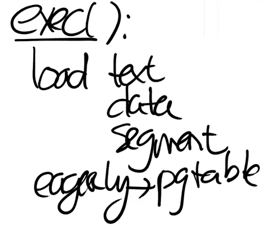

然而我们并不需要eager地load这些数据。

我们将它们放入page table中，但是将PTE的`valid`设置为`0`。

当这些内存被访问时，引发一个Page Fault，然后我们在kernel中将这些数据从file中读出，并映射进内存，最后重试指令。

## Out Of Physical Memory

当物理内存被用完，那么我们需要将一个page写入到分页文件中。

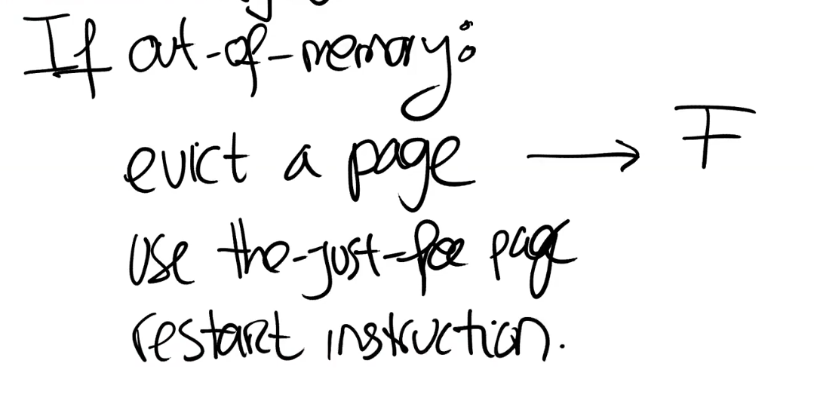

选择page写入分页文件：
* 根据LRU选择 - PTE提供了`Access`字段来判断page是否刚刚被访问过，基于它可以实现类LRU算法（例如：`CLOCK`算法）。
* 根据dirty flag选择 - 如果page是non-dirty的，只需要做很少的工作（即将PTE的`Vailed`设置为`0`然后重新使用这个page），反之则需要向分页文件写入数据。

*NOTE:不进行跨进程换页，会更容易实现。*

## Memory Mapping Files

现代OS通常提供`mmap()`系统调用。

`mmap()`将file的一部分或者全部映射到内存（通常是lazy的方式,kernel会记住这个virtual address与一个fd关联）。

产生page fault时，将file的数据读入内存。

当调用`unmmap()`时，将数据落盘。

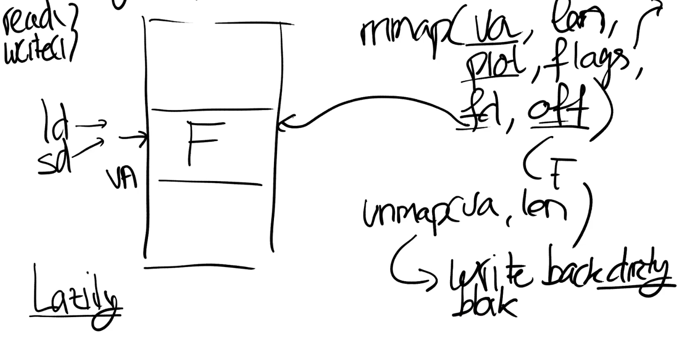