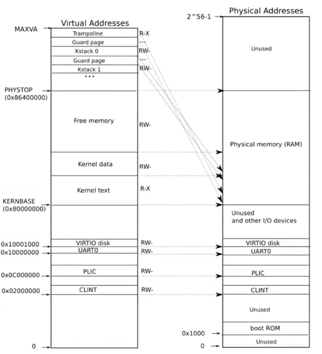

# Page Tables

## Address Space

每个process都有private的address space（地址空间）。

process的address space彼此隔离。

address space可以比physical memory更大，通过page table处理这种情况。

## Paging Hardware(RSIC-V)

page table需要硬件实现。

通常由MMU进行地址转换，将address space的virtual address（虚拟地址）转换成physical address（物理地址）。


通常page table也保存在内存中。

所以CPU有一些特殊的**寄存器**记录了page table的地址。

在`RSIC-V`处理器中，会有一个`SATP`寄存器保存page table的地址。

进行转换时，CPU会将此寄存器的值，发送给MMU。

**MMU本身并不存储page table和page table的指针。**

当OS切换process时，也会用新的page table地址替换`SATP`寄存器的旧值。

*NOTE:OS切换procees时还需要清除TLB。*

只有在kernel mode下才能更新`SATP`寄存器。


Virtual Address通常分为三部分：
1. EXT - 被硬件忽略。
2. Index - Index是该page在page table中的index。
3. Offset - Offset是页偏移，表示实际使用的是哪个byte。

```c
void *physical_address = page_table[virtual_address.index].address + virtual_address.offset; 
```

page table中的每一项（Page Table Entry，PTE）通常包含：
1. PPN（physical page number） - 物理内存的页号。
2. Flags - 这个页的标志。

`RSIC-V` PTE结构如下：


PTE包含很多权限Flags：

* Vaild - 长度 `1 bit`，为 `1` 代表该PTE有效。
* Readable - 长度 `1 bit`，为 `1` 代表所引用的page可读。
* Writable - 长度 `1 bit`，为 `1` 代表所引用的page可写。
* Executable - 长度 `1 bit`，为 `1` 代表所引用的page可执行。
* User - 长度 `1 bit`，为 `1` 代表所引用的page可以被运行在user space的process访问。
* Global - 长度 `1 bit`，为 `1` 代表所引用的page。
* RSW - 长度 `2 bits`，Resevered for supervisor software，为kernel预留。

另一些Flags用于支持`swap`（通常是`Clock替换算法`）：

* Accessed - 长度 `1 bit`，为 `1` 代表所引用的page刚刚被访问过。
* Dirty - 长度 `1 bit`，为 `1` 代表所引用的page是dirty page（脏页）。

*NOTE:Clock是一种模拟LRU算法。*

实际上，大多数page table都是多级页表。

index会被分成几个部分。

例如`RISC-V`使用3级页表的设置，将index分成了`L1`、`L2`、`L3`三个等级。

每个等级称为一个页目录（Page Directory）。


`L1`是第一级页目录的索引，`L2`是第二级页目录的索引，**第一、二级页目录记录了下一级页目录的地址表。**

`L3`是第三级页目录的索引，**第三级页目录记录了虚拟地址到物理地址的映射。**

**同样，多级页表也是由硬件实现的**。

`SATP`只记录指向最高级页目录的指针，然后我们使用index将虚拟地址转换成物理地址。

使用多级页表的优势：如果页表的大多数PTE是无效的，那么你无需为此分配空间（代价是每一次内存地址转换需要进行三次内存读写，这使得转换操作变得昂贵）。

**所有的Page Driectory总是常驻内存，所以`SATP`总是存储物理地址。**

*NOTE:我们不能让page directory存储virtual address，否则会陷入无限循环。*

每一个Page Directory必须存储在按page对齐的memory中，**因为我们通过PPN索引page directory，这不允许offset。**

为了解决转换操作过于缓慢的问题，**CPU使用TLB（translation look-side buffer）来缓存转换的结果。**

TLB是PTE的缓存，它使用与CPU高速缓存同样的昂贵部件（SRAM），**TLB硬件在CPU Core中**。

在`RISC-V`中清除TLB的指令是`sfence_vma`。

同时OS也需要使用软件完成地址转换工作，**因为我们需要在kernel访问user space process的内存。**

如果一个地址不能被翻译，那么MMU将产生一个Page Fault（页错误）。

同时OS将介入，完成一些操作。

## Implmentation

硬件（主板）决定了虚拟内存（Virtual Memory）的布局（因为主板决定了对该地址的读写应该进入DRAM还是I/O设备）。



`RISC-V`决定了，kernel从`0x80000000`处加载。

同时以`0x80000000`为分界线，低于`0x80000000`则代表不同的I/O设备，而不是物理内存。

通常处理器的手册会说明不同的地址映射到哪个I/O设备。

常见I/O设备：
* boot ROM - 主板通电后第一段要执行的不可改变（ROM）的代码，当boot ROM执行完成后，跳转到特定地址（`RISC-V`中为`0x80000000`）。
* PLIC（Platform-Level Interrupt Controller） - 中断控制器，负责将中断路由到合适的处理函数。
* CLINT（Core Local Interruptor） - Core本地中断控制器，负责将中断路由到合适的处理函数。
* UART（Universal Asynchronous Receiver/Transmitter） - 通用异步收发器，负责Console与显示器交互 。
* VARTIO disk - 负责与磁盘交互。

`Guard Page`没有任何映射，它的PTE valid始终为0，仅仅用于触发Page Fault（当对Kernel Stack的访问引发越界时），这样OS可以介入并处理Panic。

