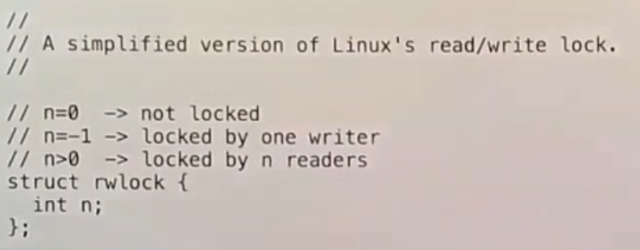

# RCU

RCU能在面对需要频繁读但是不需要频繁写的共享数据时，获得更好的性能。

多个线程可以并行的读取数据结构，但是一定出现任何一个写入操作，就必须采取一定的措施保护数据结构。

使用spin lock会使所有线程在读取和操作结构之前都加锁，这极大减低了可扩展性（即使这个临界区很小）。

因为如果多个线程同时读取数据结构也会受到spin lock限制而不得不串行。

## Read Write Lock

为了解决spin lock带来的问题，我们构造了Read Write Lock（读写锁，rw lock）。

它允许多个threads并行读或者一个thread独占写。

rw lock内部维护一个counter，记录当前reader的数量。

执行当这个counter为负数时，则代表writer占用该锁。

`r_lock()`将不断自旋，直到`counter > 0`，且成功将`counter`递增。

`w_lock()`则是简单的CAS操作，如果`counter = 0`（代表没有reader），就将`counter`设置为`-1`。

`r_lock()`部分解决了问题，但即使是没有writer，多个reader执行`r_lock()`时依然有较大的开销（CAS操作）。

并且CAS操作会造成一段时间（即使非常短）的串行，这意味着对于一个具有`n`个threads来说，执行`r_lock()`的成本是<code>O(n2)</code>。

## Read Copying Update(RCU)

为了解决rw lock的问题，我们重新设计数据结构使reader完全不使用lock，只有writer需要使用lock。

对于数据结构，一共有三种写操作：
* writer修改了某个节点的content。
* writer插入了一个节点。
* writer删除了一个节点。

当writer修改reader正在读取的节点的content时，reader可能读到脏数据。

当writer往某个位置插入节点时，writer可能在初始化完节点之前修改pointer，reader可能读到脏数据，并且该节点的next通常是不正确的。

当writer在删除节点时，如果reader正在读取该节点就会产生一场灾难，这同时也是最危险的情况。

RCU首先禁止writer原地更新节点，所有的更新必须在一个拷贝上进行。

然后该拷贝将替换原来的节点（committing write，通过单条原子指令实现原子修改）。

但是原来的节点将保留一点时间，直到我们确定没有reader在使用它。

*NOTE:双向链表并不适合RCU，但是tree很适合。*

为了使committing write能够工作，必须拷贝那些不变的部分。

同时需要memory barrier，防止指令重排。

需要确保committing write在写操作的最后一步。

并且读操作在reader的第一步。

## Reclamation

一种确定何时回收的方法是引用计数（Reference Counter，RC）。

让reader在开始读之前将节点的`rc`递增。

但是会产生与rw lock相同的问题（对`counter`的CAS递增操作）。

另一种可能是使用带GC的语言，这样GC就可以解决这个麻烦。

然而在kernel中，有一种非常有效的方法确定节点释放的时机：
* reader不能在RCU临界区中进行context switch。
* writer将延迟节点的释放，直到所有的reader线程都进行过一次context switch。

最简单的方式是调整调度器，使write thread在每一个core中都短暂地运行一次，这样每一个reader thread都进行了一次context switch（`synchronize_rcu()`）。

一种更好的方式时，记录所有thread的context switch次数，并且提供异步的函数，将要回收的pointer注册到一个回收列表中（`call_rcu()`）。

|Read|Write|
|-|-|
|||

*NOTE:这里的`rcu_read_lock()`只是关闭时钟中断，阻止上下文切换。*

*NOTE:因为RCU临界区会阻止context switch，所以要使它尽可能地小，同时不能返回任何指向被RCU保护的数据结构的指针，但可以返回一个拷贝。*

如果你使用RCU，数据读取会非常的快，除了读取数据本身的开销之外就几乎没有别的额外的开销了。

对于数据写入者，性能会更加的糟糕：
* 获取锁和释放锁。
* 一个可能非常耗时的`synchronize_rcu()`调用。

应用RCU的条件：
* 数据结构在更新时，需要能支持单个操作的committing write。
* 允许reader读到旧数据（例如在获取节点指针之后，但是不立刻读取它）。
* 读操作多于写操作。

RCU能工作的核心思想是为资源释放（Garbage Collection）增加了grace period（宽限期），在grace period中会确保所有的数据读取者都使用完了数据。所以尽管RCU是一种同步技术，也可以将其看做是一种特殊的GC技术。

*NOTE:在user space中也可以使用RCU，但是需要配合QSBR（Quiescent-State Reclamation）和EBR（Epoch Based Reclamation）使用。*

## Write Heavy Datta

在一些特殊场景中，写操作频繁的数据也可以获取好的性能，但是还不知道存在类似RCU这样通用的方法能优化写操作频繁的数据。

但仍然有一些思路可以值得借鉴：
* 最有效的方法就是重新构造你的数据结构，这样它就不是共享的。
* 某些时候你又的确需要共享的数据，而这些共享数据并没有必要被不同的CPU写入。