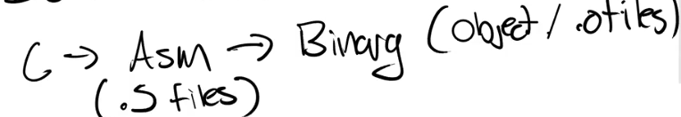
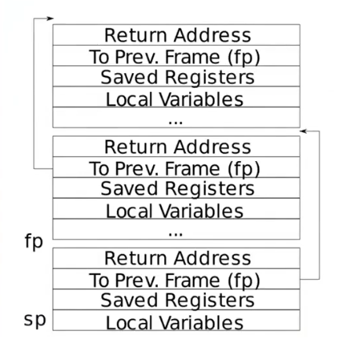

# RISC-V Calling Convention and Stack Frame

## C、Assembly & Processers

Processers 不能理解C语言，它们能理解的是instruction sets（ISA，指令集）。

每条指令（不包括伪指令）都有相应的binary coe或op code。

C Code需要先编译才能被Processers理解和执行。

## RISC-V Calling Convention

RISC-V寄存器：
|Register(ABI Name)|Description|Saver|
|-|-|-|
|zero|零寄存器，总是保存0|-|
|ra|返回地址|由调用者保存|
|sp|栈指针|由被调用者保存|
|gp|全局指针|-|
|tp|线程指针|-|
|t0|临时寄存器0|由调用者保存|
|t1|临时寄存器1|由调用者保存|
|t2|临时寄存器2|由调用者保存|
|S0/fp|保存寄存器0/帧指针|由被调用者保存|
|s1|保存寄存器1|由被调用者保存|
|a0|函数参数寄存器0/返回值寄存器0|由调用者保存|
|a1|函数参数寄存器1/返回值寄存器1|由调用者保存|
|a2|函数参数寄存器2|由调用者保存|
|a3|函数参数寄存器3|由调用者保存|
|a4|函数参数寄存器4|由调用者保存|
|a5|函数参数寄存器5|由调用者保存|
|a6|函数参数寄存器6|由调用者保存|
|a7|函数参数寄存器7|由调用者保存|
|s2|保存寄存器2|由被调用者保存|
|s3|保存寄存器3|由被调用者保存|
|s4|保存寄存器4|由被调用者保存|
|s5|保存寄存器5|由被调用者保存|
|s6|保存寄存器6|由被调用者保存|
|s7|保存寄存器7|由被调用者保存|
|s8|保存寄存器8|由被调用者保存|
|s9|保存寄存器9|由被调用者保存|
|s10|保存寄存器10|由被调用者保存|
|s11|保存寄存器11|由被调用者保存|
|t3|临时寄存器3|由调用者保存|
|t4|临时寄存器4|由调用者保存|
|t5|临时寄存器5|由调用者保存|
|t6|临时寄存器6|由调用者保存|
|ft0|浮点临时寄存器0|由调用者保存|
|ft1|浮点临时寄存器1|由调用者保存|
|ft2|浮点临时寄存器2|由调用者保存|
|ft3|浮点临时寄存器3|由调用者保存|
|ft4|浮点临时寄存器4|由调用者保存|
|ft5|浮点临时寄存器5|由调用者保存|
|ft6|浮点临时寄存器6|由调用者保存|
|ft7|浮点临时寄存器7|由调用者保存|
|fs0|浮点保存寄存器0|由被调用者保存|
|fs1|浮点保存寄存器1|由被调用者保存|
|fa0|浮点函数参数寄存器0/浮点返回值寄存器0|由调用者保存|
|fa1|浮点函数参数寄存器1/浮点返回值寄存器1|由调用者保存|
|fa2|浮点函数参数寄存器2|由调用者保存|
|fa3|浮点函数参数寄存器3|由调用者保存|
|fa4|浮点函数参数寄存器4|由调用者保存|
|fa5|浮点函数参数寄存器5|由调用者保存|
|fa6|浮点函数参数寄存器6|由调用者保存|
|fa7|浮点函数参数寄存器7|由调用者保存|
|fs2|浮点保存寄存器2|由被调用者保存|
|fs3|浮点保存寄存器3|由被调用者保存|
|fs4|浮点保存寄存器4|由被调用者保存|
|fs5|浮点保存寄存器5|由被调用者保存|
|fs6|浮点保存寄存器6|由被调用者保存|
|fs7|浮点保存寄存器7|由被调用者保存|
|fs8|浮点保存寄存器8|由被调用者保存|
|fs9|浮点保存寄存器9|由被调用者保存|
|fs10|浮点保存寄存器10|由被调用者保存|
|fs11|浮点保存寄存器11|由被调用者保存|
|ft8|浮点临时寄存器8|由调用者保存|
|ft9|浮点临时寄存器9|由调用者保存|
|ft10|浮点临时寄存器10|由调用者保存|
|ft11|浮点临时寄存器11|由调用者保存|

当用完参数寄存器时，需要使用内存传递参数。

## Stack Frame

栈从高地址向低地址增长，当分配栈空间时，我们只需要减少sp。

每一个函数调用就产生一个栈帧（stack frame）。

每一个栈帧由fp到sp构成。

fp指向当前帧的top。

sp指针栈底。

Return Address（返回地址）总是在栈帧的第一位。

接着是Prev Frame Pointer，上一个帧指针。

一个汇编函数由三个部分组成：
1. Function Prologue - 负责创建栈帧。
2. Body。
3. Function Epllogue - 负责弹出栈帧。