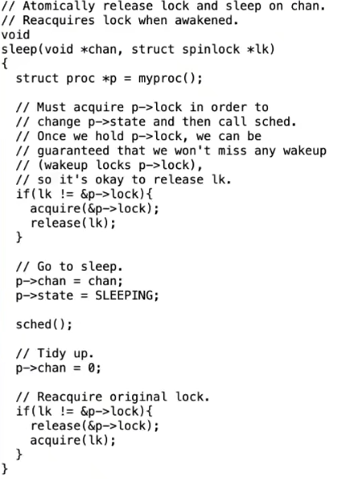

# Sleep And Wakeup

kernel通过`sleep()`和`wakeup()`函数进行协作。

`sleep()`与`wakeup()`用于处理kernel thread希望等待某些事件发生的情况，这些事件通常来自I/O或者其他进程。

实现协作最简单的方式是循环实现busy wait（忙等待）。

`sleep()`和`wakeup()`与busy wait不同，它们yield CPU来实现协作。

*NOTE:`sleep()`和`wakeup()`机制与condition variable（条件变量）相似。*

`sleep()`与`wakeup()`总是成对出现，并且需要某种方式将`sleep()`和`wakup()`连接起来。

在`sleep()`前获得锁，是为了防止lost wakeup发生，如果手动解锁，而不是在`sleep()`中解锁，`release()`与`sleep()`之间`wakeup()`被执行了（例如其他thread收到中断），那么这次唤醒就会被丢失。

使用`while`循环是为了防止虚假唤醒，因为`wakeup()`之后thread并不是立即执行，`while`的条件可能发生变化。

`sleep()`必须是一个原子操作，释放锁和修改状态为`Sleeping`不可分割，并且最后`sleep()`还要执行`acquire()`获取lock（这样`while`才能正常工作）。

## Sleep Lock

Sleep Lock是一个特别的spin lock，它使进程在无法获得lock时sleep。

|`acquire()`|`release()`|
|-|-|
|||

使用Sleep Lock的原因：
* 临界区需要很长的时间才能执行完成。
* 我们希望在临界区中打开中断。

## Kernel Thread Exit

我们不能粗暴地终止一个kernel thread：
* 该kernel thread可能正在更新kernel data structure，我们不能在它完全更新前kill掉它。
* 该kernel thread可能持有着lock。
* kernel可能运行在多个核上，该kernel thread可能正在被某个核运行。
* 即使该kernel thread打算自杀，它仍然拥有运行代码所需的资源（例如stack），而执行`exit()`需要那些资源。

`exit()`首先要关闭所有打开的文件。

释放对当前工作目录（Current Work Directory，cwd）的引用。

*NOTE:获取parent process时加锁，是为了处理子进程与父进程同时退出的情况，让process唤醒正确的“父进程”。*

将该process的子进程设置为`init`进程。

*NOTE:正在退出的进程会获取自己的lock，这时唤醒父进程与设置自己的状态为`Zombie`的顺序就不再重要。*

唤醒自己的父进程，并把自己的状态改成`Zombie`等待父进程的回收。

这时process的生命还没有完全结束，还有一些资源需要父进程回收。

此时，父进程需要调用`wait()`完成对`Zombie`状态进程的回收。

`wait()`首先寻找任何父进程是当前进程的`Zombie`进程。

然后父进程调用`freeproc()`函数完成对子进程的回收。

`kill()`系统调用只是简单地设置`process`结构的`killed`标记。

被杀死的process将在运行到内核代码安全的停止运行的位置时执行`exit()`。

所以从`sleep()`醒来时，如果在此时能够退出进程，就应该检查`killed`是否被设置了，如果是就退出进程。

如果不能退出，说明现在退出是不安全的，会在完成全部操作后退出。

*NOTE:init进程永不退出，如果init进程退出将产生panic。*