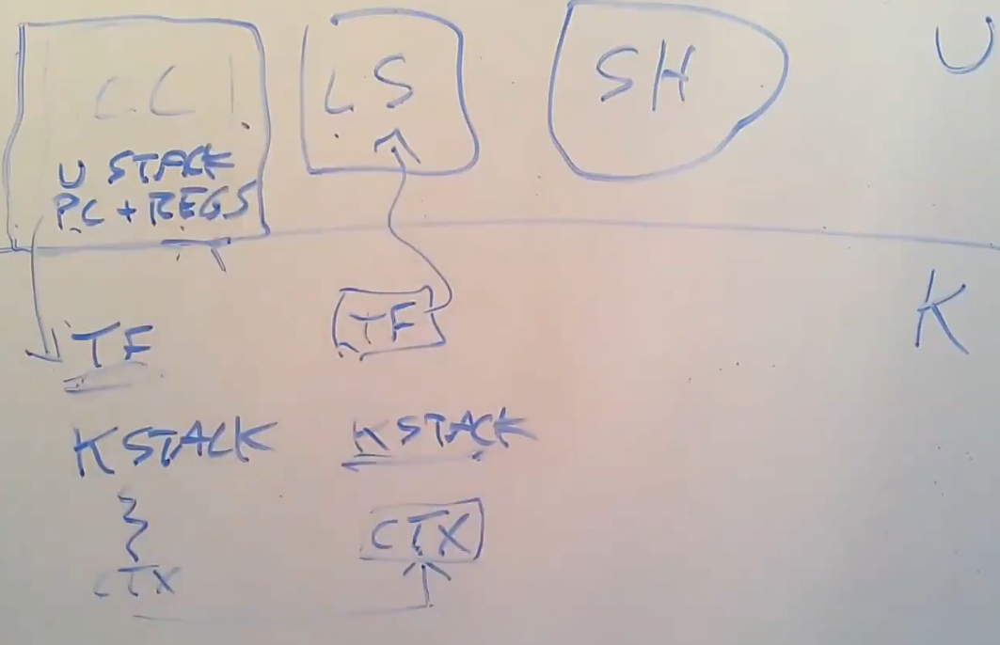
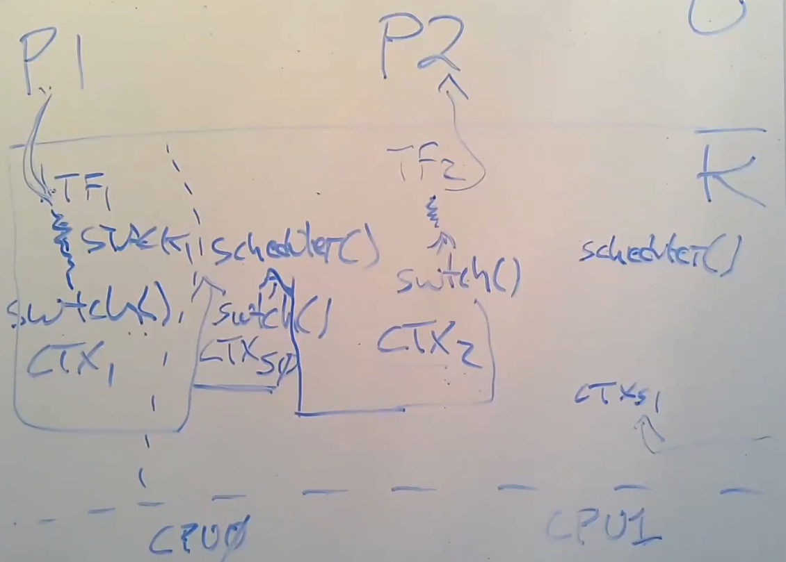
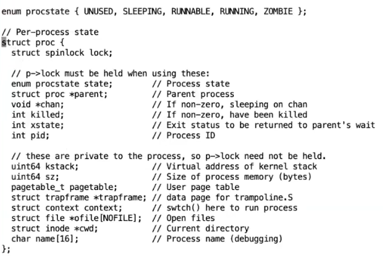
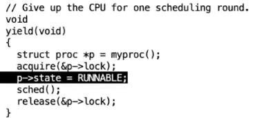
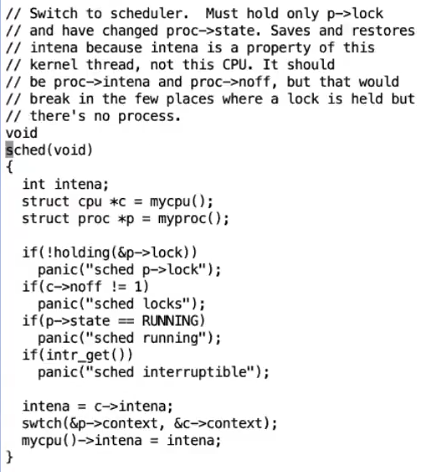
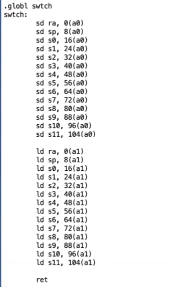
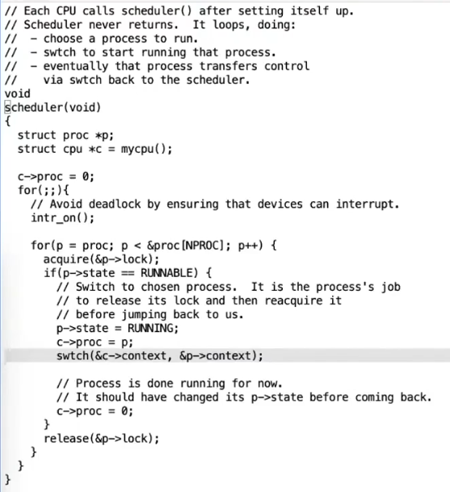
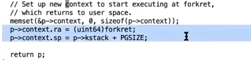
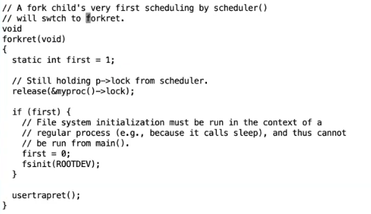
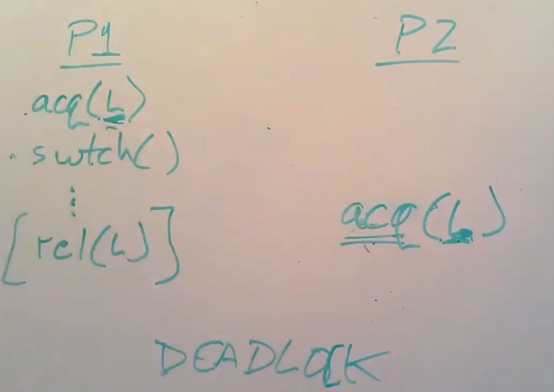

# Thread Switching

为什么需要线程：
* 人们希望计算机同时执行多个任务。
* Threads让程序的结构更简单。
* 在多核处理器上，thread能获得更快的速度。

一个线程可以认为是一个串行执行代码的单元。

Thread State由以下几个部分组成：
* PC - 程序计数器。
* Registers - 寄存器。
* Stack - 每一个thread都有自己的栈。

Kernel的任务就是管理threads，并使它们能够成功执行。

主要有两种策略：
* 在多核处理器上使用多个CPU，每个CPU运行一个线程（不能有太多线程，因为核心数与线程数严格对应）。
* 一个CPU在不同的线程中切换（适合有大量线程，但会有切换开销）。

大多数OS结合使用两种策略，即使用多个CPU并让它们在不同的threads上切换。

不同的线程系统之间的主要区别是：线程之间是否会共享内存。

一种可能是多个线程都运行在一个地址空间中。

一种是多个线程之间彼此隔离。

OS可以结合使用这两种设计。

XV6 Kernel线程共享了内存，但是XV6 User Process没有（每一个user process都需要一个kernel thread运行，在这种情况下，kernel thread之间没有共享内存）。

在更复杂的操作系统中，允许一个user process包含多个threads。

## Implment Switching

通常kernel会为每一个core都创建一个scheduler（调度器）。

当从一个thread切换到另一个thread时，需要保存和恢复thread的状态。

所以我们需要决定线程的哪些信息是需要保存的，以及保存在哪里。

如何处理需要长时间运行的线程：
* 抢占式调度 - 使用计时器中断（Timer Interrupt），在其interrupt handler中yield（出让）CPU给scheduler。


* 自愿调度 - 由user process/thread检查是否要yield CPU。

Kernel需要区分几类threads（thread的状态）：
* Running - 正在处理器上运行的thread。
* Runnable - 想要运行，但目前没有在处理器上运行的thread。
* Sleeping - 不想在处理器上进行的thread（这些thread可能在等待I/O事件）。

线程通过yield，改变自身的状态（从Running变成Runnable）。

对于每一个runnable的thread，我们都需要保存他处在running状态下的CPU状态（即PC和Registers）。

当定时器中断产生时，XV6 kernel会将process的CPU状态，保存到trapframe中，然后转移到kernel stack上运行。

然后将kernel thread的寄存器和PC保存在kernel context中，切换到另一个process的kernel context上恢复那个kernel thread。

*NOTE:每一个process都有他的kernel stack。*

最后kernel thread从trapframe中获得该process的CPU状态，返回到user space中。



*NOTE:因为另一个thread可能在kernel mode时被中断（例如执行系统调用返回前，产生了定时器中断），所以我们不能执行user process到user process的直接切换。*

实际上，我们并不会直接switch到process的kernel thread上，而是switch到该cpu core对应的kernel scheduler thread上。

然后kernel scheduler thread找出一个runnable thread，将自己的上下文保存，然后切换到该kernel thread context上。



*NOTE:每一个CPU Core都有对应的scheduler线程，scheduler线程执行的代码叫schedule loop。*



XV6将process的kernel thread context保存在`process`结构的`context`字段中，将kernel scheduler thread的context保存在`cpu`结构的`context`字段中。

*NOTE:process的kernel thread context可以保存在任何与process有关的结构中（例如trapframe）。*

*NOTE:XV6的进程只有一个用户空间线程和一个kernel thread。*




此处必须持有lock，因为修改状态时可能被其他cpu core观测到。

一个process运行在两个CPU上将导致灾难性后果（因为他们共享一个stack）。

*NOTE:此处的`acquire()`和`release()`之间隔了一次thread切换,因为后面的代码修改了switch的`ra`。*





*NOTE:挂起过程不需要保存PC，因为我们知道PC一定与`ra`寄存器相同。*

恢复过程利用`ra`寄存器修改`ret`的返回地址。

由于`schedule`函数像一个普通函数一样调用，由`caller`负责保存的寄存器已经被保存在原来的栈上，所以不需要在context中额外保存这些寄存器，只需要保存由`callee`负责保存的寄存器。

`ret`之后返回到schedule loop，该代码会释放到该`process`结构的锁。



*NOTE:lock的作用除了修改thread的状态，还有关闭中断，切换过程不能被中断打断（因为我们可能在完全恢复寄存器之前接收中断）。*

使用这种方式创建process时必须初始化一个假的context。



*NOTE:记得释放之前acquire的lock。*



当kernel thread在调用`switch()`时不允许拥有任何其他locks，他只能持有`process`结构的lock。

当kernel thread持有锁时执行`switch()`，如果下一个thread也需要这个锁，那么我们会在单核场景下引发死锁（因为被`switch()`的线程持有该线程需要的锁，而`acquire()`会关闭中断，所以时钟中断无法帮助我们，避免死锁），多核场景下也有类似的情况（即持有多个锁时可能产生）。



## Timer Interrupt

Timer Interrupt是由Timer触发的中断，既可以由usertrap处理，也可以由kerneltrap处理。

即进程无论是处于kernel Mode还是User Mode，都应该能处理Timer Interrupt。

不过对于 **riscv** 来说，Timer Interrupt是一种非常特殊的Interrupt，具体表现在以下几个方面：

* Timer 由CPU中的定时器周期触发。
* 处理时，CPU处于Machine Mode，而非Kernel Mode。
* 不可被屏蔽。
* 不进行虚拟地址转换（这意味处理函数指针着必须是物理地址）。

xv6使用软中断的方式处理timer interrupt。

```asm
timervec:
        # start.c has set up the memory that mscratch points to:
        # scratch[0,8,16] : register save area.
        # scratch[32] : address of CLINT's MTIMECMP register.
        # scratch[40] : desired interval between interrupts.

        csrrw a0, mscratch, a0
        sd a1, 0(a0)
        sd a2, 8(a0)
        sd a3, 16(a0)

        # schedule the next timer interrupt
        # by adding interval to mtimecmp.
        ld a1, 32(a0) # CLINT_MTIMECMP(hart)
        ld a2, 40(a0) # interval
        ld a3, 0(a1)
        add a3, a3, a2
        sd a3, 0(a1)

        # raise a supervisor software interrupt.
        li a1, 2
        csrw sip, a1

        ld a3, 16(a0)
        ld a2, 8(a0)
        ld a1, 0(a0)
        csrrw a0, mscratch, a0

        mret
```

处理步骤如下：
* 将三个寄存器保存在frame中（不清楚是哪个frame，应该不是trapframe）。
* 进行一些处理。
* 写入`sip`寄存器引发中断。
* 恢复寄存器，返回。

*NOTE： 寄存器`sip`记录挂起的中断，写入值将导致新中断产生（软中断）。*

*NOTE：如果中断开启，将立即处理，如果中断关闭，则等待开启后处理。*