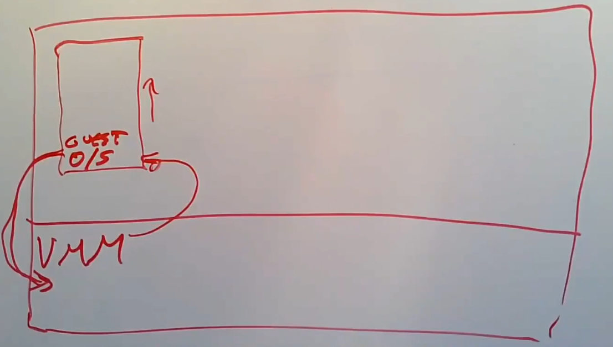

# Virtual Machines

虚拟机是对计算机的模拟器，并且这种模拟器能够运行一个操作系统。

在架构的最底层，存在一个Virtual Machine Monitor（虚拟机监视器，VMM），取代了标准的操作系统内核。

VMM的工作是模拟多个计算机来运行Guest操作系统，VMM所在的层称为Host Space（宿主空间）。

在VMM的上层，称为Guest Space（Guest空间）。

在Guest空间中，有一个或多个Guest操作系统内核。

同样在Guest Space中也存在Guest Kernel Mode和Guest User Mode。

纯软件解析（使用软件解析执行机器指令的方案）的应用并不广泛，因为它们非常缓慢。

一种广泛使用的方案是在硬件上运行Guest的指令，这种方案在Guest执行特权指令时需要特殊的方式。

## Trap And Emulate

Guest Kernel的特权指令执行方式：

* 将Guest Kernel运行在User Mode上。
* 当Guest Kernel执行特权指令时将发生trap。
* 然后由VMM去解析和执行特权指令。

VMM会为每一个Guest维护一套虚拟状态信息（Virtual State），这些状态中包含了特权寄存器的内容、Guest Mode、VMM模拟的CPU ID。

VMM同时需要保存Guest目前处于Guest Kernel Mode还是Guest User Model，因为user mode的process也会产生trap。

当Guest User Mode的process进行system call时，VMM会得到控制权，然后VMM将控制权交给OS。

当Guest设置page table时，VMM不能简单地修改虚拟状态也不能修改真正的page table寄存器（RISC-V的`SATP`寄存器）。

VMM会为每一个VM维护一个Map，这个map将Guest Physical Address转换成Host Physical Address（宿主物理地址）。

当Guest设置page table时（包括更新page table），VMM会创建一个shadow page table，这个table由Guest Page Table和VMM维护的Map组成，VMM会将Guest Physical Address替换为Host Physical Address，再设置page table寄存器。

通常有三种策略处理外部设备：
* Emulation - 当Guest使用Memory Mapping I/O操作设备的控制寄存器时，将产生page fault（address在page table中被标记为无效），VMM会模拟该设备，这种方式较慢，如果要使操作系统完全对虚拟机一无所知，这种方式是唯一可以使用的方式。
* Virtual Device - 在VMM中构建特殊的设备接口，使Guest中的驱动程序能与VMM中支持的设备进行高效交互，Guest的驱动不使用Memory Mapping I/O，而是使用在内存中的命令队列（Guest将命令发送到队列中），VMM从队列中读取这些指令然后模拟它们的结果。
* Pass Through - 某些设备硬件能够与VMM的Guest直接交互，并对多个Guest OS提供了虚拟化（例如NIC能够模拟出多个独立的NIC）。

VMM可以同时使用不同的策略，例如用Emulation提供uart设备，用Virtual Device提供disk，用Pass Through提供NIC。

## Hardware Support For Virtualization

某些硬件厂商为虚拟机提供了直接的硬件支持（例如Intel的VT-x）。

硬件将VMM的虚拟状态直接存储在硬件中，并且允许Guest用特权指令修改这些状态，VMM可以通知硬件切换到Guest Mode。

硬件有专门为Guest Mode下使用的寄存器。

VMM使用VMCS（VM Control Structure）与硬件交互，同时硬件也提供一些新的指令（例如VT-x的`VMLAUNCH`、`VMRESUME`、`VMCALL`）。

同时硬件也提供`EPT`，在Guest进行guest virtual address到guest physical address的转化时，将guest virtual address转化成host physical address。

## Dune Module In Linux

Linux的Dune模块利于硬件为process提供了隔离的功能。

允许process为它的某一段代码配置不同的page table，并处理那段代码的trap（就像OS）。

这样process对于它的某段不受信任的代码就有完全的控制能力（同时必须处理`fork`的问题，不能让不受信任的代码调用`fork`，否则会发生逃逸）。