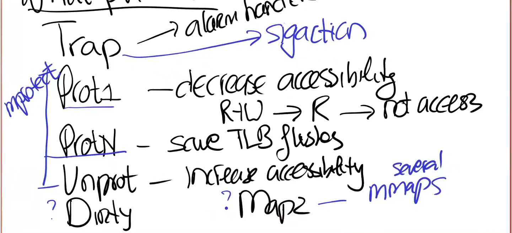
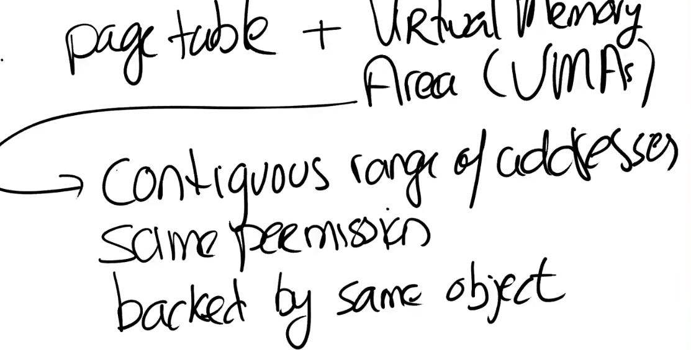
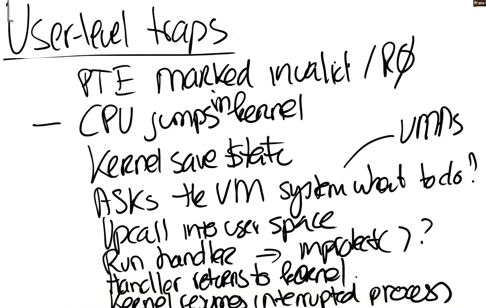

# Virtual Memory For Applications

当application也可以使用虚拟内存时，部分应用将受益，例如:
* Gabage Collection。
* Data Compression。
* Shared Virtual Memory。

要使这些应用能够使用虚拟内存，需要操作系统提供如下原语：
1. `Trap` - 允许page fault传播到user space，并由user处理。
2. `Prot1`、`ProtN` - 减低page的accessibility（PTE的RWX bits），`ProtN`相当于调用`Prot1`多次（这样能提高效率，`Prot1`需要刷新TLB）。
3. `Unprot` - 增加page的accessibility（PTE的RWX bits）。
4. `Dirty` - 查看某个page是否是脏页。
5. `Map2` - 允许user将某个特定的地址范围在同一个地址空间中映射两次。

*NOTE：在现代操作系统中，通常提供`mmap()`、`mprotect()`、`sigaction()`系统调用来实现上述的原语。*

*NOTE:page fault将产生`SIGSEGV`信号。*

Address Space通常由两个部分组成：
* Page Table - 硬件Page table，包括了地址翻译。
  
* Virtual Memory Areas（VMAs） - 与硬件无关的操作系统数据结构，记录一些有关连续虚拟内存地址段的信息。

在一个address space中有多个section，每一个section是一个连续的地址段，对于每一个section都有一个VMA对象，并且每一个section中的page都有相同的权限。

User Level Trap：
* User访问一个无效的address。
* CPU进入kernel mode，跳转到中断处理地址（trampoline code）。
* kernel保存当前process的状态到trapframe。
* 询问VM（virtual memory）系统下一步该怎么处理，VM系统将根据VMAs处理中断，并决定是否需要传播到用户空间。
* 中断传播到用户空间（进入user mode）。
* 运行用户空间的handler。
* 返回到kernel mode。
* kernel 恢复被中断的process，重试指令。

