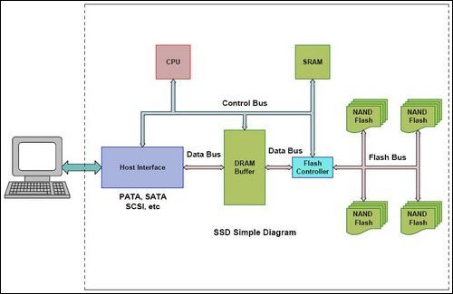

# Wear-Leveling

SSD的寿命局限于它的读写次数。对相同的存储单元不断地进行编写和擦除将更容易导致该存储单元受到永久性的损害。为了避免该情况的发生，有一种叫“Wear-Leveling”的特殊的算法被配置到SSD中。

Wear-Leveling就是将擦除/写入循环平均地分配到SSD的所有存储单元中。这样就避免了对同一个存储单元持续不断地进行擦除/写入操作，从而有效地延长了SSD的寿命。

针对Wear-Leveling算法，SSD中块单元可以分成两种类型：
* 数据块 - 数据块是闪存的主要部分，并且受到Wear-Leveling算法和数据存储器的影响。
* 空闲块 - 空闲块的数目在整个闪存中占百分之二，主要用于缓冲Wear-Leveling算法。

这就意味着闪存中块会根据Wear-Leveling准则在数据块池和空闲块池相互转换。

## Flash Translation Layer（FTL）

