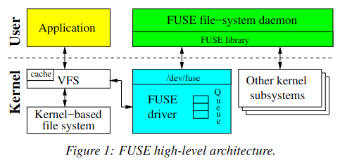
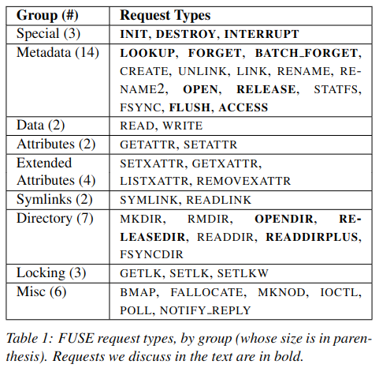
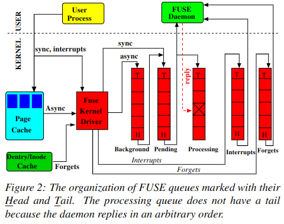

# FUSE

## Introduction

FUSE(Filesystem in User Space Environment) 是最广为人知的用户空间文件系统框架，许多文件系统是使用FUSE实现的,这主要归功于它提供的简单API。

FUSE 由内核部分和用户级守护进程两部分组成:
* 内核部分实现为 Linux 内核模块,加载后会向 Linux 的 VFS 注册一个 fuse 文件系统驱动。这个 Fuse 驱动充当了由不同用户级守护进程实现的各种特定文件系统的代理。
* 除了注册新的文件系统外,FUSE 的内核模块还注册了一个 `/dev/fuse` 块设备。这个设备充当了用户空间 FUSE 守护进程与内核之间的接口。通常来说,守护进程会从 `/dev/fuse` 读取 FUSE 请求,处理它们,然后把响应写回到 `/dev/fuse`。

当用户应用程序对挂载的FUSE文件系统执行某些操作时：
1. VFS会将该操作路由到FUSE的内核驱动程序。驱动程序会分配一个FUSE请求结构,并将其放入FUSE队列。在这一点上,提交该操作的进程通常会被置于等待状态。
2. FUSE的用户级守护进程然后通过读取`/dev/fuse`从内核队列中取出请求,并处理该请求,处理请求可能需要再次进入内核(例如：守护进程会将操作提交给底层文件系统)。
3. 处理请求完成后,FUSE守护进程会将响应写回到`/dev/fuse`，FUSE的内核驱动程序然后会将请求标记为已完成,并唤醒原始的用户进程。

某些应用程序调用的文件系统操作可以在不与 **用户级FUSE守护进程** 通信的情况下完成。例如,读取内核页缓存中已缓存页面的文件,无需转发到FUSE驱动程序。

## User-kernel protocol

当FUSE的内核驱动程序与用户空间守护进程通信时,它会形成一个FUSE请求结构。根据它们传达的操作,请求有不同的类型,大多数请求都与传统的VFS操作直接对应。

**INIT 请求** 由内核在文件系统挂载时生成。此时,用户空间和内核会进行协商:
1. 他们将使用的协议版本
2. 双方支持的功能集(例如`READDIRPLUS`或`FLOCK`支持)
3. 以及各种参数设置(例如FUSE读取缓冲大小,时间精度)。

**DESTROY 请求** 由内核在文件系统卸载过程中发送。收到DESTROY请求时,守护进程需要执行所有必要的清理操作。内核不会再向此会话发送任何请求,从 `/dev/fuse` 读取将返回0,导致守护进程优雅地退出。

**INTERRUPT 请求** 用于内核终止一个曾经发起的请求（例如,当阻塞在READ上的用户进程被终止时）。

每个请求都有一个唯一的序列号, INTERRUPT 使用该序列号来识别需要终止的请求。内核分配序列号,并在用户空间回复时用于定位已完成的请求。

每个请求也包含一个节点 ID - 一个无符号的 64 位整数,用于标识内核和用户空间中的 inode。

**LOOKUP 请求** 执行路径到 inode 的转换，每次查找现有的 inode(或创建新的 inode)时,内核都会将 inode 保存在 inode 缓存中。当从 dcache 中删除 inode 时,内核会向用户空间守护进程发送 **FORGET 请求** 。此时,守护进程可能决定释放任何相关的数据结构。 **BATCH FORGET 请求** 允许内核通过单个请求 FORGET 多个 inode。

当用户应用程序打开一个文件时,会生成一个 **OPEN 请求**。在回复这个请求时,FUSE守护进程有机会选择性地分配一个64位的文件句柄给打开的文件。这个文件句柄随后会与与打开的文件相关的每个请求一起由内核返回。用户空间的守护进程可以使用这个句柄来存储与特定打开文件相关的信息。

每当一个打开的文件被关闭时,都会生成一个 **FLUSH 请求**;当没有更多对之前打开的文件的引用时,会发送一个 **RELEASE 请求**。

**OPENDIR 和 RELEASEDIR 请求** 与 OPEN 和 RELEASE 具有相同的语义,但是针对目录。**READDIRPLUS 请求** 返回一个或多个目录条目,就像 READDIR 一样,但它还包括每个条目的元数据信息。这使内核能够预填充其 inode 缓存(类似于 NFSv3 的 READDIRPLUS 过程)。

当内核评估用户进程是否有权访问文件时,它会生成一个 **ACCESS 请求**。通过处理这个请求,FUSE 守护进程可以实现自定义的权限逻辑。但是,通常用户使用默认权限选项挂载 FUSE,这使内核可以根据标准的 Unix 属性(所有权和权限位)授予或拒绝对文件的访问。在这种情况下,不会生成 ACCESS 请求。

## Libraries、API-Level and Queues

从概念上来说,FUSE 库由两个层次组成:
* 较低的层次(这一部分导出了低级的 FUSE API)负责以下几项任务,:
  1. 从内核接收并解析请求。
  2. 发送格式正确的回复。
  3. 文件系统的配置和挂载。
  4. 隐藏内核和用户空间之间可能存在的版本差异。
* 高级 FUSE API 建立在底层 API 之上,允许开发者跳过 path-to-inode 映射的实现。高级 API 中没有 inode 和查找操作,简化了代码开发，所有高级 API 方法都直接在文件路径上操作。

FUSE维护着五个队列：
* Interrupts 队列
* Forgets 队列
* Pending 队列
* Processing 队列
* Background 队列

一个请求同时只能属于一个队列。

FUSE将 INTERRUPT 请求放入 Interrupts 队列, FORGET 请求放入 Forgets 队列,同步请求(如元数据)放入 Pending 队列。

当文件系统守护进程从 /dev/fuse 读取时,请求会被转移到用户空间守护进程:
1. 优先处理 Interrupts 队列中的请求,它们会在任何其他请求之前被转移到用户空间。
2. FORGET 请求和 非FORGET 请求会被公平选择:转移每8个 非FORGET 请求会转移16个 FORGET 请求。这降低了 FORGET 请求的突发性,同时允许其他请求继续进行。
3. Pending 队列中最早的请求会被转移到用户空间,同时移动到 Processing 队列。因此,Processing 队列中的请求正在被守护进程处理。当守护进程回复一个请求(通过写入`/dev/fuse`),相应的请求就会从 Processing 队列中删除。
4. 如果 Pending 队列为空,FUSE守护进程就会阻塞在对`/dev/fuse`的`read`调用上。

Background 队列用于暂存异步请求。 **在典型的设置中,只有读取请求会进入 Background 队列。** 如果写回缓存已启用，那么写请求也会进入 Background 队列，在这种配置下,来自用户进程的写入操作首先会累积到内核页面缓存中,之后 bdflush 线程会唤醒来刷新脏页面。在刷新页面的过程中,FUSE 会形成异步写入请求并将其放入 Background 队列。 **来自 Background 队列的请求会逐渐流入 Pending 队列。** FUSE 会限制同时存在于 Pending 队列中的异步请求数量,最多不超过可配置的 `max_background` 参数(默认为12)。 **当 Pending 队列中的异步请求少于`max_background`时,来自 Background 队列的请求会被移动到 Pending 队列。** 这样做的目的是限制突发的 Background 请求对重要同步请求造成的延迟。

队列的长度并未明确限制。然而,当 Pending 和 Processing 的异步请求数量达到可调拥塞阈值参数的值(默认为 `max_background` 的75%,即9个),FUSE会通知Linux VFS系统已拥塞;VFS然后会限制向该文件系统写入的用户进程。

## Options

**Splicing and FUSE buffers**  在基本设置中,FUSE 守护进程必须从 `/dev/fuse` 读取请求并写入应答。每个这样的调用都需要在内核和用户空间之间进行内存复制。这对于 WRITE 请求和 READ 回复尤其有害,因为它们通常需要处理大量数据。为了缓解这一问题,FUSE 可以使用 Linux 内核提供的拼接(splicing)功能。拼接允许用户空间在两个内核内存缓冲区之间传输数据,而无需将数据复制到用户空间。

FUSE 以两种形式表示其缓冲区:
1. 在用户守护进程地址空间中由指针标识的常规内存区域,或
2. 由文件描述符指向的内核空间内存。

如果用户空间文件系统实现了 `write_buf()` 方法,那么 FUSE 会将来自 `/dev/fuse` 的数据拼接,并以包含文件描述符的缓冲区形式直接传递给该方法。FUSE 会拼接包含多于一个页面数据的 WRITE 请求。类似的逻辑也适用于对包含多于两个页面数据的 READ 请求的应答。

**Multithreaded** 在多线程模式下,FUSE 的守护进程以一个线程启动。如果 Pending 队列中有两个或更多请求可用,FUSE 会自动生成额外的线程。每个线程一次处理一个请求。处理完请求后,每个线程会检查是否有超过 10 个线程,如果是,该线程会退出。

FUSE 库创建的线程数量没有明确的上限。存在一个隐式的限制,原因如下:
1. 默认情况下,Pending 队列中最多只能有 12 个异步请求(`max_background` 参数)。
2. 同步请求在 Pending 队列中的数量取决于用户进程产生的 I/O 活动总量。
3. 此外, **每个 INTERRUPT 和 FORGET 请求都会调用一个新线程。** 在一个典型的系统中,如果没有 interrupts 支持且很少有 FORGET 被生成,FUSE 守护进程的总线程数最多为 (12 + Pending 队列中的请求数)。

**Write-back cache and max write** FUSE的基本写入行为是同步的,只有4KB的数据被发送到用户守护进程进行写入。这在某些工作负载下会导致性能问题;当将一个大文件复制到FUSE文件系统时, `/bin/cp` 间接地导致每4KB的数据被同步地发送到用户空间。FUSE实施的解决方案是使FUSE的页面缓存支持写回策略,并使写入操作异步化。通过这一变更,文件数据可以被推送到用户守护进程,最大写入大小可达32页。

**Page cache** FUSE默认没有启用 page cache（但默认情况下数据也有可能被缓存），总共有两个选项：
1. `kernel_cache`选项,每次打开文件时都会刷新文件内容的缓存。此选项仅应在文件数据不会通过外部方式更改的文件系统上启用。因此，它不适合网络文件系统和其他“中间”文件系统。如果未指定此选项（也未指定 `direct_io`），在打开文件之后数据仍会被缓存，因此 `read` 系统调用并不总是会发起 READ请求。
2. `auto_cache`选项，这个选项是 `kernel_cache` 的一种替代方案。与无条件保留缓存数据不同，如果自上次打开以来文件的修改时间或大小发生变化，则在 打开文件时会使缓存数据失效。