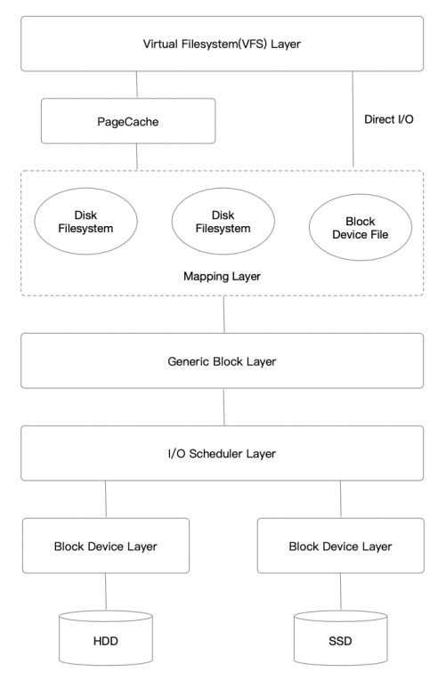

# Basic

Linux IO存储栈主要有以下7层:



## VFS

### Introduction

VFS层的作用是屏蔽了底层不同的文件系统的差异性，为用户程序提供一个统一的、抽象的、虚拟的文件系统，提供统一的对外API，使用户程序调用时无需感知底层的文件系统，只有在真正执行读写操作的时候才调用之前注册的文件系统的相应函数。

VFS支持的文件系统主要有三种类型：
* 基于磁盘的文件系统：ext*、XFS等。
* 网络文件系统：NFS、CIFS等。
* 特殊文件系统：/proc、裸设备等。

VFS主要有四个对象类型(不同的文件系统都要实现)：
* `superblock` - 整个文件系统的元信息。对应的操作结构体：`struct super_operations`。
* `inode` - 单个文件的元信息。对应的操作结构体：`struct inode_operations`。
* `dentry` - 目录项，一个文件目录项（父目录下的文件/目录）对应一个`dentry`。对应的操作结构体：`struct dentry_operations`。
* `file` - 进程打开的一个文件。对应的操作结构体：`struct file_operations`。

所有结构的定义都可以在<a href="https://github.com/torvalds/linux/blob/master/include/linux/fs.h"><code>fs.h</code></a>找到。

### Superblock

`superblock`结构体定义了整个文件系统的元信息，以及相应的操作。

例如ext4的定义如下。

```c
static const struct fs_context_operations ext4_context_ops = {
	.parse_param	= ext4_parse_param,
	.get_tree	= ext4_get_tree,
	.reconfigure	= ext4_reconfigure,
	.free		= ext4_fc_free,
};

static struct file_system_type ext4_fs_type = {
	.owner			= THIS_MODULE,
	.name			= "ext4",
	.init_fs_context	= ext4_init_fs_context,
	.parameters		= ext4_param_specs,
	.kill_sb		= ext4_kill_sb,
	.fs_flags		= FS_REQUIRES_DEV | FS_ALLOW_IDMAP,
};
```

### Inode

`inode`结构体定义了文件的元数据，比如大小、最后修改时间、权限等，除此之外还有一系列的函数指针，指向具体文件系统对文件操作的函数，包括常见的`open`、`read`、`write`等，由`i_fop`函数指针提供。

文件系统最核心的功能全部由`inode`的函数指针提供。主要是`inode`的`i_op`、`i_fop`字段。

```c
struct inode {
	......
	const struct inode_operations	*i_op;

	const struct file_operations	*i_fop;
	......
}
```

在打开inode的时候会设置不同的`i_op`和`i_fop`。

```cpp
struct inode *__ext4_iget(struct super_block *sb, unsigned long ino,
			  ext4_iget_flags flags, const char *function,
			  unsigned int line)
{
    .......
    if (S_ISREG(inode->i_mode)) {
		inode->i_op = &ext4_file_inode_operations;
		inode->i_fop = &ext4_file_operations;
		ext4_set_aops(inode);
	} else if (S_ISDIR(inode->i_mode)) {
		inode->i_op = &ext4_dir_inode_operations;
		inode->i_fop = &ext4_dir_operations;
    }
    .......
}
```

### Dentry

`dentry`是目录项，由于每一个文件必定存在于某个目录内，我们通过路径查找一个文件时，最终肯定找到某个目录项。在Linux中，目录和普通文件一样，都是存放在磁盘的数据块中，在查找目录的时候就读出该目录所在的数据块，然后去寻找其中的某个目录项。

```c
struct dentry {
	......
	const struct dentry_operations *d_op;
	......
};
```

在我们使用Linux的过程中，根据目录查找文件的例子无处不在，而目录项的数据又都是存储在磁盘上的，如果每一级路径都要读取磁盘，那么性能会十分低下。所以需要目录项缓存，把`dentry`放在缓存中加速。

VFS把所有的`dentry`放在`dentry_hashtable`哈希表里面，使用LRU淘汰算法。

### File

用户程序能接触的VFS对象只有`file`，由进程管理。我们常用的打开一个文件就是创建一个`file`对象，并返回一个文件描述符。出于隔离性的考虑，内核不会把`file`的地址返回，而是返回一个整形的`fd`。

```cpp
struct file {
	// 操作文件的函数指针，和inode里面的i_fop一样，在open的时候赋值为i_fop。
	const struct file_operations *f_op;

	// 指向对应inode对象
	struct inode *f_inode;

	// 每个文件都有自己的一个偏移量
	loff_t f_pos;
	......
}
```

`file`对象是由内核进程直接管理的。每个进程都有当前打开的文件列表，放在`files_struct`结构体中。

```c
struct files_struct {
  /*
   * read mostly part
   */
	atomic_t count;
	bool resize_in_progress;
	wait_queue_head_t resize_wait;

	struct fdtable __rcu *fdt;
	struct fdtable fdtab;
  /*
   * written part on a separate cache line in SMP
   */
	spinlock_t file_lock ____cacheline_aligned_in_smp;
	unsigned int next_fd;
	unsigned long close_on_exec_init[1];
	unsigned long open_fds_init[1];
	unsigned long full_fds_bits_init[1];
	struct file __rcu * fd_array[NR_OPEN_DEFAULT]; // 打开的文件列表
};
```

`fd_array`数组存储了所有打开的`file`对象，用户程序拿到的文件描述符(`fd`)实际上是这个数组的索引。

### IO Stack

`read`、`write`系统调用实际上是对VFS的封装。

```cpp
SYSCALL_DEFINE3(read, unsigned int, fd, char __user *, buf, size_t, count)
{
	return ksys_read(fd, buf, count);
}

ssize_t ksys_read(unsigned int fd, char __user *buf, size_t count)
{
	struct fd f = fdget_pos(fd);
	ssize_t ret = -EBADF;

	if (f.file) {
		loff_t pos, *ppos = file_ppos(f.file);
		if (ppos) {
			pos = *ppos;
			ppos = &pos;
		}
		ret = vfs_read(f.file, buf, count, ppos);
		if (ret >= 0 && ppos)
			f.file->f_pos = pos;
		fdput_pos(f);
	}
	return ret;
}
```

```c
SYSCALL_DEFINE3(write, unsigned int, fd, const char __user *, buf,
		size_t, count)
{
	return ksys_write(fd, buf, count);
}

ssize_t ksys_write(unsigned int fd, const char __user *buf, size_t count)
{
	struct fd f = fdget_pos(fd);
	ssize_t ret = -EBADF;

	if (f.file) {
		loff_t pos, *ppos = file_ppos(f.file);
		if (ppos) {
			pos = *ppos;
			ppos = &pos;
		}
		ret = vfs_write(f.file, buf, count, ppos);
		if (ret >= 0 && ppos)
			f.file->f_pos = pos;
		fdput_pos(f);
	}

	return ret;
}
```

而VFS又将调用对应的`f_op`。

```c
ssize_t vfs_read(struct file *file, char __user *buf, size_t count, loff_t *pos)
{
	ssize_t ret;

	if (!(file->f_mode & FMODE_READ))
		return -EBADF;
	if (!(file->f_mode & FMODE_CAN_READ))
		return -EINVAL;
	if (unlikely(!access_ok(buf, count)))
		return -EFAULT;

	ret = rw_verify_area(READ, file, pos, count);
	if (ret)
		return ret;
	if (count > MAX_RW_COUNT)
		count =  MAX_RW_COUNT;

	if (file->f_op->read)
		ret = file->f_op->read(file, buf, count, pos);
	else if (file->f_op->read_iter)
		ret = new_sync_read(file, buf, count, pos);
	else
		ret = -EINVAL;
	if (ret > 0) {
		fsnotify_access(file);
		add_rchar(current, ret);
	}
	inc_syscr(current);
	return ret;
}

ssize_t vfs_write(struct file *file, const char __user *buf, size_t count, loff_t *pos)
{
	ssize_t ret;

	if (!(file->f_mode & FMODE_WRITE))
		return -EBADF;
	if (!(file->f_mode & FMODE_CAN_WRITE))
		return -EINVAL;
	if (unlikely(!access_ok(buf, count)))
		return -EFAULT;

	ret = rw_verify_area(WRITE, file, pos, count);
	if (ret)
		return ret;
	if (count > MAX_RW_COUNT)
		count =  MAX_RW_COUNT;
	file_start_write(file);
	if (file->f_op->write)
		ret = file->f_op->write(file, buf, count, pos);
	else if (file->f_op->write_iter)
		ret = new_sync_write(file, buf, count, pos);
	else
		ret = -EINVAL;
	if (ret > 0) {
		fsnotify_modify(file);
		add_wchar(current, ret);
	}
	inc_syscw(current);
	file_end_write(file);
	return ret;
}
```

如果`file->f_op->read`或者`file->f_op->write`指针不为`NULL`会调用相应的函数。

但如果为`NULL`同时`file->f_op->write_iter != NULL`，就会走`new_sync_write`。

```cpp
const struct file_operations ext4_file_operations = {
	.llseek		= ext4_llseek,
	.read_iter	= ext4_file_read_iter,
	.write_iter	= ext4_file_write_iter,
	.iopoll		= iocb_bio_iopoll,
	.unlocked_ioctl = ext4_ioctl,
#ifdef CONFIG_COMPAT
	.compat_ioctl	= ext4_compat_ioctl,
#endif
	.mmap		= ext4_file_mmap,
	.mmap_supported_flags = MAP_SYNC,
	.open		= ext4_file_open,
	.release	= ext4_release_file,
	.fsync		= ext4_sync_file,
	.get_unmapped_area = thp_get_unmapped_area,
	.splice_read	= ext4_file_splice_read,
	.splice_write	= iter_file_splice_write,
	.fallocate	= ext4_fallocate,
};
```

可以看到对于ext4，则是走了`new_sync_write`的流程。

```c
static ssize_t new_sync_write(struct file *filp, const char __user *buf, size_t len, loff_t *ppos)
{
	struct kiocb kiocb;
	struct iov_iter iter;
	ssize_t ret;

	init_sync_kiocb(&kiocb, filp);
	kiocb.ki_pos = (ppos ? *ppos : 0);
	iov_iter_ubuf(&iter, ITER_SOURCE, (void __user *)buf, len);

	ret = call_write_iter(filp, &kiocb, &iter);
	BUG_ON(ret == -EIOCBQUEUED);
	if (ret > 0 && ppos)
		*ppos = kiocb.ki_pos;
	return ret;
}

static ssize_t
ext4_file_write_iter(struct kiocb *iocb, struct iov_iter *from)
{
	struct inode *inode = file_inode(iocb->ki_filp);

	if (unlikely(ext4_forced_shutdown(inode->i_sb)))
		return -EIO;

#ifdef CONFIG_FS_DAX
	if (IS_DAX(inode))
		return ext4_dax_write_iter(iocb, from);
#endif
	if (iocb->ki_flags & IOCB_DIRECT)
		return ext4_dio_write_iter(iocb, from);
	else
		return ext4_buffered_write_iter(iocb, from);
}

static ssize_t ext4_buffered_write_iter(struct kiocb *iocb,
					struct iov_iter *from)
{
	ssize_t ret;
	struct inode *inode = file_inode(iocb->ki_filp);

	if (iocb->ki_flags & IOCB_NOWAIT)
		return -EOPNOTSUPP;

	inode_lock(inode);
	ret = ext4_write_checks(iocb, from);
	if (ret <= 0)
		goto out;

	ret = generic_perform_write(iocb, from);

out:
	inode_unlock(inode);
	if (unlikely(ret <= 0))
		return ret;
	return generic_write_sync(iocb, ret);
}
```

`ext4_buffered_write_iter`最后调用`generic_perform_write`函数，这些通用函数是基本上所有文件系统的核心逻辑。

然后从VFS层进入Page Cache层。

### Page Cache

对于写操作，文件系统最后调用`generic_perform_write`，对于读操作，则是`generic_file_aio_read`。

`generic_perform_write`的流程如下：
* 根据文件偏移量计算要写入的数据再PageCache中的位置。
* 将用户态的Buffer拷贝到PageCache中。
* 检查PageCache是否占用太多，如果是则将部分PageCache的数据刷回磁盘。

`generic_file_aio_read`的流程如下：
* 根据文件偏移量计算出要读取数据在PageCache中的位置。
* 如果命中PageCache则直接返回，否则触发磁盘读取任务，会有预读的操作，减少IO次数。
* 数据读取到PageCache后，拷贝到用户态Buffer中。

使用Buffered IO时，VFS层的读写很大程度上是依赖于PageCache的，只有当Cache Missing，Cache过满等才会涉及到磁盘的操作。

### Device File

类似`/dev/sd*`这种设备文件虽然仍由VFS管理，但是程序访问它时，将直接调用设备驱动程序提供的相应函数。

通常搭配`O_DIRECT`和`libaio`或（`io_uring`）一起使用。

默认的块设备函数列表如下：

```c
const struct file_operations def_blk_fops = {
	.open		= blkdev_open,
	.release	= blkdev_release,
	.llseek		= blkdev_llseek,
	.read_iter	= blkdev_read_iter,
	.write_iter	= blkdev_write_iter,
	.iopoll		= iocb_bio_iopoll,
	.mmap		= blkdev_mmap,
	.fsync		= blkdev_fsync,
	.unlocked_ioctl	= blkdev_ioctl,
#ifdef CONFIG_COMPAT
	.compat_ioctl	= compat_blkdev_ioctl,
#endif
	.splice_read	= filemap_splice_read,
	.splice_write	= iter_file_splice_write,
	.fallocate	= blkdev_fallocate,
};
```

使用块设备时，将使用`def_blk_fops`。

对此类文件的调用将会直接进入通用块设备层。

## Page Cache

### Introduction

在HDD时代，由于内核和磁盘速度的巨大差异，Linux内核引入了页高速缓存(PageCache)，把磁盘抽象成一个个固定大小的连续Page，通常为4K。对于VFS来说，只需要与PageCache交互，无需关注磁盘的空间分配以及是如何读写的。

当我们使用Buffered IO的时候便会用到PageCache层，与Direct IO相比，用户程序无需offset、length对齐。是因为通用块层处理IO都必须是块大小对齐的。

Buffered IO中PageCache帮我们做了对齐的工作：如果我们修改文件的offset、length不是页大小对齐的，那么PageCache会执行RMW的操作，先把该页对应的磁盘的数据全部读上来，再和内存中的数据做Modify，最后再把修改后的数据写回磁盘。虽然是写操作，但是非对齐的写仍然会有读操作。

Direct IO由于跳过了PageCache，直达通用块层，所以需要用户程序处理对齐的问题。

*NOTE：内核的存储体系中主要有两种缓存，一是 Page Cache，二是 Buffer Cache。Page Cache 是在 Linux IO 栈中为文件系统服务的缓存，而 Buffer Cache 是处于更下层的 Block Device 层，由于应用大部分的使用存储数据是基于文件系统，因此 Buffer Cache 实际上只是引用了 Page Cache 的数据，而只有在直接使用块设备跳过文件系统时，Buffer Cache 才真正掌握缓存。*

### Flush

如果发生机器宕机，位于PageCache中的数据就会丢失；所以仅仅写入PageCache是不可靠的，需要有一定的策略将数据刷入磁盘。通常有几种策略：
* 手动调用`fsync`、`fdatasync`刷盘。
* 脏页占用比例超过了阈值，触发刷盘。
* 脏页驻留时间过长，触发刷盘。

Linux内核目前的做法是为每个磁盘都建立一个线程，负责每个磁盘的刷盘。

`fsync()` 的实现取决于文件系统，文件系统会将要求数据从缓存中强制写到持久设备中。但是这里还有另外一个大“麻烦”，通常成为 Block Device Cache(块设备缓存)，这类缓存并不存在归 Kernel 管理，它或许是传统磁盘上的控制器缓存，RAID 控制器缓存，它主要是被块设备自己管理。因此，大多数文件系统在实现 `fsync` 这类接口时，同时会使用 Kernel Block 模块提供的 `blkdev_issue_flush` API 去给块设备发送一个 Flush Request，块设备收到 Flush Request 后就会回写自身的缓存。

但是如果机器上存在电容，那么实际上 Flush Request 会大大降低文件系统的读写性能，因此，文件系统会提供如 barrier 选项来让用户选择是否需要发送 Flush Request，比如 XFS 在 mount 时就支持 “barrier=0″ 来选择不发送 Flush Request。

### Perfetch

从VFS层我们知道写是异步的，写完PageCache便直接返回了；但是读是同步的，如果PageCache没有命中，需要从磁盘读取，很影响性能。如果是顺序读的话PageCache便可以进行预读策略，异步读取该Page之后的Page，等到用户程序再次发起读请求，数据已经在PageCache里，大幅度减少IO的次数，不用阻塞读系统调用，提升读的性能。

## Mapping Layer

映射层是在PageCache之下的一层，由多个文件系统(Ext系列、XFS等，打开文件系统的文件)以及块设备文件(直接打开裸设备文件)组成，主要完成两个工作：

* 内核确定该文件所在文件系统或者块设备的块大小，并根据文件大小计算所请求数据的长度以及所在的逻辑块号。
* 根据逻辑块号确定所请求数据的物理块号，也即在在磁盘上的真正位置。

由于通用块层以及之后的的IO都必须是块大小对齐的，我们通过DIO打开文件时，略过了PageCache，所以必须要自己将IO数据的offset、length对齐到块大小。

## Generic Block Layer

通用块层类似于VFS，封装了底层实际的磁盘设备。

通用块层最核心的数据结构便是`bio`，描述了从上层提交的一次IO请求。

```c
struct bio {
	struct bio		*bi_next;	/* request queue link */
	struct block_device	*bi_bdev;
	blk_opf_t		bi_opf;		/* bottom bits REQ_OP, top bits
						 * req_flags.
						 */
	unsigned short		bi_flags;	/* BIO_* below */
	unsigned short		bi_ioprio;
	blk_status_t		bi_status;
	atomic_t		__bi_remaining;

	struct bvec_iter	bi_iter;

	blk_qc_t		bi_cookie;
	bio_end_io_t		*bi_end_io;
	void			*bi_private;
#ifdef CONFIG_BLK_CGROUP
	/*
	 * Represents the association of the css and request_queue for the bio.
	 * If a bio goes direct to device, it will not have a blkg as it will
	 * not have a request_queue associated with it.  The reference is put
	 * on release of the bio.
	 */
	struct blkcg_gq		*bi_blkg;
	struct bio_issue	bi_issue;
#ifdef CONFIG_BLK_CGROUP_IOCOST
	u64			bi_iocost_cost;
#endif
#endif

#ifdef CONFIG_BLK_INLINE_ENCRYPTION
	struct bio_crypt_ctx	*bi_crypt_context;
#endif

	union {
#if defined(CONFIG_BLK_DEV_INTEGRITY)
		struct bio_integrity_payload *bi_integrity; /* data integrity */
#endif
	};

	unsigned short		bi_vcnt;	/* how many bio_vec's */

	/*
	 * Everything starting with bi_max_vecs will be preserved by bio_reset()
	 */

	unsigned short		bi_max_vecs;	/* max bvl_vecs we can hold */

	atomic_t		__bi_cnt;	/* pin count */

	struct bio_vec		*bi_io_vec;	/* the actual vec list */

	struct bio_set		*bi_pool;

	/*
	 * We can inline a number of vecs at the end of the bio, to avoid
	 * double allocations for a small number of bio_vecs. This member
	 * MUST obviously be kept at the very end of the bio.
	 */
	struct bio_vec		bi_inline_vecs[];
};

struct bio_vec {
	struct page	*bv_page;
	unsigned int	bv_len;
	unsigned int	bv_offset;
};
```

所有到通用块层的IO，都要把数据封装成`bio_vec`的形式，放到`bio`结构体内。

在VFS层的读请求，是以Page为单位读取的，如果改Page不在PageCache内，那么便要调用文件系统定义的`read_page`函数从磁盘上读取数据。

```c
static const struct address_space_operations ext4_da_aops = {
	.read_folio		= ext4_read_folio,
	.readahead		= ext4_readahead,
	.writepages		= ext4_writepages,
	.write_begin		= ext4_da_write_begin,
	.write_end		= ext4_da_write_end,
	.dirty_folio		= ext4_dirty_folio,
	.bmap			= ext4_bmap,
	.invalidate_folio	= ext4_invalidate_folio,
	.release_folio		= ext4_release_folio,
	.direct_IO		= noop_direct_IO,
	.migrate_folio		= buffer_migrate_folio,
	.is_partially_uptodate  = block_is_partially_uptodate,
	.error_remove_page	= generic_error_remove_page,
	.swap_activate		= ext4_iomap_swap_activate,
};
```

## I/O Scheduler Layer

Linux调度层是Linux IO体系中的一个重要组件，介于通用块层和块设备驱动层之间。IO调度层主要是为了减少磁盘IO的次数，增大磁盘整体的吞吐量，会队列中的多个bio进行排序和合并，并且提供了多种IO调度算法，适应不同的场景。

Linux内核为每一个块设备维护了一个IO队列，item是`struct request`结构体，用来排队上层提交的IO请求。一个request包含了多个`bio`，一个IO队列queue了多个request。

```cpp
struct request {
	......
	// total data len
	unsigned int __data_len;

	// sector cursor
	sector_t __sector;

	// first bio
	struct bio *bio;

	// last bio
	struct bio *biotail;
	......
}
```

上层提交的bio有可能分配一个新的request结构体去存放，也有可能合并到现有的request中。

Linux内核目前提供了以下几种调度策略：
* Deadline - 默认的调度策略，加入了超时的队列。适用于HDD。
* CFQ - 完全公平调度器。
* Noop - No Operation，最简单的FIFIO队列，不排序会合并。适用于SSD、NVME。

## Block Dirver Layer

每一类设备都有其驱动程序，负责设备的读写。IO调度层的请求也会交给相应的设备驱动程序去进行读写。大部分的磁盘驱动程序都采用DMA的方式去进行数据传输，DMA控制器自行在内存和IO设备间进行数据传送，当数据传送完成再通过中断通知CPU。

通常块设备的驱动程序都已经集成在了kernel里面，也即就算我们直接调用块设备驱动驱动层的代码还是要经过内核。

spdk实现了用户态、异步、无锁、轮询方式NVME驱动程序。块存储是延迟非常敏感的服务，使用NVME做后端存储磁盘时，便可以使用spdk提供的NVME驱动，缩短IO流程，降低IO延迟，提升IO性能。

## Physical Device

物理设备层便是我们经常使用的HDD、SSD、NVME-SSD等磁盘设备了。