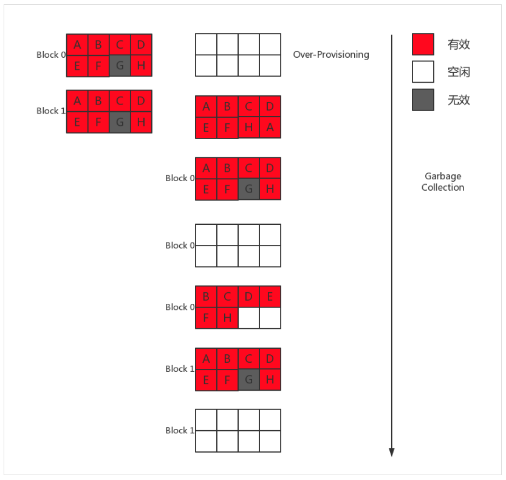

# SSD Basic

## Introduction

SSD诞生于上世纪70年代，最早的SSD使用RAM作为存储介质，但是RAM掉电后数据就会丢失，同时价格也特别贵。后来出现了基于闪存(Flash)的SSD，Flash掉电后数据不会丢失，因此Flash-SSD慢慢取代了RAM-SSD，但是此时HDD已经占据了大部分的市场。

到本世纪初，随着制造工艺的不断进步，SDD迎来了长足的发展，同时HDD在工艺和技术上已经很难有突破性的进展，SSD在性能和容量上还在不断突破。

SSD很可能取代HDD成为主流的存储的设备。

## Basic

SSD主要组件有：
* SSD控制器。
* Flash存储阵列。
* 板上DRAM(可选)
* HOST接口(SATA、SAS、PCIe等)。

Flash的基本存储单元是浮栅晶体管，同时根据制造工艺分为NOR型和NAND型。NAND容量大，按照Page进行读写，适合进行数据存储，基本上存储使用的SSD的Flash都是NAND。

SSD内部一般都是使用NAND-Flash作为存储介质，逻辑结构如下图：


SSD中一般有多个NAND-Flash，每个NAND-Flash包含多个Block，每个Block包含多个Page。

由于NAND的特性，存取都必须以Page为单位，即每次读写至少是一个Page。通常地，每个Page的大小为4K或者8K，同时不能覆盖Page。

如果要覆盖写，必须先要清空里面的内容，再写入。由于清空内容的电压较高，必须是以Block为单位，因此，没有空闲的Page时，必须要找到没有有效内容的Block，先擦除再选择空闲的Page写入。

SSD中也会维护一个mapping table，维护逻辑地址到物理地址的映射。每次读写时，可以通过逻辑地址直接查表计算出物理地址，与传统的HDD相比，省去了寻道时间和旋转时间。

## I/O Process

SSD和HDD的主要区别为：
* 定位数据快 - HDD需要经过寻道和旋转，才能定位到要读写的数据块，而SSD通过mapping table直接计算即可。
* 读取速度快 - HDD的速度取决于旋转速度，而SSD只需要加电压读取数据，一般而言，要快于HDD。

在顺序读测试中，由于定位数据只需要一次，定位之后，则是大批量的读取数据的过程，此时，HDD和SSD的性能差距主要体现在读取速度上，HDD能到200M左右，而普通SSD是其两倍。

在随机读测试中，由于每次读都要先定位数据，然后再读取，HDD的定位数据的耗费时间很多，一般是几毫秒到十几毫秒，远远高于SSD的定位数据时间(一般0.1ms左右)，因此，随机读写测试主要体现在两者定位数据的速度上，此时，SSD的性能是要远远好于HDD的。

SSD的写分为新写入和覆盖写两种。

### New Write


新写流程：
* 找到空闲的Page。
* 写入空闲Page。
* 刷新Mapping Table。

### Overwirte


覆盖写流程：
* 寻找空闲页 $H$ 。
* 读取页 $G$ 中的数据到SSD内部的buffer中，把更新的字节更新到buffer。
* buffer中的数据写入到 $H$。
* 更新Mapping Table中的页 $G$ ，置为无效页。
* 更新Mapping Table中的页 $H$ ，添加映射关系。

如果在覆盖写操作比较多的情况下，会产生较多的无效页，类似于磁盘碎片，此时需要SSD的GC机制来回收这部分空间了。

### Garbage Collection

Over-Provisioning指SSD实际的存储空间比可写入的空间要大。比如一块SSD实际空间128G，可用容量却只有120G。

假设系统中只有两个Block，最终还剩下两个无效的Page。此时要写入一个新Page，根据NAND原理，必须要先对两个无效的Page擦除才能用于写入。而擦除的粒度是Block，需要读取当前Block有效数据到新的Block，如果此时没有额外的空间，便做不了擦除操作了，那么最终那两个无效的Page便不能得到利用。所以需要SSD提供额外空间即Over-Provisioning，保证GC的正常运行。



GC流程如下：
* 从Over-Provisoning空间中，找到一个空闲的Block $T$ 。
* 把 Block $0$ 的 $ABCDEFH$ 和Block $1$ 的 $A$ 复制到空闲Block $T$ 。
* 擦除Block $0$ 。
* 把Block $1$ 的 $BCDEFH$ 复制到Block $0$ ，此时Block $0$ 就有两个空闲Page。
* 擦除BLock $1$ 。

GC机制会带来两个问题：
* SSD的寿命减少。NAND-Flash中每个原件都有擦写次数限制，超过一定擦写次数后，就只能读取不能写入了。
* 写放大(Write Amplification)。即内部真正写入的数据量大于用户请求写入的数据量。

如果频繁的在某些Block上做GC，会使得这些元件比其他部分更快到达擦写次数限制。因此，需要损耗均衡控制(Wear-Leveling)算法，使得原件的擦写次数比较平均，进而延长SSD的寿命。

## Trim

`Trim`指令也叫Disable Delete Notify(禁用删除通知)，是微软联合各大SSD厂商所开发的一项技术，属于ATA8-ACS规范的技术指令。

Trim(Discard)的出现主要是为了提高GC的效率以及减少写入放大的发生，最大作用是清空待删除的无效数据。在SSD执行读、擦、写步骤的时候，预先把擦除的步骤先做了，这样才能发挥出SSD的性能，通常SSD掉速很大一部分原因就是待删除的无效数据太多，每次写入的时候主控都要先做清空处理，所以性能受到了限制。

在文件系统上删除某个文件时候，简单的在逻辑数据表内把存储要删除的数据的位置标记为可用而已，而并不是真正将磁盘上的数据给删除掉。

对比不同介质：
* 使用机械硬盘的系统根本就不需要向存储设备发送任何有关文件删除的消息，系统可以随时把新数据直接覆盖到无用的数据上。
* 固态硬盘只有当系统准备把新数据要写入那个位置的时候，固态硬盘才意识到原来这写数据已经被删除。而如果在这之前，SSD执行了GC操作，那么GC会把这些实际上已经删除了的数据还当作是有效数据进行迁移写入到其他的Block中，这是没有必要的。

在没有Trim的情况下，SSD无法事先知道那些被‘删除’的数据页已经是‘无效’的，必须到系统要求在相同的地方写入数据时才知道那些数据可以被擦除，这样就无法在最适当的时机做出最好的优化，既影响GC的效率(间接影响性能)，又影响SSD的寿命。

Trim和Discard的支持，不仅仅要SSD实现这个功能，而是整个数据链路中涉及到的文件系统、RAID控制卡以及SSD都需要实现。要使用这个功能必须要在mount文件系统时，加上discard选项。如果自己管理SSD裸设备就需要通过`ioctl`函数`BLKDISCARD`命令来操作了。

```cpp
int block_device_discard(int fd, int64_t offset, int64_t len)
{
	uint64_t range[2] = {(uint64_t)offset, (uint64_t)len};
  	return ioctl(fd, BLKDISCARD, range);
}
```

## Bit-Error

Bit-Error是磁盘的一种静默错误。造成Nand-Error的因素有：
* 电荷泄漏 - 长期不使用，会发生电荷泄漏，导致电压分布往左移，例如00漂移到01,10漂移到11。
* 读干扰(Read-Disturb)。
* 写干扰(Program-Disturb)。

不同因素造成的错误类型也不同：
* Erase-Error - erase操作未能将cell复位到erase状态时，称为erase error。可能是制造问题，或者多次P/E引起的栅极氧化层缺陷所致。
* Program-Interference-Error - 由Program-Disturb所导致的错误，会使电压分布偏移。
* Retention-Error - 由电荷泄露引发的错误，会使电压分布偏移。
* Read-Error - 由Read-Disturb所导致的错误，会使电压分布偏移。

retention时间越长，flash的浮栅极泄露的电子会越多，因而误码率越高，所以NAND-Error机制主要是为了减少Retention-Error。

### Read-Disturb

读取NAND的某个Page时，Block当中未被选取的Page控制极都会加一个正电压，以保证未被选中的MOS管是导通的。这样频繁的在一个MOS管控制极加正电压，就可能导致电子被吸进浮栅极，形成轻微的Program，导致分布电压右移，产生Bit-Error。Read-Disturb只影响同一Block中的其他Page。


### Program-Disturb

SSD擦除之后所有的bits都为`1`，写`1`不需要编程（Program），写`0`才需要。

如下图所示，绿色的Cell是写`0`，它们需要Program，红色的cell写`1`，并不需要Program。我们把绿色的Cell称为Programmed Cells，红色的Cell称为Stressed Cells。

写某个Page的时候，会在其WordLine的控制极加一个正电压(下图是20V),对于Programmed Cells所在的String，它是接地的，对于不需要Program Cell所在的String，则接一正电压（下图为10V）。这样最终产生的后果是，Stressed Cell也会被轻微Program。


## I/O Jitter

* GC机制 - 会导致内部IO，从而抢占用户的IO，导致性能抖动，甚至下降。
* Bit-Error - 对于读操作，如果Bit-Error控制在一定范围内，那么延迟可以控制在100us内。如果超过了BCH快速解码的范围，将花费大量时间解码，延迟将增加。
* 读写冲突 - 当一个读请求和写请求落在了同一个Block或者Page，会导致读延迟增加。针对这个问题，在存储系统设计过程中，需要将读写请求在空间上进行分离，从而避免读写请求在同一个Block上冲突。
* 读擦冲突 - 当一个读请求和擦除请求落在了同一个Block，那么读请求将会被擦除请求block，NAND-Flash的擦除操作基本上在2ms以上，导致读延迟增加。为了解决这个问题，有些NAND-FLash也引入了Erase-Suspend的功能，让读优先于擦除操作，从而降低延迟。