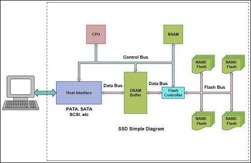

# SSD

## Introduction

SSD诞生于上世纪70年代，最早的SSD使用RAM作为存储介质，但是RAM掉电后数据就会丢失，同时价格也特别贵。后来出现了基于闪存(Flash)的SSD，Flash掉电后数据不会丢失，因此Flash-SSD慢慢取代了RAM-SSD，但是此时HDD已经占据了大部分的市场。

到本世纪初，随着制造工艺的不断进步，SDD迎来了长足的发展，同时HDD在工艺和技术上已经很难有突破性的进展，SSD在性能和容量上还在不断突破。

SSD很可能取代HDD成为主流的存储的设备。

SSD主要组件有：
* SSD控制器。
* Flash存储阵列。
* 板上DRAM(可选)
* HOST接口(SATA、SAS、PCIe等)。

Flash的基本存储单元是浮栅晶体管，同时根据制造工艺分为NOR型和NAND型。NAND容量大，按照Page进行读写，适合进行数据存储，基本上存储使用的SSD的Flash都是NAND。

SSD内部一般都是使用NAND-Flash作为存储介质，逻辑结构如下图：


SSD中一般有多个NAND-Flash，每个NAND-Flash包含多个Block，每个Block包含多个Page。

由于NAND的特性，存取都必须以Page为单位，即每次读写至少是一个Page。通常地，每个Page的大小为4K或者8K，同时不能覆盖Page。

如果要覆盖写，必须先要清空里面的内容，再写入。由于清空内容的电压较高，必须是以Block为单位，因此，没有空闲的Page时，必须要找到没有有效内容的Block，先擦除再选择空闲的Page写入。

SSD中也会维护一个mapping table，维护逻辑地址到物理地址的映射。每次读写时，可以通过逻辑地址直接查表计算出物理地址，与传统的HDD相比，省去了寻道时间和旋转时间。

### I/O Process

SSD和HDD的主要区别为：
* 定位数据快 - HDD需要经过寻道和旋转，才能定位到要读写的数据块，而SSD通过mapping table直接计算即可。
* 读取速度快 - HDD的速度取决于旋转速度，而SSD只需要加电压读取数据，一般而言，要快于HDD。

在顺序读测试中，由于定位数据只需要一次，定位之后，则是大批量的读取数据的过程，此时，HDD和SSD的性能差距主要体现在读取速度上，HDD能到200M左右，而普通SSD是其两倍。

在随机读测试中，由于每次读都要先定位数据，然后再读取，HDD的定位数据的耗费时间很多，一般是几毫秒到十几毫秒，远远高于SSD的定位数据时间(一般0.1ms左右)，因此，随机读写测试主要体现在两者定位数据的速度上，此时，SSD的性能是要远远好于HDD的。

SSD的写分为新写入和覆盖写两种。

新写流程：
* 找到空闲的Page。
* 写入空闲Page。
* 刷新Mapping Table。


覆盖写流程：
* 寻找空闲页 $H$ 。
* 读取页 $G$ 中的数据到SSD内部的buffer中，把更新的字节更新到buffer。
* buffer中的数据写入到 $H$。
* 更新Mapping Table中的页 $G$ ，置为无效页。
* 更新Mapping Table中的页 $H$ ，添加映射关系。


如果在覆盖写操作比较多的情况下，会产生较多的无效页，类似于磁盘碎片，此时需要SSD的GC机制来回收这部分空间了。

### Garbage Collection

Over-Provisioning指SSD实际的存储空间比可写入的空间要大。比如一块SSD实际空间128G，可用容量却只有120G。

假设系统中只有两个Block，最终还剩下两个无效的Page。此时要写入一个新Page，根据NAND原理，必须要先对两个无效的Page擦除才能用于写入。而擦除的粒度是Block，需要读取当前Block有效数据到新的Block，如果此时没有额外的空间，便做不了擦除操作了，那么最终那两个无效的Page便不能得到利用。所以需要SSD提供额外空间即Over-Provisioning，保证GC的正常运行。


GC流程如下：
* 从Over-Provisoning空间中，找到一个空闲的Block $T$ 。
* 把 Block $0$ 的 $ABCDEFH$ 和Block $1$ 的 $A$ 复制到空闲Block $T$ 。
* 擦除Block $0$ 。
* 把Block $1$ 的 $BCDEFH$ 复制到Block $0$ ，此时Block $0$ 就有两个空闲Page。
* 擦除BLock $1$ 。

GC机制会带来两个问题：
* SSD的寿命减少。NAND-Flash中每个原件都有擦写次数限制，超过一定擦写次数后，就只能读取不能写入了。
* 写放大(Write Amplification)。即内部真正写入的数据量大于用户请求写入的数据量。

如果频繁的在某些Block上做GC，会使得这些元件比其他部分更快到达擦写次数限制。因此，需要损耗均衡控制(Wear-Leveling)算法，使得原件的擦写次数比较平均，进而延长SSD的寿命。

### Trim

`Trim`指令也叫Disable Delete Notify(禁用删除通知)，是微软联合各大SSD厂商所开发的一项技术，属于ATA8-ACS规范的技术指令。

Trim(Discard)的出现主要是为了提高GC的效率以及减少写入放大的发生，最大作用是清空待删除的无效数据。在SSD执行读、擦、写步骤的时候，预先把擦除的步骤先做了，这样才能发挥出SSD的性能，通常SSD掉速很大一部分原因就是待删除的无效数据太多，每次写入的时候主控都要先做清空处理，所以性能受到了限制。

在文件系统上删除某个文件时候，简单的在逻辑数据表内把存储要删除的数据的位置标记为可用而已，而并不是真正将磁盘上的数据给删除掉。

对比不同介质：
* 使用机械硬盘的系统根本就不需要向存储设备发送任何有关文件删除的消息，系统可以随时把新数据直接覆盖到无用的数据上。
* 固态硬盘只有当系统准备把新数据要写入那个位置的时候，固态硬盘才意识到原来这写数据已经被删除。而如果在这之前，SSD执行了GC操作，那么GC会把这些实际上已经删除了的数据还当作是有效数据进行迁移写入到其他的Block中，这是没有必要的。

在没有Trim的情况下，SSD无法事先知道那些被‘删除’的数据页已经是‘无效’的，必须到系统要求在相同的地方写入数据时才知道那些数据可以被擦除，这样就无法在最适当的时机做出最好的优化，既影响GC的效率(间接影响性能)，又影响SSD的寿命。

Trim和Discard的支持，不仅仅要SSD实现这个功能，而是整个数据链路中涉及到的文件系统、RAID控制卡以及SSD都需要实现。要使用这个功能必须要在mount文件系统时，加上discard选项。如果自己管理SSD裸设备就需要通过`ioctl`函数`BLKDISCARD`命令来操作了。

```cpp
int block_device_discard(int fd, int64_t offset, int64_t len)
{
	uint64_t range[2] = {(uint64_t)offset, (uint64_t)len};
  	return ioctl(fd, BLKDISCARD, range);
}
```

### Bit-Error

Bit-Error是磁盘的一种静默错误。造成Nand-Error的因素有：
* 电荷泄漏 - 长期不使用，会发生电荷泄漏，导致电压分布往左移，例如00漂移到01,10漂移到11。
* 读干扰(Read-Disturb)。
* 写干扰(Program-Disturb)。

不同因素造成的错误类型也不同：
* Erase-Error - erase操作未能将cell复位到erase状态时，称为erase error。可能是制造问题，或者多次P/E引起的栅极氧化层缺陷所致。
* Program-Interference-Error - 由Program-Disturb所导致的错误，会使电压分布偏移。
* Retention-Error - 由电荷泄露引发的错误，会使电压分布偏移。
* Read-Error - 由Read-Disturb所导致的错误，会使电压分布偏移。

retention时间越长，flash的浮栅极泄露的电子会越多，因而误码率越高，所以NAND-Error机制主要是为了减少Retention-Error。

读取NAND的某个Page时，Block当中未被选取的Page控制极都会加一个正电压，以保证未被选中的MOS管是导通的。这样频繁的在一个MOS管控制极加正电压，就可能导致电子被吸进浮栅极，形成轻微的Program，导致分布电压右移，产生Bit-Error。Read-Disturb只影响同一Block中的其他Page。


SSD擦除之后所有的bits都为`1`，写`1`不需要编程（Program），写`0`才需要。

如下图所示，绿色的Cell是写`0`，它们需要Program，红色的cell写`1`，并不需要Program。我们把绿色的Cell称为Programmed Cells，红色的Cell称为Stressed Cells。

写某个Page的时候，会在其WordLine的控制极加一个正电压(下图是20V),对于Programmed Cells所在的String，它是接地的，对于不需要Program Cell所在的String，则接一正电压（下图为10V）。这样最终产生的后果是，Stressed Cell也会被轻微Program。


### I/O Jitter

* GC机制 - 会导致内部IO，从而抢占用户的IO，导致性能抖动，甚至下降。
* Bit-Error - 对于读操作，如果Bit-Error控制在一定范围内，那么延迟可以控制在100us内。如果超过了BCH快速解码的范围，将花费大量时间解码，延迟将增加。
* 读写冲突 - 当一个读请求和写请求落在了同一个Block或者Page，会导致读延迟增加。针对这个问题，在存储系统设计过程中，需要将读写请求在空间上进行分离，从而避免读写请求在同一个Block上冲突。
* 读擦冲突 - 当一个读请求和擦除请求落在了同一个Block，那么读请求将会被擦除请求block，NAND-Flash的擦除操作基本上在2ms以上，导致读延迟增加。为了解决这个问题，有些NAND-FLash也引入了Erase-Suspend的功能，让读优先于擦除操作，从而降低延迟。

## Wear-Leveling

SSD的寿命局限于它的读写次数。对相同的存储单元不断地进行编写和擦除将更容易导致该存储单元受到永久性的损害。为了避免该情况的发生，有一种叫“Wear-Leveling”的特殊的算法被配置到SSD中。

Wear-Leveling就是将擦除/写入循环平均地分配到SSD的所有存储单元中。这样就避免了对同一个存储单元持续不断地进行擦除/写入操作，从而有效地延长了SSD的寿命。



针对Wear-Leveling算法，SSD中块单元可以分成两种类型：
* 数据块 - 数据块是闪存的主要部分，并且受到Wear-Leveling算法和数据存储器的影响。
* 空闲块 - 空闲块的数目在整个闪存中占百分之二，主要用于缓冲Wear-Leveling算法。

这就意味着闪存中块会根据Wear-Leveling准则在数据块池和空闲块池相互转换（由算法对block进行标记）。

### Flash Translation Layer（FTL）

FTL提供对逻辑地址到物理地址映射的管理，同时对闪存和无效块映射进行擦除计数管理。每个块的擦除次数都会被记录在一个叫做擦除计数表（ECT）的表格中。当块进行一次擦除时,ECT都会将该块的擦除次数自动加一。

Wear-Leveling会浏览该计数表，以此来决定哪些块必须从数据块转化成空闲块，或者相反。当需要转换操作时，转换表会把逻辑块地址重新分配给物理块地址，同时在新的块组中重新组合块地址和擦除计数值。下图是ECT的一个简单的块管理示意图和转换映射表。


在典型操作情况下，ECT和转换映射表是在SRAM(静态随机存储器)中进行管理的。然而，SRAM是一个非永久性存储器，所以映射表和ECT必须存储到NAND Flash上。

SSD通上电源时，SRAM就会从NAND Flash上加载映射表，并周期性或在断电时，重新备份到NAND Flash上。

*NOTE：推测设备必须在断电时预留足够的电源，以便写入映射表。*

Wear-Leveling有两种类型：
* 动态 - 动态Wear-Leveling算法保证数据的编写和循环的擦除会被均匀地分布到NAND Flash的所有块中。。
* 静态 - 静态Wear-Leveling会对那些处于不活动状态的块单元进行寻址，并把数据写入它们之中。。

### Dynamic Wear-Leveling

当出现一个写数据请求时，动态Wear-Leveling就会开始启动。该算法先对ECT的空闲块进行浏览，寻找一个擦除计数值最小的块单元。一旦找到符合要求的块，就将数据写入，并将该块标记为数据块（放入数据块池）。然后将新块的物理地址与主机发送过来的逻辑地址在转换映射表上建立彼此的映射关系。

通过这种做法，即使重复地对同一个逻辑地址进行写数据，由于逻辑地址和物理地址之间的映射关系发生了变化，所以数据自然不会在同一个物理块上进行重复写入。数据写入后，就需要将与主机写入的逻辑地址最初相映射的物理数据块进行擦除，然后更新ECT块擦除计数值，并将块标记为空闲（放入空闲块池），修改ECT中的块组信息。

### Static Wear-Leveling

静态Wear-Leveling 会把所有block包括没被写入和包含冷数据的block都纳入到磨损均衡中。如果冷数据是在擦写次数少的young block中，会把数据迁移到擦写次数较多的old block中。这样young block就可以标记为空闲接收新数据的写入。

静态Wear-Leveling使用两个触发机制定期地进行操作：
* 第一个触发机制是检测不活动块单元的闲置存储阶段。如果这个闲置阶段超过了所设定的上限，就会启动ECT进行浏览操作，寻找在数据块池中擦除计数值最小的块单元，以及空闲块池中擦除计数值最大的块单元。
* 一旦该查找完成，第二个触发机制就会将数据块池中最小的擦除计数值与空闲块池中最大的计数值进行相减，如果结果超过了设定上限，那么在数据块池中擦除计数值最小的块单元的数据就会被转移到空闲块池中擦除计数值最大的块单元中。然后两个块的身份互换。然后需要更新FTL的映射表和ECT。

### Invalid Blocks Handle

无效块包含一些无效内容，导致SSD的稳定性无法得到保证。在制造过程或者运行时，难免会产生一些损坏的块单元。当SSD第一次启动时，驱动器就会浏览每个块单元，在FTL的无效块列表中（IBT）找出那些由SSD卖主事先标记好的无效块。


在运行过程中，擦除编写也会出现错误。它们会被NAND Flash芯片中的监测状态寄存器检测出来。如果错误出现，状态寄存器中指定的比特位就会被重设，以此来表示该块已经不再稳定，必须被标示为无效。当一个损坏的块被检测出来时，FTL会将该块上的数据重新写入到空闲块池中擦除计数值最小的块中，并将该逻辑地址重新映射到新的物理地址上。被检测到出现错误的块会在IBT中被标示，并从空闲块池中删除。

当无效块的数量增加时，伴随而来的是可用闪存的减少，空闲块中的可用块也会随着减少。而上述方法相较于其他将无效块替换的算法来说，能够有效地提高闪存的使用率。因为那些替换算法是使用那些保留未使用的块单元来替换无效块的。

## Unwritten Contract of Performance

SSD 与 HDD 具有不同的性能特征，部分原因是不可预测的后台活动，例如垃圾收集和磨损均衡，因此将SSD的性能分为两个方面：

* 即时性能 - 指定I/O模式下，SSD所能达到的最大性能。
* 可持续性能 - 指定I/O模式下，SSD在长期内可以维持的性能。

### Request Scala Rule

**SSD客户端应发出大的数据请求或多个小的并发请求。 请求规模小会导致资源利用率低，降低即时和可持续性能。**

现代SSD具有多个独立单元，例如通道，可以并行工作。为了利用这种并行性，当请求大小较大时，一种常见的技术是将每个请求分条为子请求，并将其发送到不同的单元。

### Locality Rule

**SSD 客户端应尽可能进行局部性的访问。 没有局部性的工作负载可能会导致较差的即时性能，因为频繁的缓存未命中会导致许多与转换相关的读取和写入。**

因为闪存芯片不允许原地更新，所以FTL必须在逻辑页和物理页之间保持动态映射。一种自然而然的选择是使用页级映射，它在逻辑页和物理页之间维持一对一的映射。这种映射需要大量的RAM，而RAM由于其高价格、相对较高的功耗以及映射和数据缓存的竞争需求而稀缺。

按需闪存翻译层（On-demand FTL），将映射存储在闪存中并在RAM中缓存，减少了映射所需的RAM。翻译的映射仅在需要时加载，并可能被驱逐以腾出空间给新的翻译。这样的翻译缓存需要局部性；一些FTL仅利用时间局部性，而其他则同时利用时间和空间局部性。

较差的局部性也会影响可持续性能，因为在垃圾收集和磨损均衡过程中，数据移动需要进行转换和映射更新。

### Aligned Sequentiality Rule

**使用混合闪存翻译层（FTL）的固态硬盘（SSD）客户应从块边界的对齐起始位置开始写入，并进行顺序写入。**

一种减少内存需求的选择是混合映射，其中地址空间的一部分由页级映射覆盖，其余部分由块级映射覆盖。由于块级映射的一个条目可以覆盖比页级映射更大的空间，因此内存需求显著减少。混合FTL对新数据使用页级映射，当映射缓存耗尽时，将其转换为块级映射。这种转换（也称为合并）的成本取决于现有的页级映射，而这又取决于写入的对齐和顺序。


如果发生非对齐写入，则需要搬运数据，上图中左边的块级映射转换就要比右边快。这一规则不会影响即时性能，因为转换发生在稍后的阶段，但违反这一规则会由于延迟转换期间昂贵的数据迁移而降低可持续性能。

### Grouping by Death Time Rule

页的死亡时间是指页被主机丢弃或覆盖的时间。如果一个块中的数据具有不同的死亡时间，那么在第一次和最后一次页失效之间，会有一个时间窗口，在这个窗口内，块中同时存在有效数据和无效数据。这样的时间窗口称为 “僵尸窗口（zombie window）” ，在僵尸窗口中的一个块称为“僵尸块”。一般来说，较大的僵尸窗口会增加块被选中进行垃圾回收的几率，从而导致高昂的数据移动成本，因为闪存翻译层（FTL）必须将有效数据移动到新块并擦除旧块。

通过将具有相似死亡时间的数据放置在同一个块中来减少。实现这一目标有两种实际方法：
* 按顺序分组 - 对写入进行排序，因此具有相似死亡时间的数据会聚集在写入序列中。由于许多 FTL 将数据追加到日志中，因此连续写入的数据在物理上是聚集的。
* 按空间分组 - 将不同的死亡组放置在空间的不同部分。这种方法依赖于逻辑空间分割，这是 FTL 中的一种流行技术因为 FTL 将写入不同段的数据放置到不同的日志中，所以将死亡组放置到不同的逻辑段中在物理上将它们隔离开来。


按死亡时间分组规则不会影响页级 FTL 或混合 FTL 的即时性能，因为在这两种情况下，数据只是简单地附加到日志块中。违反这一规则会影响可持续性能，因为它增加了垃圾收集的成本。

### Uniform Data Lifetime Rule

**SSD的客户端应创建具有相似寿命的数据。**

磨损的单元会变得不稳定或完全无法使用。不均匀的块磨损可能导致SSD的超额配置区域丧失，这对性能至关重要。严重的不均匀磨损可能导致设备容量的过早丧失。

为了防止不均匀磨损，FTL（闪存翻译层）进行磨损平衡，这可以是动态的或静态的。动态磨损平衡通过在需要新块时使用较少使用的块来均匀化擦写/编程（P/E）计数。静态磨损平衡通常通过将一个不常用块中的数据复制到新位置来完成，以便该块可以用于更活跃的数据。静态磨损平衡可以定期进行，或在达到某个阈值时触发。由于静态磨损平衡会导致昂贵的数据移动，这会干扰前台流量并增加设备的整体磨损，因此最好避免使用。

寿命相对较长的数据会长时间占用块，而寿命较短的数据则会迅速使用并减少其他块的可用 P/E 循环，导致磨损不均。如果客户数据的寿命更加均匀，块将在大致相同的时间后被释放以供重新使用。寿命不均匀并不会直接影响即时性能，但会影响可持续性能，因为它需要进行磨损均衡，并导致容量的损失。