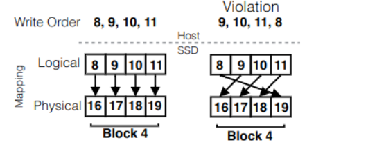
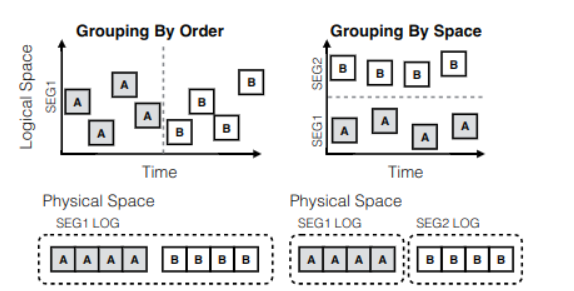

# Unwritten Contract

## Performance

SSD 与 HDD 具有不同的性能特征，部分原因是不可预测的后台活动，例如垃圾收集和磨损均衡，因此将SSD的性能分为两个方面：

* 即时性能 - 指定I/O模式下，SSD所能达到的最大性能。
* 可持续性能 - 指定I/O模式下，SSD在长期内可以维持的性能。

### Request Scala Rule

**SSD客户端应发出大的数据请求或多个小的并发请求。 请求规模小会导致资源利用率低，降低即时和可持续性能。**

现代SSD具有多个独立单元，例如通道，可以并行工作。为了利用这种并行性，当请求大小较大时，一种常见的技术是将每个请求分条为子请求，并将其发送到不同的单元。

### Locality Rule

**SSD 客户端应尽可能进行局部性的访问。 没有局部性的工作负载可能会导致较差的即时性能，因为频繁的缓存未命中会导致许多与转换相关的读取和写入。**

因为闪存芯片不允许原地更新，所以FTL必须在逻辑页和物理页之间保持动态映射。一种自然而然的选择是使用页级映射，它在逻辑页和物理页之间维持一对一的映射。这种映射需要大量的RAM，而RAM由于其高价格、相对较高的功耗以及映射和数据缓存的竞争需求而稀缺。

按需闪存翻译层（On-demand FTL），将映射存储在闪存中并在RAM中缓存，减少了映射所需的RAM。翻译的映射仅在需要时加载，并可能被驱逐以腾出空间给新的翻译。这样的翻译缓存需要局部性；一些FTL仅利用时间局部性，而其他则同时利用时间和空间局部性。

较差的局部性也会影响可持续性能，因为在垃圾收集和磨损均衡过程中，数据移动需要进行转换和映射更新。

### Aligned Sequentiality Rule

**使用混合闪存翻译层（FTL）的固态硬盘（SSD）客户应从块边界的对齐起始位置开始写入，并进行顺序写入。**

一种减少内存需求的选择是混合映射，其中地址空间的一部分由页级映射覆盖，其余部分由块级映射覆盖。由于块级映射的一个条目可以覆盖比页级映射更大的空间，因此内存需求显著减少。混合FTL对新数据使用页级映射，当映射缓存耗尽时，将其转换为块级映射。这种转换（也称为合并）的成本取决于现有的页级映射，而这又取决于写入的对齐和顺序。

如果发生非对齐写入，则需要搬运数据，上图中左边的块级映射转换就要比右边快。这一规则不会影响即时性能，因为转换发生在稍后的阶段，但违反这一规则会由于延迟转换期间昂贵的数据迁移而降低可持续性能。

### Grouping by Death Time Rule

页的死亡时间是指页被主机丢弃或覆盖的时间。如果一个块中的数据具有不同的死亡时间，那么在第一次和最后一次页失效之间，会有一个时间窗口，在这个窗口内，块中同时存在有效数据和无效数据。这样的时间窗口称为 “僵尸窗口（zombie window）” ，在僵尸窗口中的一个块称为“僵尸块”。一般来说，较大的僵尸窗口会增加块被选中进行垃圾回收的几率，从而导致高昂的数据移动成本，因为闪存翻译层（FTL）必须将有效数据移动到新块并擦除旧块。

通过将具有相似死亡时间的数据放置在同一个块中来减少。实现这一目标有两种实际方法：
* 按顺序分组 - 对写入进行排序，因此具有相似死亡时间的数据会聚集在写入序列中。由于许多 FTL 将数据追加到日志中，因此连续写入的数据在物理上是聚集的。
* 按空间分组 - 将不同的死亡组放置在空间的不同部分。这种方法依赖于逻辑空间分割，这是 FTL 中的一种流行技术因为 FTL 将写入不同段的数据放置到不同的日志中，所以将死亡组放置到不同的逻辑段中在物理上将它们隔离开来。

按死亡时间分组规则不会影响页级 FTL 或混合 FTL 的即时性能，因为在这两种情况下，数据只是简单地附加到日志块中。违反这一规则会影响可持续性能，因为它增加了垃圾收集的成本。

## SSD Lifetime

闪存单元在磨损之前可以承受有限数量的程序/擦除（P/E）次数，最近的商业SSD的P/E循环数量约为103次，预计在未来会减少。

### Uniform Data Lifetime Rule

**SSD的客户端应创建具有相似寿命的数据。**

磨损的单元会变得不稳定或完全无法使用。不均匀的块磨损可能导致SSD的超额配置区域丧失，这对性能至关重要。严重的不均匀磨损可能导致设备容量的过早丧失。

为了防止不均匀磨损，FTL（闪存翻译层）进行磨损平衡，这可以是动态的或静态的。动态磨损平衡通过在需要新块时使用较少使用的块来均匀化擦写/编程（P/E）计数。静态磨损平衡通常通过将一个不常用块中的数据复制到新位置来完成，以便该块可以用于更活跃的数据。静态磨损平衡可以定期进行，或在达到某个阈值时触发。由于静态磨损平衡会导致昂贵的数据移动，这会干扰前台流量并增加设备的整体磨损，因此最好避免使用。

寿命相对较长的数据会长时间占用块，而寿命较短的数据则会迅速使用并减少其他块的可用 P/E 循环，导致磨损不均。如果客户数据的寿命更加均匀，块将在大致相同的时间后被释放以供重新使用。寿命不均匀并不会直接影响即时性能，但会影响可持续性能，因为它需要进行磨损均衡，并导致容量的损失。

