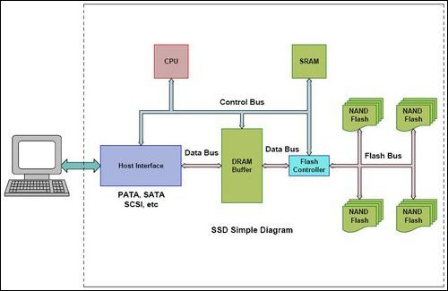
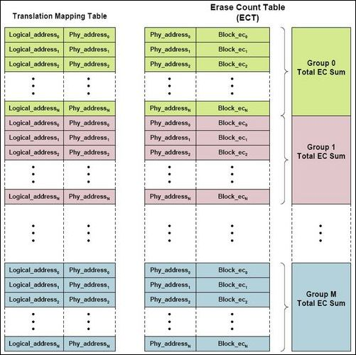
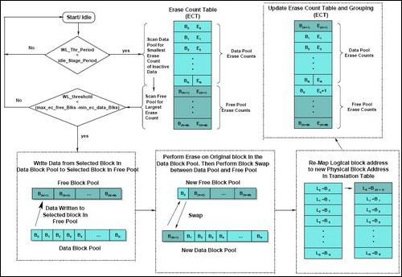

# Wear-Leveling

SSD的寿命局限于它的读写次数。对相同的存储单元不断地进行编写和擦除将更容易导致该存储单元受到永久性的损害。为了避免该情况的发生，有一种叫“Wear-Leveling”的特殊的算法被配置到SSD中。

Wear-Leveling就是将擦除/写入循环平均地分配到SSD的所有存储单元中。这样就避免了对同一个存储单元持续不断地进行擦除/写入操作，从而有效地延长了SSD的寿命。

针对Wear-Leveling算法，SSD中块单元可以分成两种类型：
* 数据块 - 数据块是闪存的主要部分，并且受到Wear-Leveling算法和数据存储器的影响。
* 空闲块 - 空闲块的数目在整个闪存中占百分之二，主要用于缓冲Wear-Leveling算法。

这就意味着闪存中块会根据Wear-Leveling准则在数据块池和空闲块池相互转换（由算法对block进行标记）。

## Flash Translation Layer（FTL）

FTL提供对逻辑地址到物理地址映射的管理，同时对闪存和无效块映射进行擦除计数管理。每个块的擦除次数都会被记录在一个叫做擦除计数表（ECT）的表格中。当块进行一次擦除时,ECT都会将该块的擦除次数自动加一。

Wear-Leveling会浏览该计数表，以此来决定哪些块必须从数据块转化成空闲块，或者相反。当需要转换操作时，转换表会把逻辑块地址重新分配给物理块地址，同时在新的块组中重新组合块地址和擦除计数值。下图是ECT的一个简单的块管理示意图和转换映射表。

在典型操作情况下，ECT和转换映射表是在SRAM(静态随机存储器)中进行管理的。然而，SRAM是一个非永久性存储器，所以映射表和ECT必须存储到NAND Flash上。

SSD通上电源时，SRAM就会从NAND Flash上加载映射表，并周期性或在断电时，重新备份到NAND Flash上。

*NOTE：推测设备必须在断电时预留足够的电源，以便写入映射表。*

Wear-Leveling有两种类型：
* 动态 - 动态Wear-Leveling算法保证数据的编写和循环的擦除会被均匀地分布到NAND Flash的所有块中。。
* 静态 - 静态Wear-Leveling会对那些处于不活动状态的块单元进行寻址，并把数据写入它们之中。。

## Dynamic Wear-Leveling

当出现一个写数据请求时，动态Wear-Leveling就会开始启动。该算法先对ECT的空闲块进行浏览，寻找一个擦除计数值最小的块单元。一旦找到符合要求的块，就将数据写入，并将该块标记为数据块（放入数据块池）。然后将新块的物理地址与主机发送过来的逻辑地址在转换映射表上建立彼此的映射关系。

通过这种做法，即使重复地对同一个逻辑地址进行写数据，由于逻辑地址和物理地址之间的映射关系发生了变化，所以数据自然不会在同一个物理块上进行重复写入。数据写入后，就需要将与主机写入的逻辑地址最初相映射的物理数据块进行擦除，然后更新ECT块擦除计数值，并将块标记为空闲（放入空闲块池），修改ECT中的块组信息。

## Static Wear-Leveling

静态Wear-Leveling 会把所有block包括没被写入和包含冷数据的block都纳入到磨损均衡中。如果冷数据是在擦写次数少的young block中，会把数据迁移到擦写次数较多的old block中。这样young block就可以标记为空闲接收新数据的写入。

静态Wear-Leveling使用两个触发机制定期地进行操作：
* 第一个触发机制是检测不活动块单元的闲置存储阶段。如果这个闲置阶段超过了所设定的上限，就会启动ECT进行浏览操作，寻找在数据块池中擦除计数值最小的块单元，以及空闲块池中擦除计数值最大的块单元。
* 一旦该查找完成，第二个触发机制就会将数据块池中最小的擦除计数值与空闲块池中最大的计数值进行相减，如果结果超过了设定上限，那么在数据块池中擦除计数值最小的块单元的数据就会被转移到空闲块池中擦除计数值最大的块单元中。然后两个块的身份互换。然后需要更新FTL的映射表和ECT。

## Invalid Blocks Handle

无效块包含一些无效内容，导致SSD的稳定性无法得到保证。在制造过程或者运行时，难免会产生一些损坏的块单元。当SSD第一次启动时，驱动器就会浏览每个块单元，在FTL的无效块列表中（IBT）找出那些由SSD卖主事先标记好的无效块。

在运行过程中，擦除编写也会出现错误。它们会被NAND Flash芯片中的监测状态寄存器检测出来。如果错误出现，状态寄存器中指定的比特位就会被重设，以此来表示该块已经不再稳定，必须被标示为无效。当一个损坏的块被检测出来时，FTL会将该块上的数据重新写入到空闲块池中擦除计数值最小的块中，并将该逻辑地址重新映射到新的物理地址上。被检测到出现错误的块会在IBT中被标示，并从空闲块池中删除。

当无效块的数量增加时，伴随而来的是可用闪存的减少，空闲块中的可用块也会随着减少。而上述方法相较于其他将无效块替换的算法来说，能够有效地提高闪存的使用率。因为那些替换算法是使用那些保留未使用的块单元来替换无效块的。

