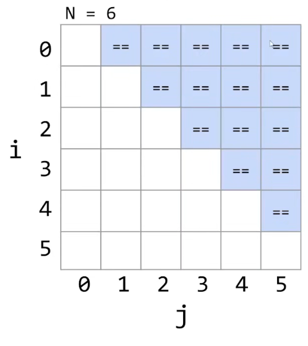

# Asymptotics Behavior

渐近行为（Asymptotics Behavior）是一个数学概念，描述当输入（或自变量）接近无穷大时函数的行为方式。

通常用于估计算法的时间复杂度。

算法的时间复杂度代表了算法的可扩展性。

## Simplified Analysis Process

简化算法的时间复杂度估算：

* 只考虑最坏的情况。
* 忽略乘法常数。
* 只考虑每一个操作中的最高阶的项（将该操作作为算法的代表性操作）。

分析步骤：

* 选择一个具有代表性的操作。
* 计算出代表操作的数量增长率。

### Example

对于该算法，可以选择代表性操作`=`。

假设`N = 6`，列出下表。

由此可得，执行`=`操作的次数 $C = 1 + 2 + 3 + ... + (N - 2) + (N - 1) = \frac{(N-1)*N}{2}$ 。

## Big-Theta Theory

如果函数 $R(N)$ 属于 $\theta(f(N))$ ，那么：

* 存在 $k_1$和 $k_2$。
* 使得不等式 $k_1 * f(N) \le R(N) \le k_2 * f(N)$ ，在 $N \to \infty$ 时成立。

$\theta$ 用于描述函数的增长。

复杂度也可以使用 $\theta$ 进行表示。

## Big-O Theory

如果将 $\theta$ 看成是`=`，那么 $O$ 可以被看成是`<=`。

如果函数 $R(N)$ 属于 $O(f(N))$ ，那么：

* 存在 $k_1$ 。
* 使得不等式 $R(N) \le k_1 * f(N)$ ，在 $N \to \infty$ 时成立。

*NOTE：因此在描述复杂度时，使用 O 更准确。*