# Binary Search Trees

二叉搜索树（Binary Search Tree）是一种实现关联容器的方式。

## Ordered Linked List Set

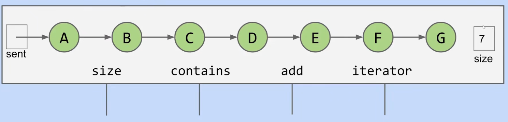

有序链表是一种实现关联容器的简单方式。

但是它的`contain`和`add`操作都需要线性时间`O(N)`。

## BST Definitions

树的组成分为两个部分：
* 一组节点。
* 以及一组连接节点的边。
  
其中，两个节点之间只能有一条边。

除了根节点（root node）之外的节点都有一个父节点，根节点没有父节点。

没有子节点的节点称为叶节点。

在一个二叉树（binary tree）中每一个节点都有`0`、`1`或`2`个子节点。

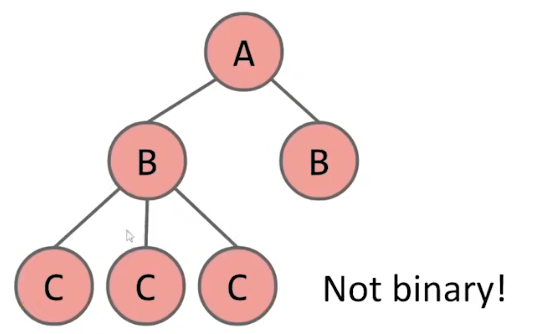

二叉搜索树（binary search tree）是一种二叉树，同时具有BST性质（BST Property）：
* 对于树中的Key `X`来说，左边子树的每一个key都小于`X`。
* 右边子树的每一个key都大于`X`。

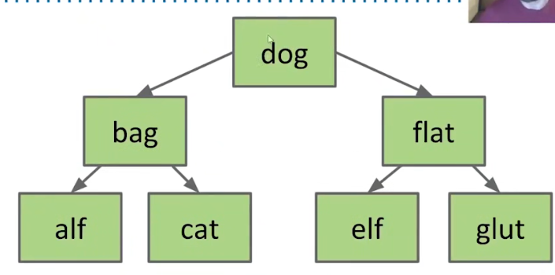

## BST Operations

### Search

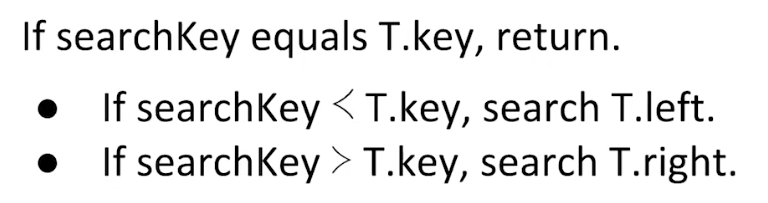

要搜索一个Key `X`需要从根节点开始按以下规则搜索：
* 如果当前节点的key等于`X`，返回当前节点。
* 如果当前节点的key大于`X`，设置当前节点为左孩子，重新进行操作。
* 如果当前节点的key小于`X`，设置当前节点为右孩子，重新进行操作。

```cpp
Node *Find(Key x) {
    Node *node = root;
    while(node != nullptr && node.Key != x) {
        if(node.Key > x) {
            node = node.Left;
        } else {
            node = node.Right;
        }
    }
    return node;
}
```

### Insert

`Insert`的规则与`Search`类似，插入一个Key `X`需要从根节点开始按以下规则搜索：
* 如果当前节点的key等于`X`，插入到当前节点。
* 如果当前节点的key大于`X`，设置当前节点为左孩子，重新进行操作。
* 如果当前节点的key小于`X`，设置当前节点为右孩子，重新进行操作。

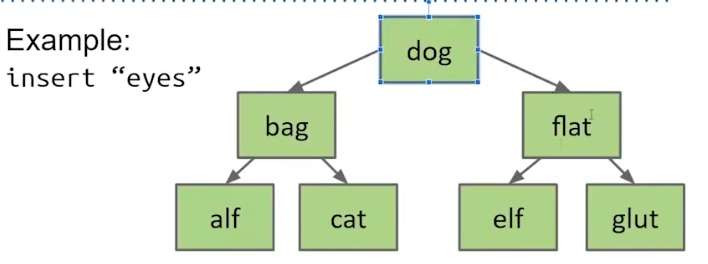

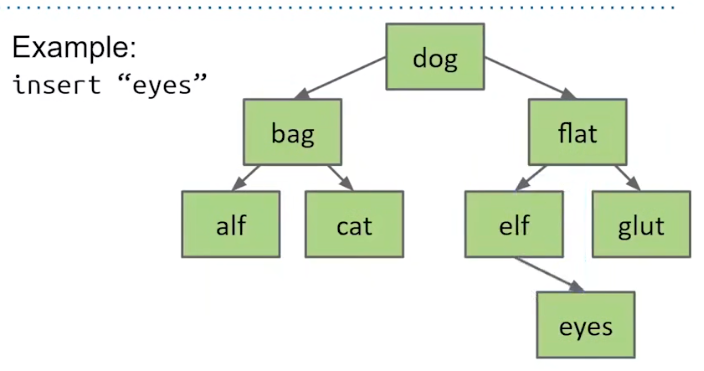

```cpp
Node **GetInsertSlot(Key x,Node *node) {
    if(node.Key == x) {
        return &node;
    } else if(node.Key > x) {
        return &node.Left;
    }
    return &node.Right;
}

void Insert(Key x) {
    if(root = nullptr) {
        root = new Node(x);
        return;
    }
    Node **slot = GetInsertSlot(root);
    // if find an empty position
    // or find an existed key
    while(*slot != nullptr && slow->Key != x) {
        slot = GetInsertSlot(*slot);
    }
    Node *newNode = new Node(x);
    swap(newNode,*slot);
    if(newNode != nullptr) {
        delete newNode;
    }
}
```

### Delete

对于`Delete`而言，存在三种情况：
* 要删除的节点没有子节点，只需要将父节点的指针设置为空。
* 要删除的节点有一个子节点，只需要将父节点的指针设置为删除节点的子节点。
* 要删除的节点有两个子节点，略微复杂。

|No Child|One Child|Two Child|
|-|-|-|
|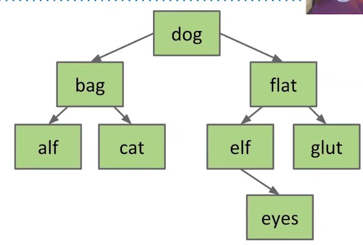|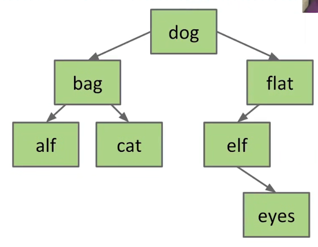|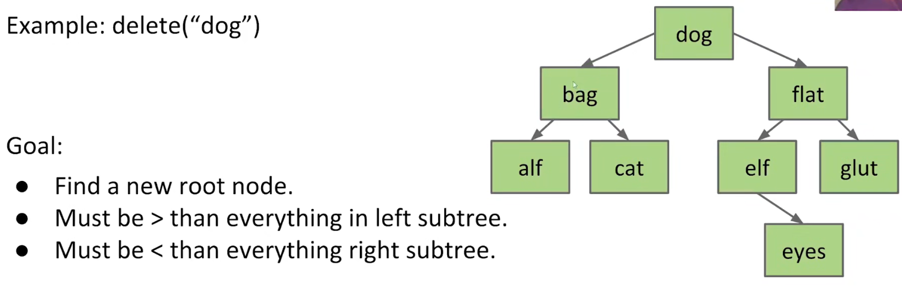|
|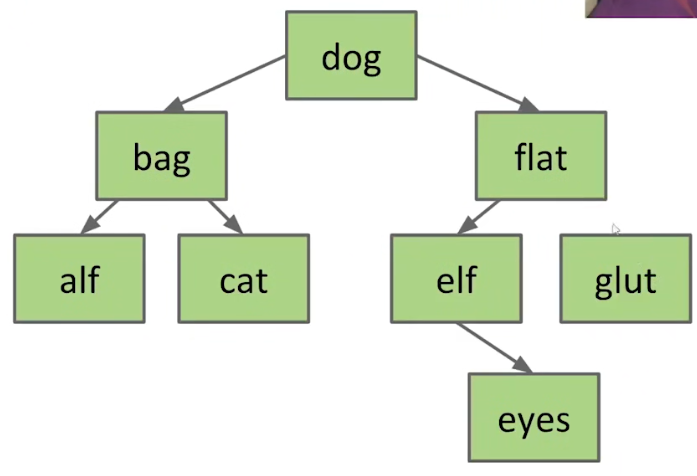|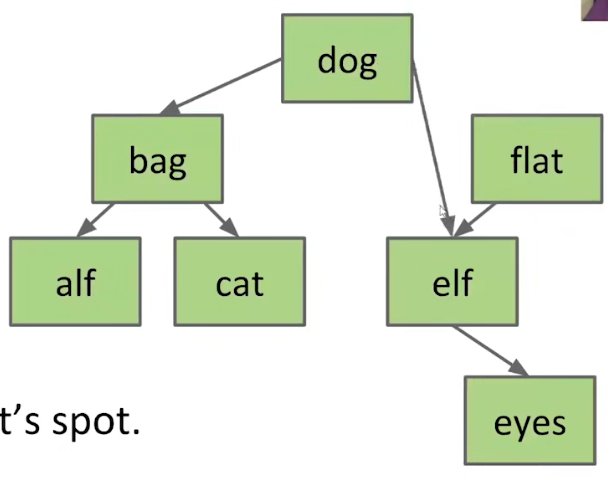|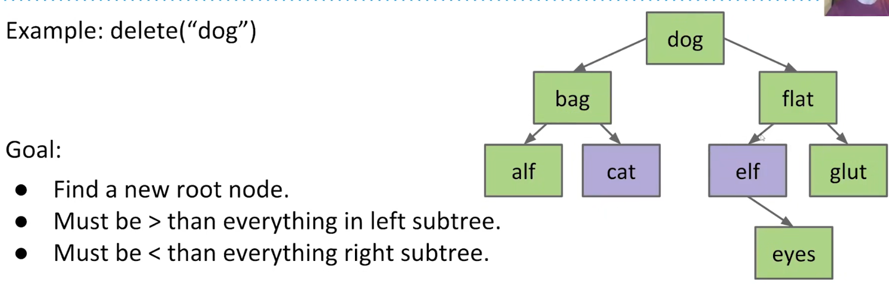|
||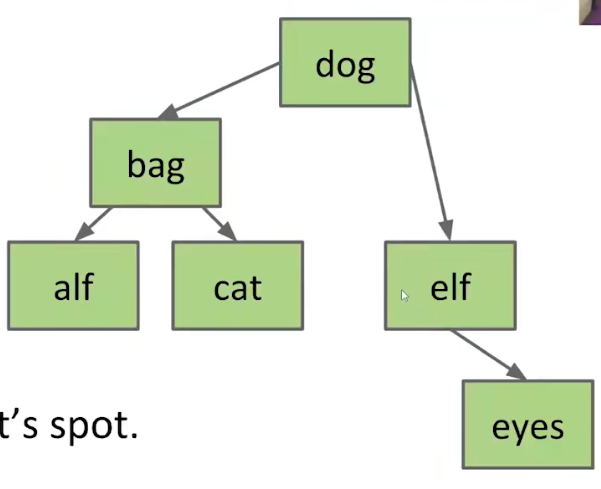|用前驱项或后继项代替删除节点的Key，并进入"No Child" Case or "OneChild" Case|

这个删除方式称为“hibbard delete”。

*NOTE：节点的前驱项是左子树最右边的子节点。*

*NOTE：节点的后继项是右子树最左边的子节点。*

```cpp
// return the ptr that point to parent node's (left/right) field
Node **FindSlot(Key x) {
    Node **slot = &root;
    Node *node = root;
    while(node != nullptr && node.Key != x) {
        if(node.Key > x) {
            slot = &node.Left;
            node = node.Left;
        } else {
            slot = &node.Right;
            node = node.Right;
        }
    }
    return slot;
}

size_t GetChildCount(Node *node) {
    size_t i = 0;
    if(node.Left != nullptr) {
        i += 1;
    }
    if(node.Right != nullptr) {
        i += 1;
    }
    return i;
}

Node *GetOnlyChild(Node *node) {
    if(node.Left != nullptr) {
        return node.Left;
    }
    return node.Right;
}

// find the ptr that point to predecessor node
Node **FindPredecessorSlot(Node *node) {
    // enter left tree
    Node **slot = &node.Left;
    node = node.Left;
    // travel to right side
    while(node.Right != nullptr) {
        slot = &node.Right;
        node = node.Right;
    }
    return slot;
}

void Delete(Key x) {
    Node **slot = FindSlot(x);
    if(*slot == nullptr) {
        // not found
        return;
    }
    size_t count = GetChildCount(*slot);
    if(count == 0) {
        // case(1): no child
        Node *tmp = *slot;
        *slot = nullptr;
        delete tmp;
    } else if(count == 1) {
        // case(2): one child
        Node *tmp = *slot;
        *slot = GetOnlyChild(tmp);
        delete tmp;
    } else {
        // case(3): two child
        // use predecessor way
        Node **predecessorSlot = FindPredecessorSlot(*slot);
        // use predecessor to replace key
        (*slot)->Key = (*predecessorSlot)->Key;
        count = GetChildCount(*predecessorSlot);
        if(count == 0) {
            // re-enter case(1)
            Node *tmp = *predecessorSlot;
            *predecessorSlot = nullptr;
            delete tmp;
        } else {
            // re-enter case(2)
            Node *tmp = *predecessorSlot;
            *predecessorSlot = GetOnlyChild(tmp);
            delete tmp;
        }
    }
}
```

## BST Tree Height

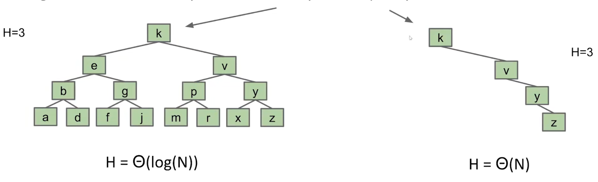

在高度相同的情况下，稀疏的BST和密集的BST可能呈现完全不同的形态。

在最坏的情况下，稀疏的BST的搜索效率下降为与链表一致。

*NOTE：以随机顺序插入和删除的binary search tree是密集的，但是我们无法一直的以随机顺序进行操作。*