# Disjoint Sets

## Operations

并查集（disjoint sets）有两个操作：
* `connect(i,j)` - 连接两个对象。
* `isConnected(i,j)` - 查看两个对象是否被连接。

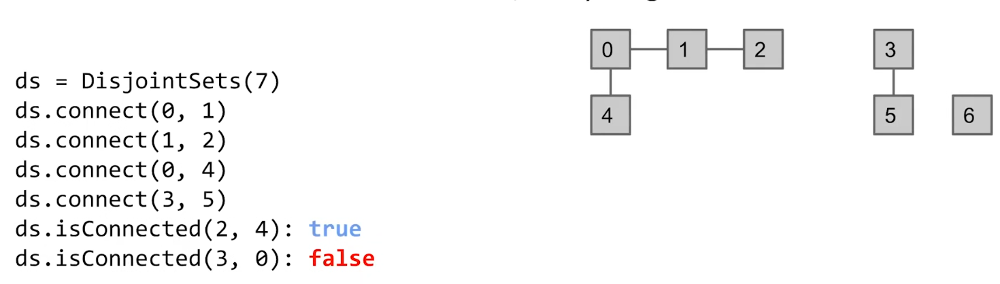

连接可以是直接的也可以是间接的。

为了高效地解决这个问题，我们不跟踪元素的线，而是把连接在一起的元素放入一个Set中。

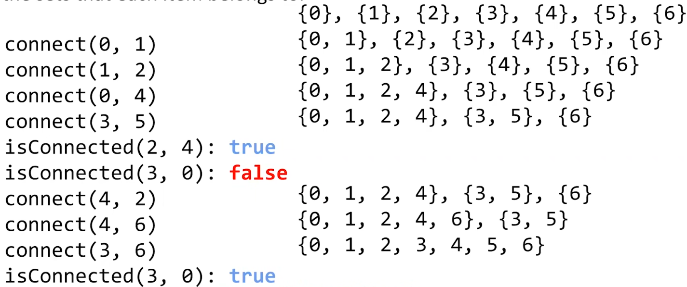

## List Of Sets Disjoint Sets

一种直接的方式是使用`List<Set>` 存储所有的Sets。

当没有元素连接在一起时，每个集合都只包含一个空的元素。

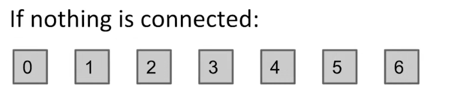

执行`connect(i,j)`时，遍历`List<Set>`找到`i`和`j`所属的Set，然后合并两个Set。

执行`isConnected(i,j)`时，遍历`List<Set>`找到`i`或`j`所属的Set，然后查看另一个元素是否在相同的Set中。

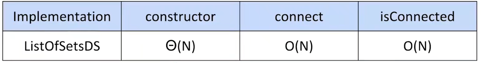

这种实现方式时间复杂度十分高。

## Quick Find Disjoint Sets

Quick Find Disjoint Sets不跟踪集合，而是直接跟踪元素以及它们所属的集合id。

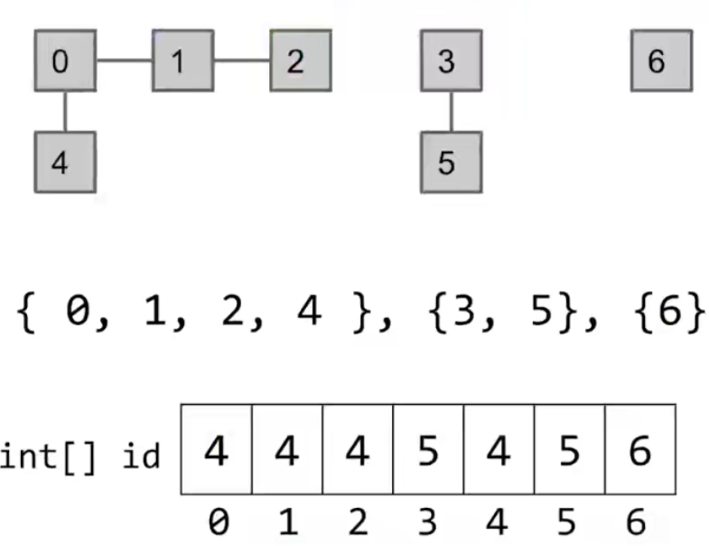

|Before `Connect(2,3)`|After `Connect(2,3)`|
|-|-|
||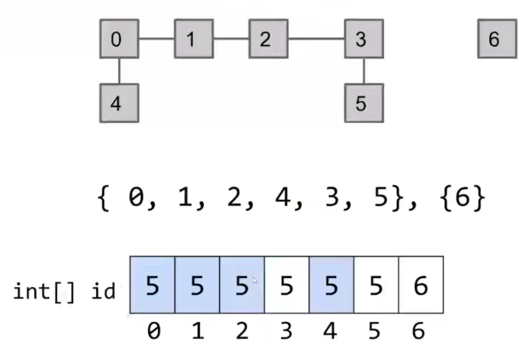|

这样的好处是使`isConnected`的代价变得很低。

```cpp
void connect(int i,int j) {
    int firstSet = id[i];
    int secondSet = id[j];
    for(int i = 0;i != id.size();++i) {
        if(id[i] == secondSet) {
            id[i] = firstSet;
        }
    }
}
```

```cpp
void isConnected(int i,int j) {
    int firstSet = id[i];
    int secondSet = id[j];
    return firstSet == secondSet;
}
```

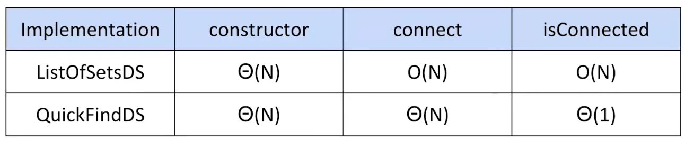

## Quick Union

Quick Union于Quick Find Disjoint Sets类似。

但Quick Union跟踪元素以及它们的父元素。

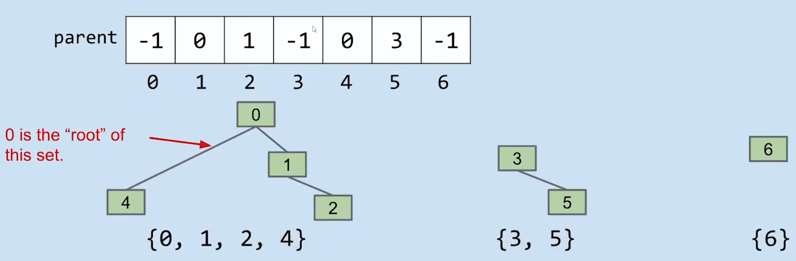

```cpp
int find(int i) {
    int parent = parents[i];
    while(parent != -1) {
        i = parent;
        parent = parents[i];
    }
    return i;
}
```

```cpp
void connect(int i,int j) {
    // find the root of i
    i = find(i);
    // find the root of j
    j = find(j);
    // set root of i be a child of root of j
    if(i != j) {
        parents[i] = j;
    }
}
```

*NOTE: 此处不能只寻找`i`的root而直接将`i`连接到`j`上，因为这么做可能导致环路。*

```cpp
void isConnected(int i,int j) {
    // find the root of i
    i = find(i);
    // find the root of j
    j = find(j);
    // check two roots
    return i == j;
}
```

## Weighted Quick Union

Weighted Quick Union是对Quick Union的改进。

Weighted Quick Union将选择合适的连接方式而不是总是将`j`作为`i`的`parent`来尽可能地平衡树。

Weighted Quick Union不仅跟踪元素的`paraent`，还跟踪树的大小。

*NOTE：可以在`parents`中使用负数表示大小。*

总是将小的tree插入到大的tree下面。

```cpp
FindResult find(int i) {
    int parent = parents[i];
    while(parent >= 0) {
        i = parent;
        parent = parents[i];
    }
    // return {root,size}
    return {i,parent};
}
```

```cpp
void connect(int i,int j) {
    // find the root of i
    i,iSz = find(i);
    // find the root of j
    j,jSz = find(j);
    // connect two root
    if(i != j) {
        if (iSz > hSz) {
            parent[j] = i;
            // set size of j tree
            parent[j] += iSz;
        } else {
            parent[i] = j;
            // set size of i tree
            parent[i] += jSz;
        }
    }
}
```

*NOTE：这个插入规则将导致size大的tree高度比如比size小的tree高。*

|Connect Process|
|-|
|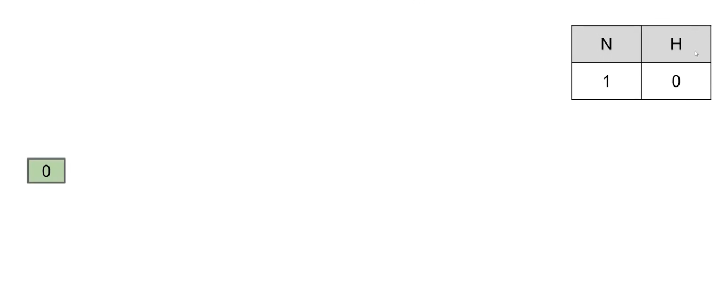|
|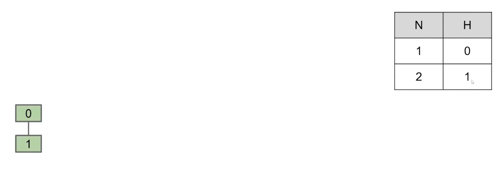|
|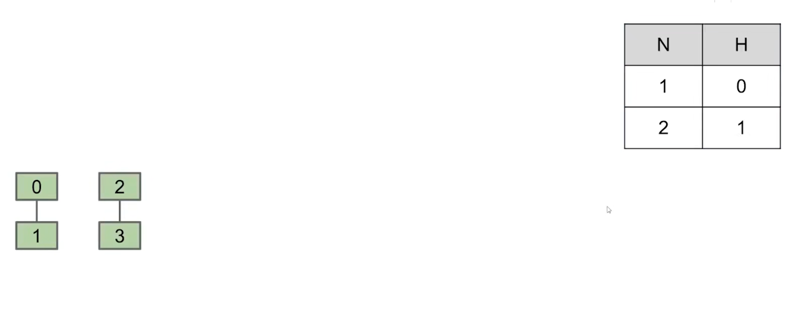|
|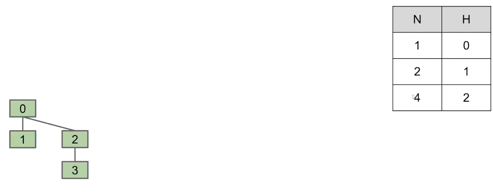|

想要使得一个tree的高度增长，必须创造一个大小与他相同的tree连接到前者。

```cpp
void isConnected(int i,int j) {
    // find the root of i
    i,_ = find(i);
    // find the root of j
    j,_ = find(j);
    // check two roots
    return i == j;
}
```

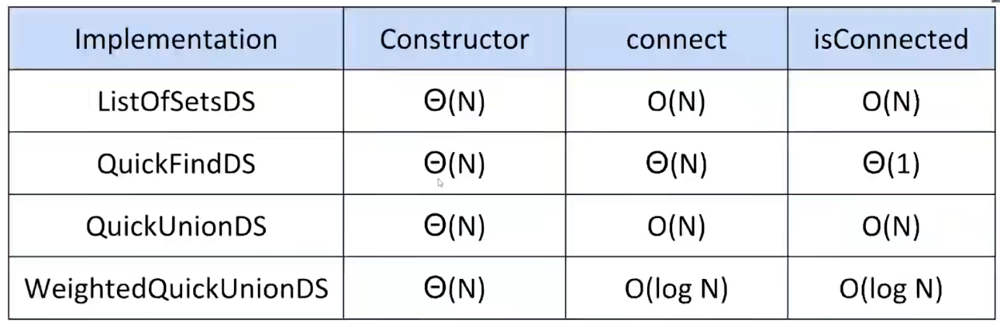

## Path Compression

仍可以对现有的数据结构进行改进，一个idead是缓存`find`的结果。

|`isConnected(14,13)`|
|-|
|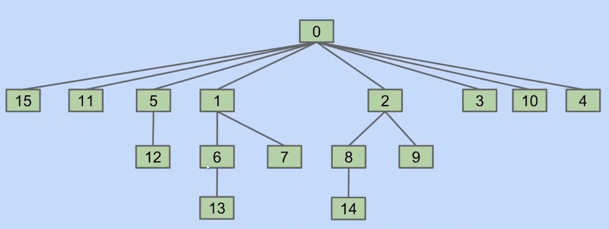|
|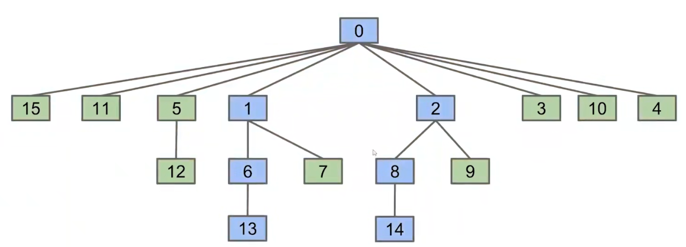|
|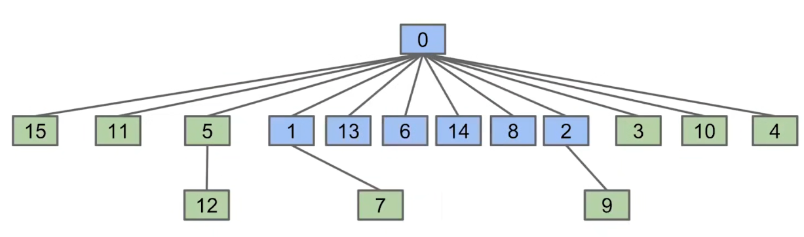|

```cpp
FindResult findAndCache(int i) {
    int original = i;
    int parent = parents[i];
    while(parent >= 0) {
        i = parent;
        parent = parents[i];
    }
    int size = parent;
    int root = i;
    i = original;
    // cache root
    int parent = parents[i];
    while(parent >= 0) {
        parents[i] = root;
        i = parent;
        parent = parents[i];
    }
    return {root,size}
}
```

```cpp
void isConnected(int i,int j) {
    // find the root of i
    i,_ = findAndCache(i);
    // find the root of j
    j,_ = findAndCache(j);
    // check two roots
    return i == j;
}
```