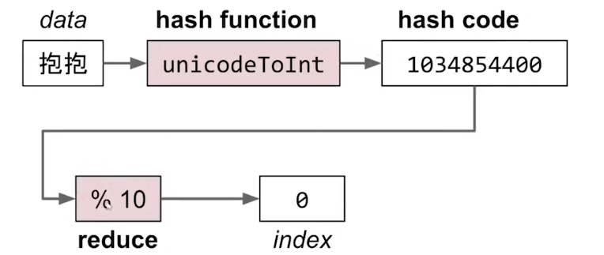
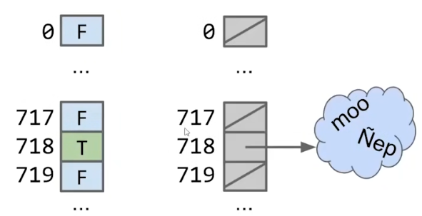
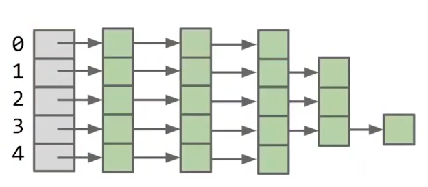
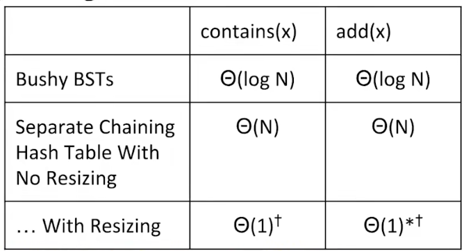

# Hashing

hash code将无限的目标集映射一个有限的集合。

所以hash code一定会产生碰撞（Collision）。

hash table使用hash code作为index，将数据存储在一个array中。



## Chain Hash Table

chain hash table将冲突的key放在一个bucket组成一个chain。



同时记录table中有多少个元素和bucket的数量。

当负载因子（load factor）达到一个极限时，重建hash table并将bucket翻倍。



*NOTE： `load factor = count/bucket`。*



resize hash table，保证`bucket`与`count`一样线性增长。

那么我们可以得到`O(1)`平均复杂度的`insert`、`remove`和`find`。

```cpp
void Insert(Key key,size_t hash) {
    count += 1;
    if(count/bucket > load_factor) {
        Rebuild();
    }
    size_t index = hash % bucket;
    table[index].Push(Key);
}

bool Contain(Key key,size_t hash) {
    size_t index = hash % bucket;
    return table[index].Contain(key);
}
```

## Hash Code

设计一个好的hash函数很难。

通过一个小技巧可以设计出一个还算能用的hash函数。

将序列的每一个元素按某个base累加。

*NOTE： 这个base通常是小质数（在Java中，这个值是`31`）。*

```cpp
size_t Hash(const char *s,size_t length) {
    size_t h = 0;
    for(size_t i = 0;i != length;i++) {
        h *= base;
        h += s[i];
    }
    return h;
}
```

---

另请参阅：
* [Hash Table](../../CMU%2015-445/Hash%20Table/Note.md)