# Heaps

堆（heaps）是完全二叉树，是实现优先级队列（priority queue）的一种方式。

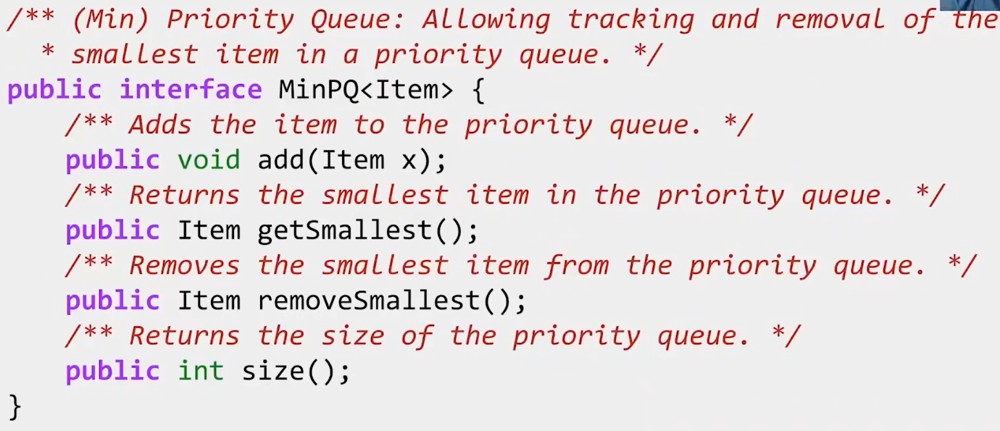

堆分为大顶堆（max-heap）和小顶堆（min-heap）分别能够提供最大值的快速访问和最小值的快速访问。

大顶堆的上层元素不能小于它的下层元素，小顶堆的上层元素不能大于下层元素。

堆可能很轻易地使用数组表示。

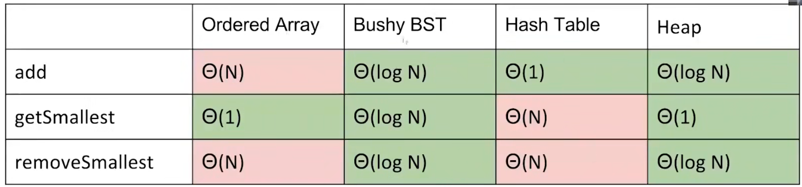

## GetTop

```cpp
Key *GetTop() {
    if(array.Count() != 0) {
        return array[0];
    }
    return nullptr;
}
```

## Insert

|Insert|
|-|
|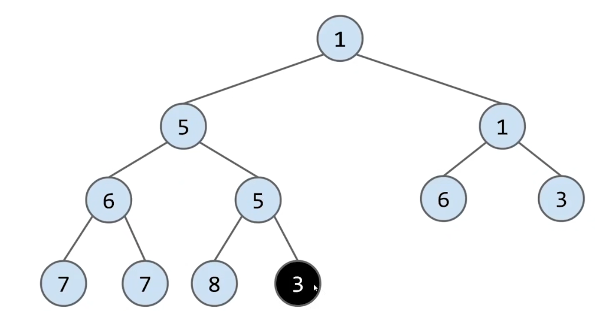|
|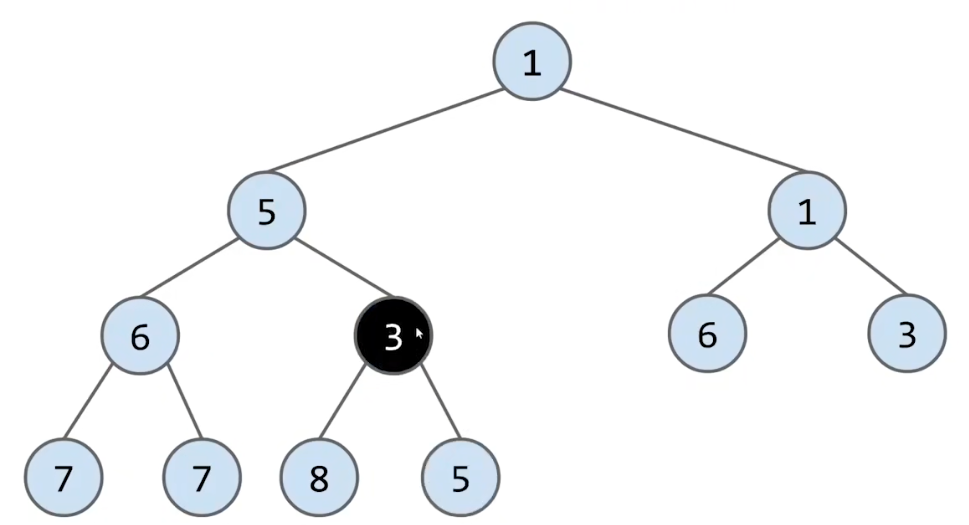|
|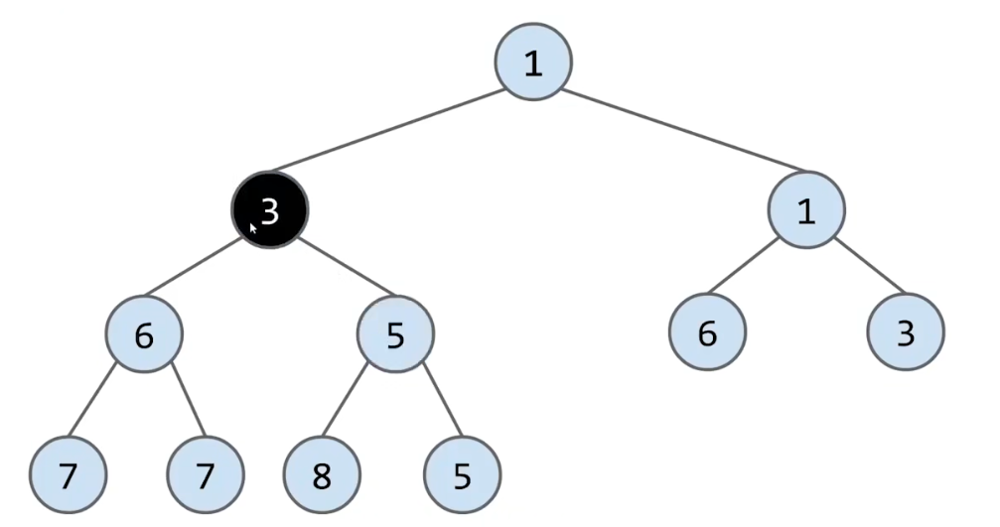|
|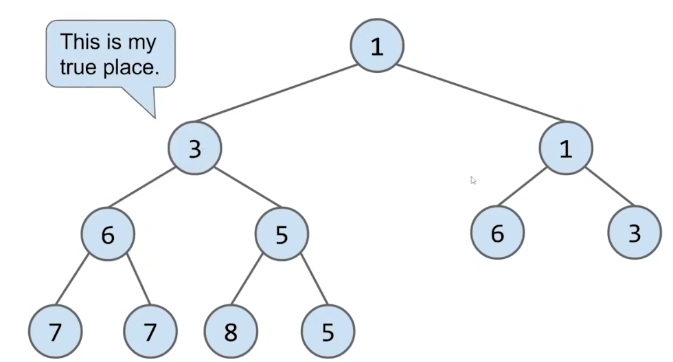|

插入过程将key放到最后的位置。

然后上浮到合适的位置。

```cpp
size_t GetLeftChild(size_t i) {
    return (i * 2) + 1;
}

size_t GetRightChild(size_t i) {
    return (i * 2) + 2;
}

size_t GetParent(size_t i) {
    // set parent is x
    // if we are left child:
    // (x * 2) + 1 = i
    // if we are right child:
    // (x * 2) + 2 = i
    // when i + 1, we got:
    // (x * 2) + 2 = i + 1
    // (x * 2) + 3 = i + 1
    // we take advantage of integer rounding
    // div it by 2, got:
    // (i + 1)/2 = x + 1
    return (i + 1)/2 - 1;
}

void Insert(Key key) {
    size_t i = array.Push(key);
    while(i != 0) {
        size_t parent = GetParent(i);
        if(array[parent] > array[i]) {
            Swap(array[parent],array[i]);
            i = parent;
        } else {
            break;
        }
    }
}
```

## Remove

|Remove|
|-|
|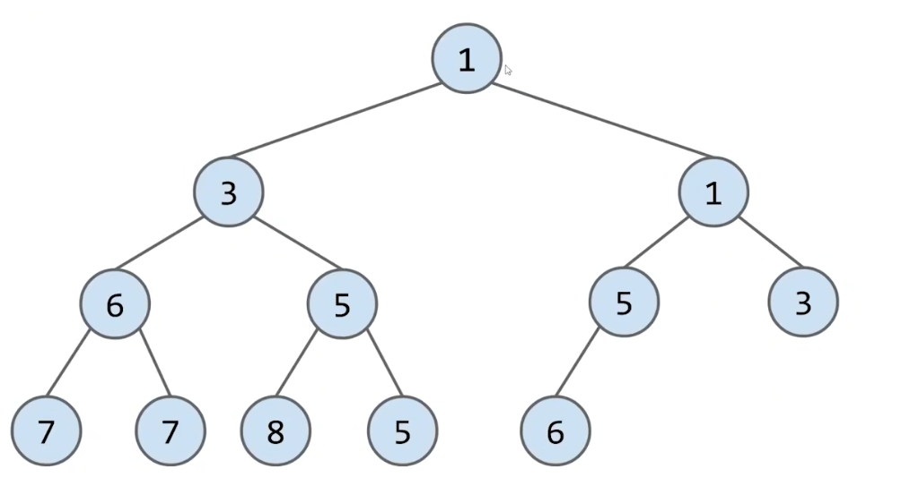|
|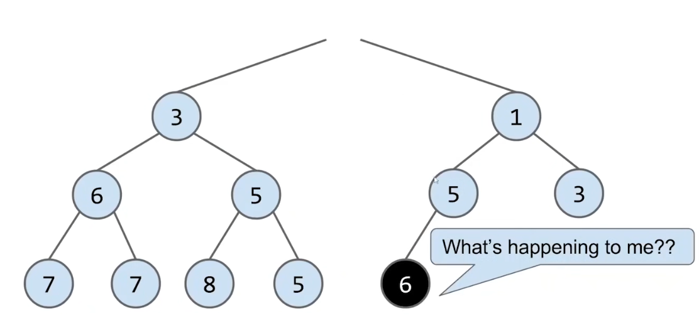|
|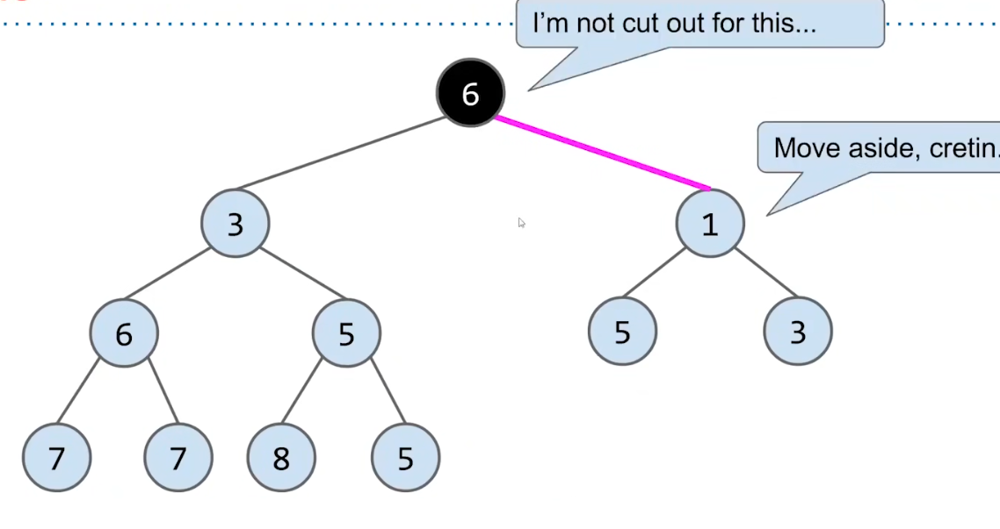|
|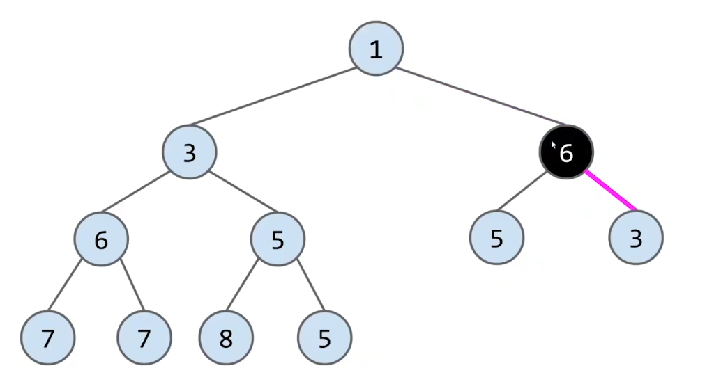|
|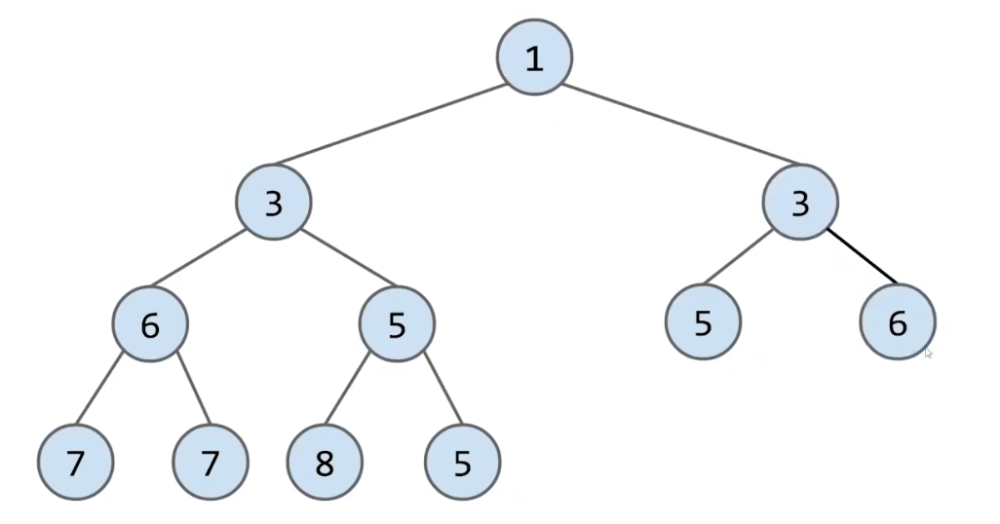|

删除过程将最后的key放到root的位置。

然后下潜到合适的位置。

```cpp
void RemoveTop() {
    if(array.Empty()) {
        return;
    }
    size_t i = array.Count() - 1;
    if(i != 0) {
        // swap root with last item
        Swap(array[i],array[0]);
        // remove old root
        array.PopBack();
        // 
        i = 0;
        size_t left = GetLeftChild(i);
        while(left < array.Count()) {
            size_t right = left + 1;
            size_t selectedChild = left;
            if(right < array.Count() && array[left] > array[right]) {
                selectedChild = right;
            }
            if(array[i] <= array[selectedChild]) {
                break;
            }
            Swap(array[i],array[selectedChild]);
            i = selectedChild;
            left = GetLeftChild(selectedChild);
        }
    } else {
        array.PopBack();
    }
}
```