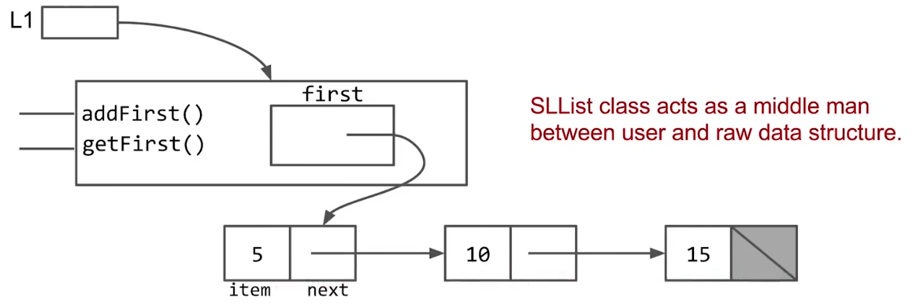

# Lists

线性表是最基础的数据结构，按某种顺序存储元素。

## Single Linked List（SLList）

Single Linked List由一系列的nodes组成，每一个node都内嵌一个指向下一个node的pointer。

|Operations|Speed|
|-|-|
|Random Access|Slow|
|Random Insert|Fast|
|Random Delete|Fast|
|Sequential Access|Fast|
|Backward Sequential Access|Slow|
|Sequential Insert|Fast|
|Last Delete|Fast|

## Double Linked List（DLList）

Double Linked List由一系列的nodes组成，每一个node都内嵌一个指向下一个node的pointer，以及一个指向上一个node的pointer。

|Operations|Speed|
|-|-|
|Random Access|Slow|
|Random Insert|Fast|
|Random Delete|Fast|
|Sequential Access|Fast|
|Backward Sequential Access|Fast|
|Sequential Insert|Fast|
|Last Delete|Fast|

## Array List（AList）

Array List由一组在物理上聚集（cluster）在一起的元素，它们的逻辑顺序与它们的物理顺序相同，并且元素之间的存储空间是紧密相连的。

*NOTE：这意味着良好的空间局部性。*

|Operations|Speed|
|-|-|
|Random Access|Fast|
|Random Insert|Slow|
|Random Delete|Slow|
|Sequential Access|Fast|
|Backward Sequential Access|Fast|
|Sequential Insert|Fast|
|Last Delete|Fast|

*NOTE：请使用AList作为默认线性数据结构，因为它有较好的局部性。*