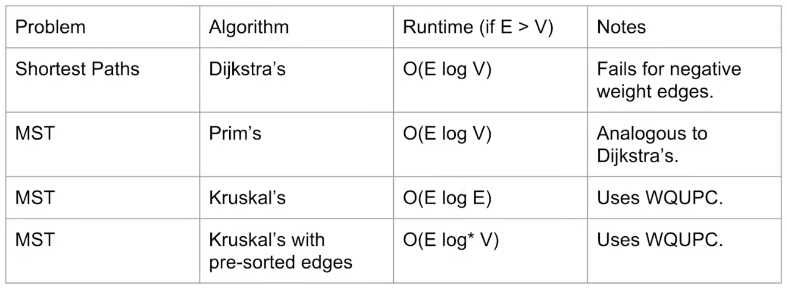

# Minimum Spanning Trees

最小生成树（Minimum Spanning Trees）由一个带权图生成。

它的边的权加起来具有最小的总权，并且它是一个树（即没有环，且连通）。

*NOTE：只有连通图能生成最小生成树。*

*NOTE：当权值不唯一时，最小生成树不唯一。*

## Cut Property

将带权图的节点涂成两种颜色，连接不同颜色的节点的边称为交边（crossing edge）。

*NOTE：涂法是任意的。*

权值最小的交边一定在最小生成树中。


## Prime Algorithm

Prime Algorithm 利用Cut Property产生最小生成树。

首先将起点标记成另一种颜色


它的所有出边就都是交边，将它们添加到队列中。

选择其中权值最小的交边，将相应的点标记成与起点相同的颜色。


并将该点的出边也添加到队列中。

重复以上步骤直到所有的点都被连接。

|Full Process|
|-|
||
||
||
||
||
||
||
||
||
||
||

### Pseudo Code

```cpp
Tree Prime(Node *begin) {
    Tree result;
    // color it as white
    begin.Mark();
    // add it to tree
    result.AddNode(begin);
    EdgeSet edges;
    // add all edges to queue
    for (const auto &edge:begin) {
        edges.Put({edge.From,edges.To,edge.Weight});
    }
    while (!edges.Empty()) {
        // get the min-edge
        Edge *min = nullptr;
        for (const auto &edge:edges) {
            if (min == nullptr || edge.Weight < min.Weight) {
                min = edge;
            }
        }
        edges.Remove(min);
        // add it to tree
        result.AddNode(min.To);
        result.Connect(min.From,min.To);
        // mark it as white
        min.To.Mark();
        for (const auto &edge:min.To) {
            // if it is not white
            if (!edge.To.Marked()) {
                // add to queue
                if (edges.Contain(edge.To) ||
                    edge.To.Weight < edges.Get(edge.To).Weight) {
                    edges.Put({edge.From,edge.To,edge.Weight});
                }
            }
        }
    }
    return result;
}
```

*NOTE：在实际中，使用优先级队列索引最小边。*

## Kruskal Algorithm

Kruskal Algorithm比Prime Algorithm更容易实现。

Kruskal Algorithm首先将所有的边排序，然后依次将边添加到最小生成树中。

并且，我们跳过可能导致成环的边。

|Full Process|
|-|
||
||
||
||
||
||
||
||
||
||
||
||
||
||

### Pseudo Code

```cpp
Tree Kruskal() {
    // get all edges
    Vector<Edge*> edges = GetAllEdges();
    // sort by weight
    Sort(edges);
    Tree result;
    // cycle detect
    QuickUnion qu;
    while (edges.Empty()) {
        Edge *e = nullptr;
        // get a non-cycle edge
        do {
            // if edges is empty
            if (edges.Empty()) {
                break;
            }
            e = edges.Front();
            edges.PopFront();
        } while(qu.IsConnected(e.From,e.To));
        // add nodes to tree
        if (!e.From.Marked()) {
            e.From.Mark();
            result.Add(e.From);
        }
        if (!e.To.Marked()) {
            e.To.Mark();
            result.Add(e.To);
        }
        result.Connect(e.From,e.To);
        qu.Connect(e.From,e.To);
    }
    return result;
}
```

