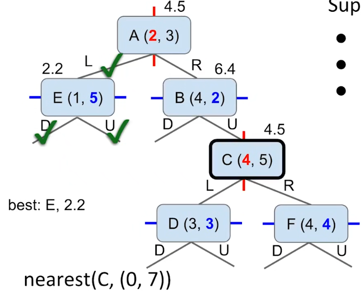
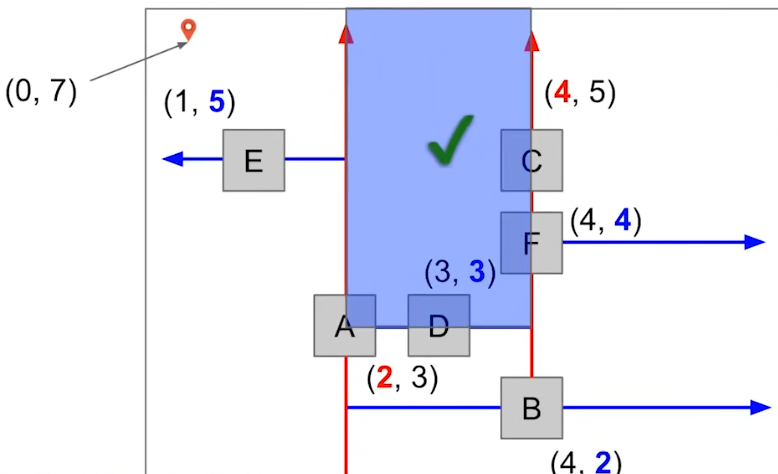

# Range Searching And Multi-Dimensional Data

## Nearest Search

BST可以进行临近搜索，找到与key最接近的节点。

只需要进行正常的BST搜索，通常记住与该Key最近的Key。

如果没有找到返回最近的Key，否则返回找到的节点。

|Full Process|
|-|
||
||
||
||

```cpp
Node *NearestSearch(Key key) {
    if(root == nullptr) {
        return nullptr;
    }
    if(root.Key == key) {
        return root;
    }
    Node *last = root;
    Node *node = root;
    while(node != nullptr && node.Key != key) {
        if(key.GetDistanceWith(node.Key) < key.GetDistanceWith(last.Key)) {
            last = node;
        }
        if(node.Key > key) {
            node = node.Left;
        } else {
            node = node.Right;
        }
    }
    if(node != nullptr) {
        return node;
    }
    return last;
}
```

## Multi-Dimensional Range Search

用单一坐标建立的BST无法进行有效的多维范围搜索。

*NOTE：因为索引只有一个维度，搜索另一个维度的数据时需要遍历。*

|Only-X BST|Only-Y BST|
|-|-|
|||

## QuadTrees

四叉树可以用于索引多维数据，它是BST的推广。


四个方向分别代表：
* `(smaller,smaller)` - 在两个维度都比父节点小。
* ` (smaller,larger)` - 在第一个维度比父节点小，第二个维度比父节点大。
* ` (larger,smaller)` - 在第一个维度比父节点大，第二个维度比父节点小。
* `  (larger,larger)` -  在两个维度都比父节点大。

*NOTE：实际中larger或者smaller可能包含equal，但不会包含all-equal。*

### Insert

插入操作也与BST类似。

|Trees|Images|
|-|-|
|||
|||
|||
|||
|||

```cpp
Node **GetChildSlot(Node *node,int32_t first,int32_t second) {
    if(first >= 0) {
        first = 1;
    } else {
        first = 0;
    }
    if(second >= 0) {
        second = 1;
    } else {
        second = 0;
    }
    return &node.Child[first][second];
}

Node **FindSlot(Key key) {
    Node *node = root;
    Node **slot = &root;
    while(node != nullptr && node.Key != key) {
        int32_t firstComp = Compare(key.First,node.Key.First);
        int32_t secondComp = Compare(key.First,node.Key.Second);
        slot = GetChildSlot(node,firstComp,secondComp);
        node = *slot;
    }
    return slot;
}

void Insert(Key key) {
    Node **slot = FindSlot(key);
    *slot = NewNode(key);
}
```

### Point Search

点查算法也与BST类似。

```cpp
Node *Search(Key key) {
    Node **slot = FindSlot(key);
    return *slot;
}
```

### Range Search

从根节点开始搜索：
* 将根节点入队。
* 将节点从队列取出：
  * 如果节点在范围内，添加到结果集，并添加它的所有子节点到队列。
  * 如果不在范围内，添加其可能在范围内的子节点到队列。
* 重复执行直到队列为空。

|Full Process|
|-|
||
||
||
||
||
||
||
||

```cpp
NodeSet RangeSearch(Range range) {
    NodeSet result;
    if(root != nullptr) {
        Queue<Node*> queue;
        queue.Push(root);
        while(!queue.Empty()) {
            Node *node = queue.Front();
            queue.PopFront();
            if(node.In(range)) {
                result.Add(node);
                for(const auto &child : node) {
                    queue.Push(child);
                }
            } else {
                NodeSet ways = node.ChildMayIn(range);
                for(const auto &child : ways) {
                    queue.Push(child);
                }
            }
        }
    }
    return result;
}
```

## K-D Trees

四叉树只能处理二维的数据，但是K-D Trees能够在更高纬度的空间进行索引。

*NOTE：高维索引数据结构还有R-Trees，它是B-Trees在高维的推广。*

K-D Trees将多个维的索引在层之间进行轮换。

*NOTE：例如，在二维中就是：x、y，三维则是x、y、z。*

### Insert

插入过程与BST类似，但是需要在不同的层变换比较的维度。

|Trees|Images|
|-|-|
|||
|||
|||
|||
|||
|||

```cpp
constexpr size_t Dimensions = 2;

Node **GetChildSlot(Node *node,Key key,size_t dim) {
    if(key.Get(dim) >= node.Key.Get(dim)) {
        return &node.Right;
    }
    return &node.Left;
}

Node **FindSlot(Key key) {
    Node *node = root;
    Node **slot = &root;
    size_t level = 0;
    while(node != nullptr && node.Key != key) {
        size_t dim = level % Dimensions;
        slot = GetChildSlot(node,key,dim);
        node = *slot;
        level += 1;
    }
    return slot;
}

void Insert(Key key) {
    Node **slot = FindSlot(key);
    *slot = NewNode(key);
}
```

### Point Search

查询过程与插入类似。

```cpp
Node *Search(Key key) {
    Node **slot = FindSlot(key);
    return *slot;
}
```

### NearestSearch

最近搜索有点棘手，关键问题在于不在目标方向的一端（“bad side”）也可能是有价值的。


如何判断“bad side”有没有价值呢？

>
> 取决于“bad side”的父节点，
> 如果父节点的任意一个维度（除了衡量“good side”和“bad side”的维度）的坐标到目标点的对应坐标的距离，
> 小于或等于最佳点到目标点的距离，
> 那么“bad side”就是有价值的。
>

*NOTE：因为在另外在“bad side”可能存在于父节点和目标都垂直的点，如果存在，则该点会比best更好。*

|Search|Images|
|-|-|
|||
|||
|||
|||
|||
|||
|||
|||
|||
|||
|||

```cpp
bool BadSideUseful(Node *node,Key goal,Node *best,size_t dim) {
    size_t distance = goal.GetDistance(best.Key);
    for(size_t i = 0;i != Dimensions; ++i) {
        if (i != dim &&
            goal.GetDistanceIn(node.Key.Get(i),i) <= distance) {
            return true;
        }
    }
    return false;
}

Node *NearestSearch(Node *node,Key goal,Node *best,size_t level) {
    if(node == nullptr) {
        return best;
    }
    if(node.Key == goal) {
        return node;
    }
    if(node.Key.GetDistance(goal) < best.Key.GetDistance(goal)) {
        best = node;
    }
    size_t dim = level % Dimensions;
    Node *goodSide = node.Left;
    Node *badSide = node.Right;
    if(key.Get(dim) >= node.Key.Get(dim)) {
        Swap(goodSide,badSide);
    }
    best = NearestSearch(goodSide,goal,best,level + 1);
    if(BadSideUseful(node,goal,best,dim)) {
        best = NearestSearch(badSide,goal,best,level + 1);
    }
    return best;
}

Node *NearestSearch(Key goal) {
    return NearestSearch(root,goal,root,0);
}
```