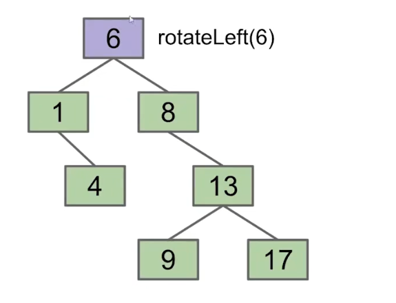

# Red Black Trees

红黑树（Red Black Tree）是一种实现关联容器的方式，经常用在内存数据结构中（在一般场景拥有不错的性能）。

*NOTE： 如果数据量较大，即使在内存数据的场景下，也请使用B-Tree。*

## Tree Rotation

树翻转（tree rotation）是一种平衡BST的方式，它能够保持BST密集。

Left Rotation将节点作为其右子节点的新左子节点。

|Left Rotation|
|-|
||
||
||

*NOTE：看上去像是暂时merge了两个节点。*

```cpp
void rotateLeft(Node **slot) {
    Node *node = *slot;
    if(node == nullptr) {
        return;
    }
    // get right child of node
    Node *right = node.Right;
    // set node's right child to be right's left child
    node.Right = right.Left;
    // set right's left child to be node
    right.Left = node;
    // publish changes
    *slot = right;
}
```

Right Rotation则是将节点作为其左子树的新右节点。

|Right Rotation|
|-|
||
||

```cpp
void rotateRight(Node **slot) {
    Node *node = *slot;
    if(node == nullptr) {
        return;
    }
    // get left child of node
    Node *left = node.Left;
    // set node's left child to be old left child's right
    node.Left = left.Right;
    // set left's right child to be node
    left.Right = node;
    // publish changes
    *slot = left;
}
```

|Balance BST|
|-|
||
||
||
||
||
||
||
||
||

平衡BST可以由不平衡的BST通过有限的旋转步骤得到。

## Left-Leaning Red Black Binary Search Tree（LLRB)

左倾红黑二叉搜索树（LLRB）的结构可以与一颗相应的2-3 Tree对应。

因为2-3 Tree是平衡的，所以LLRB也是平衡的。


红色的线称为“胶水连接”，当胶水连接都指向左边时，该树就是LLRB。

|2-3 Tree|LLRB|
|-|-|
|||

同时LLRB也满足以下条件：
* 没有节点可以由两条红色连接进行连接。
* 所有节点到根节点的黑色连接数量相同。

*NOTE：一个LLRB的高度不会超过一个 2-3 Tree的高度。*

## Search

LLRB的搜索操作与BST相同。

```cpp
Node *Search(Key key) {
    Node *node = root;
    while(node != nullptr && node.Key != key) {
        if(node.Key > key) {
            node = node.Left;
        } else {
            node = node.Right;
        }
    }
    return node;
}
```

## Insert

在LLRB中，我们只使用Red link去添加节点。


当存在右倾的Red link时，左旋Red link的父节点。


当出现两个连续的red link时，右旋red link的起点。

|Rotation|
|-|
||
||

当父节点的两个子节点都由red link连接时，翻转连接父节点的link的颜色（color flip）。

|Color Flip|
|-|
||
||

*NOTE：可能存在级联操作（修改之后违反了其他规则需要继续修复）。*

在实践中，可以将连接子节点的link的颜色存储到子节点中。

```cpp
RBNode *FindParent(RBNode *node) {
    if(root == node) {
        return nullptr;
    }
    RBNode *begin = root;
    while(begin != nullptr && begin.Left != node && begin.Right != node) {
        if(begin.Key > node.Key) {
            begin = begin.Left;
        } else {
            begin = begin.Right;
        }
    }
    return nullptr;
}

RBNode **FindSlot(Key key) {
    RBNode **slot = &root;
    RBNode *node = *slot;
    while(node != nullptr && node.Key != key) {
        if(node.Key > key) {
            slot = &node.Left;
            node = *slot;
        } else {
            slot = &node.Right;
            node = *slot;
        }
    }
    return slot;
}

void Insert(Key key) {
    RBNode **slot = FindSlot(key);
    if(*slot == nullptr) {
        // root's color is unnecessary
        *slot = NewRedNode(key);
    }
    RBNode *node = *slot;
    RBNode *parent = FindParent(node);
    while(parent != nullptr) {
        // case(3): color flip
        if(parent.Left != nullptr && parent.Right != nullptr) {
            if(parent.Left.Color() == parent.Right.Color() && parent.Left.Color() == Red) {
                parent.Left.SetColor(Black);
                parent.Right.SetColor(Black);
                parent.SetColor(Red);
            }
        }
        // case(2): two red link
        RBNode *upper = GetParent(parent);
        if(upper != nullptr) {
            if(parent.Left.Color() == parent.Color() && parent.Color() == Red) {
                // set color
                Color upperColor = upper.Color();
                upper.SetColor(Red);
                // parent will replace the position of upper
                parent.SetColor(upperColor);
                parent.Left.SetColor(Red);
                slot = FindSlot(upper);
                RotateRight(slot);
            }
        }
        // case(1): right red link
        if(parent.Right != nullptr && parent.Right.Color() == Red) {
            // set color
            Color parentColor = parent.Color();
            parent.SetColor(Red);
            // right will replace the position of parent
            parent.Right.SetColor(parentColor);
            slot = FindSlot(parent);
            RotateLeft(slot);
        }
        parent = upper;
    }
}
```