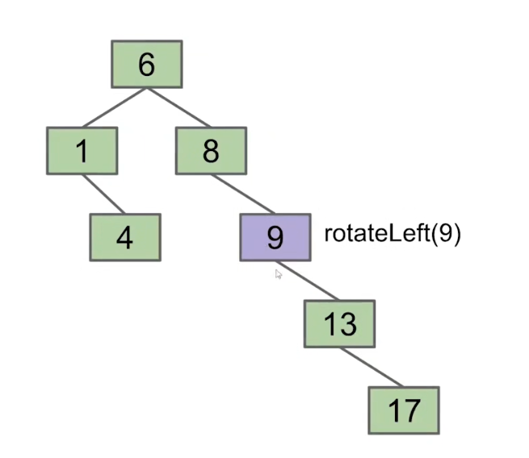

# Red Black Trees

红黑树（Red Black Tree）是一种实现关联容器的方式，经常用在内存数据结构中（在一般场景拥有不错的性能）。

*NOTE： 如果数据量较大，即使在内存数据的场景下，也请使用B-Tree。*

## Tree Rotation

树翻转（tree rotation）是一种平衡BST的方式，它能够保持BST密集。

Left Rotation将节点作为其右子节点的新左子节点。

|Left Rotation|
|-|
||
||
||

*NOTE：看上去像是暂时merge了两个节点。*

```cpp
void rotateLeft(Node **slot) {
    Node *node = *slot;
    if(node == nullptr) {
        return;
    }
    // get right child of node
    Node *right = node.Right;
    // set node's right child to be right's left child
    node.Right = right.Left;
    // set right's left child to be node
    right.Left = node;
    // publish changes
    *slot = right;
}
```

Right Rotation则是将节点作为其左子树的新右节点。

|Right Rotation|
|-|
||
||

```cpp
void rotateRight(Node **slot) {
    Node *node = *slot;
    if(node == nullptr) {
        return;
    }
    // get left child of node
    Node *left = node.Left;
    // set node's left child to be old left child's right
    node.Left = left.Right;
    // set left's right child to be node
    left.Right = node;
    // publish changes
    *slot = left;
}
```

|Balance BST|
|-|
||
||
||
||
||
||
||
||
||

平衡BST可以由不平衡的BST通过有限的旋转步骤得到。