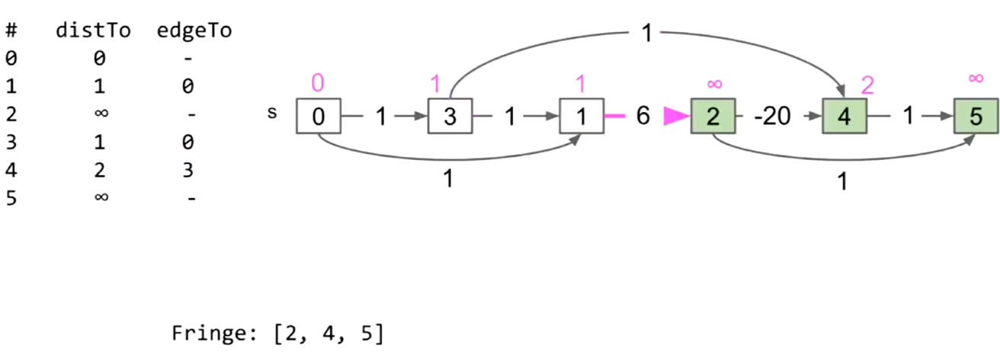

# Reductions And Decomposition

## Topological Sort


将图的每一个节点看成一个task，节点的入边看成task的依赖（再执行task A之前必须先执行task B）。

task的执行顺序就是一个拓扑顺序（Topological Order），它可以由拓扑排序（topological sort）得到。


如果图中存在环，那么该图的拓扑顺序不存在。

要进行拓扑排序：

* 我们将没有入度的节点称为“good point”。
* 对每一个“good point”进行Postorder DFS，将每一个节点放入一个List中。
* 最后将得到的List翻转，就得到了拓扑顺序。

|Full Process|
|-|
||
||
||
||
||
||
||
||
||
||
||
||
||
||

### Pseudo Code

```cpp

void TopologicalPostorder(Node *node,Vector<Node*> &order) {
    if(e.To.Marked()) {
        return;
    }
    e.To.Mark();
    for(const auto &e:node.GetAllOutEdges()) {
        TopologicalPostorder(e.To,order);
    }
    order.PushBack(node);
}

Vector<Node*> TopologicalSort() {
    Vector<Node*> order;
    for(const auto &node:GetAllNodes()) {
        if(node.GetAllInEdges().Empty()) {
            TopologicalPostorder(node,order);
        }
    }
    for(size_t i = 0,count = order.size()/2;i != count; ++i) {
        swap(order[i],order[order.size() - 1 - i]);
    }
    return order;
}

```

## Shortest Paths in DAGs


使用拓扑排序，我们可以在附带负边的DAG中求出最短路径。


|Full Process|
|-|
||
||
||
||
||
||
||

```cpp
DistanceTable ShortestPaths() {
    DistanceTable table;
    auto order{TopologicalSort()};
    if(!order.Empty()) {
        Node *begin = order[0];
        // init result table
        table.SetDistance(begin,0);
        table.SetPath(begin,{});
        for(size_t i = 0; i != order.Size(); ++i) {
            Node *from = order[i];
            // relax edges
            for(auto &edge : from.Edges()) {
                // if we meet a shorter distance
                auto newDis = edge.Distance + e.Distance;
                if(!table.Contain(edge.To) || newDis < table.GetDistance(edge.To)) {
                    table.SetDistance(edge.To,newDis);
                    table.SetPath({table.GetPath(order[i]),edge.To});
                }
            }
        }
    }
}
```

## Longest Paths In DAGs

只需要拷贝整张图然后，翻转边的权值的符号。

|Before|After|
|-|-|
|||

再运行Shortest Paths DAGs 算法，最后再把得到的最短距离的符号翻转回去就能得到最长距离，就能得到Longest Paths DAGs。


*NOTE：在图上求Longest Paths的算法目前是指数复杂度的，并且与许多数学问题相关。*


## Reduction

如果任务 $Q$ 的子程序可以用来解 $P$，那么我们说 $P$ 可以简化为 $Q$（$P$ reduces to $Q$）。

*NOTE：一个问题被转换之后能用另一种问题的解法解决。*

