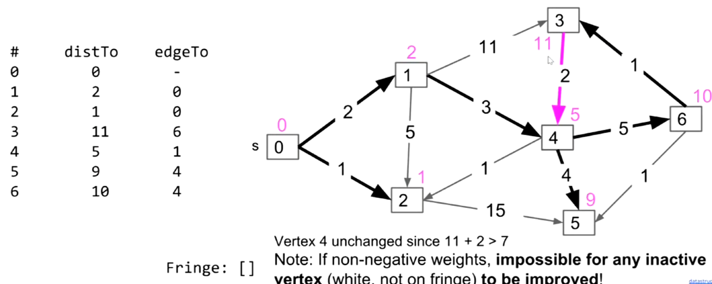

# Shortest Paths

## Dijkstra Algorithm

Dijkstra 算法可以计算出某个点到其他点的最短路径。

*NOTE：前提是不能有负边。*

*NOTE：如果图没有权，BFS就能得到最短路径。*

Dijkstra 是一种 Best First Search（最佳优先搜索），它总是先考虑当前条件下最优的元素（即最小的权值）。

首先将所有点加入队列，初始化它们的距离为`INF`。


然后将起点的出边加入到队列。


从队列中选择最佳的点，并将其移出队列。


如果经过该点之后再达到它的出边，比其他方式更短（即比在队列中记录的值更小），更新队列。

*NOTE：称为对该节点的边进行relax。*


重复执行以上操作，直到队列为空。

|Full Process|
|-|
||
||
||
||
||
||
||
||
||
||
||

### Pseudo Code

```cpp
DistanceTable ShortestPaths(Node *begin) {
    DistanceTable table;
    // init result table
    table.SetDistance(begin,0);
    table.SetPath(begin,{});
    // if no edges
    // return directly
    if(begin.Edges.Empty()) {
        return table;
    }
    EdgeSet edges;
    // push start point to queue
    // {from,to,distance}
    edges.Put({nullptr,begin,0});
    while(!edges.Empty()) {
        // pop min-item for queue
        Edge *min = nullptr;
        for(size_t i = 0; i != edges.Count(); ++i) {
            if( min == nullptr ||
                edges[i].Distance < min.Distance) {
                min = edges[i];
            }
        }
        edges.Remove(min);
        // put it to result table
        table.SetDistance(e.To,e.Distance);
        table.SetPath(e.To, { table.GetPath(e.From),e.To } );
        // update queue
        Node *from = e.To;
        // relax edges
        for(auto &edge : from.Edges()) {
            // if not contain by result table
            if (!table.Contain(edge.To)) {
                // if we meet a shorter distance
                auto newDis = edge.Distance + e.Distance;
                if(!edges.Contain(edge.To) || newDis < edges.Get(edge.To)) {
                    // {from,to,distance}
                    edges.Put({from,edge.To,newDis});
                }
            }
        }
    }
    return table;
}
```

*NOTE：现代实现中使用优先级队列来索引最小权值的边。*

## A* Algorithm

A* 能够计算出某个点到另外一个点的最短路径。

它是对Dijkstra的改进，提升了Dijkstra的速度。

*NOTE：因为我们通常只关心一个点，例如A地到B地的距离。*

A*的改进是通过修改边的权值实现的（将其修改为`weight + h(start point,point)`，即距离加上某个值）。

其中函数`h`称为“启发式函数”。