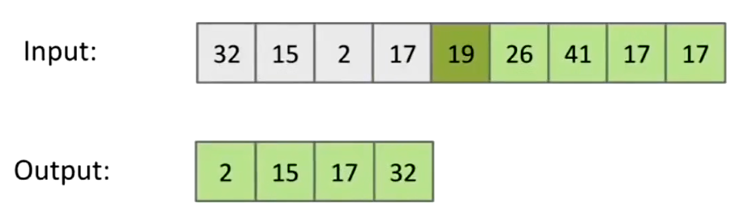

# Sorts

## Selection Sort

时间复杂度：$O(N^2)$


* 找到序列中最小的元素。
* 将它放在序列最前面。
* 然后将第一位元素排除出序列，如果排除后序列长度为1则退出，否则重复过程。

## Heap Sort

将所有元素放入heap中，然后逐个从heap中弹出。

### Heapification

堆化（Heapification）将数组原地变成堆。

只需要反向遍历数组，尝试将元素下沉。

|Array|Heap|
|-|-|
|||
|||
|||
|||
|||
|||
|||
|||
|||
|||
|||
|||

*NOTE：只能使用大顶堆进行，因为最后弹出的时候需要将元素放到最后面，如果使用小顶堆将得到相反的顺序。*

## Merge Sort

归并排序（merge sort）是一种递归算法：
* 首先将数组分为两个部分。
* 分别对两个部分进行merge sort（最深层的array的count将为1）。
* 然后merge两个已被排序的部分。


*NOTE：目前没有较好的in-place merge sort算法，现有的算法都很复杂。*

*NOTE：由于内存分配的原因，该算法会较为缓慢，但它是唯一一种可用于外排序的算法。*

另请参阅：[Algorithm](/CMU%2015-445/Algorithm/Note.md)。

## Insert Sort


从一个空的已排序序列开始，添加元素到该序列的合适的位置。

|Full Process|
|-|
||
||
||
||
||
||
||
||
||
||

插入排序存在in-place算法。


*NOTE：在几乎有序数组和小数组（长度小于15）上较快。*

## Quick Sort


选择数组中的一个元素作为`pivot`。

然后进行Partitioning，将比`pivot`小的元素放到`pivot`的左边，其余的放到右边。

具体步骤：
* 选择数组的第一项为`pivot`。
* 定义两个指针`left`、`right`，其中`left = 0`，`right = size - 1`。
* 当`left < right`时，执行以下步骤：
  * 使用`right`指针往回找，直到遇到一个比`pivot`更小的值，把它放置到`left`的位置上。
  * 使用`left`指针往后找，直到遇到一个比`pivot`更大的值，把它放置到`right`的位置上。
* 在循环结束时，`left == right`，将`pivot`放置到`left`的位置上。


快速排序是一个递归算法：
* 先对整个范围进行Partitioning。
* 然后
  * 对`[0,pivot index - 1]`进行Partitioning。
  * 对`[pivot index + 1,end)`进行Partitioning。
* 在递归的最深层，我们要进行Partitioning的范围将是`0`或`1`。

```cpp
void QuickSort(int *arr, size_t begin, size_t end) {
    if (begin >= end) {
        return;
    }
    size_t size = end - begin;
    if (size == 1) {
        return;
    }
    // pick first element
    // as pivot
    int pivot = arr[begin];
    size_t left = begin;
    size_t right = end - 1;
    // partitioning
    while (left < right) {
        // find first right element that
        // smaller than pivot
        while (left < right && arr[right] >= pivot) {
            --right;
        }
        // take place of left side element
        if (left < right) {
            arr[left] = arr[right];
        }
        // find first left element that
        // larger than pivot
        while (left < right && arr[left] < pivot) {
            ++left;
        }
        // take place of right side element
        if (left < right) {
            arr[right] = arr[left];
        }
    }
    // put the pivot to center
    arr[left] = pivot;
    // sort left side of pivot
    if (left) {
        QuickSort(arr, begin, left);
    }
    // sort right side of pivot
    QuickSort(arr, left + 1, end);
}
```


在排序前对序列进行shuffle，可以降低出现quick sort最坏情况的概率。

