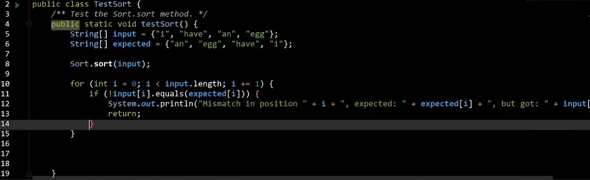

# Tests & Concepts

### Ad Hoc Testing

特别测试（ad hoc test），用一组特定的input和期望的output去测试代码。



### Benchmark

基准测试（benchmark），负责测试代码的性能。

### Choas Test

混沌测试（Choas Test）通过注入故障的方式，检测系统的健壮性。

### Invariant

不变量（invariant）指的是保证代码能够运行的条件。

### Subtype Polymorphism

子类多态（Subtype Polymorphism）指函数调用取决于运行时类型（某个基类的子类）进行。

```python
def print_larger(x,y):
    if x.largeThan(y):
        return x.str()
    return y.str()
```

### Higher Order Functions

高阶函数（Higher Order Functions）是另一种实现多态的方式，通过将函数作为参数来实现多态。

```python
def print_larger(x,y,compare,stringify):
    if compare(x,y):
        return stringify(x)
    return stringify(y)
```


### Abstract Data Type

抽象数据类型（Abstract Data Type）是一种编程语言中的类型，它只由操作定义而不是由实现定义。