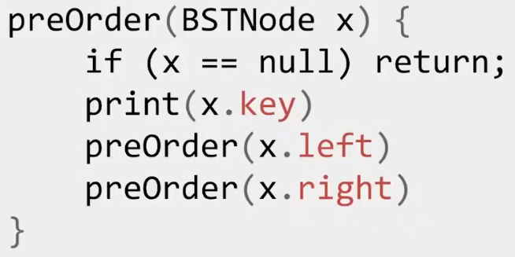
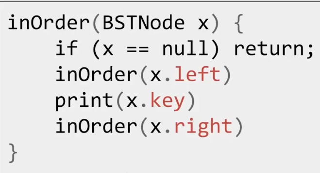
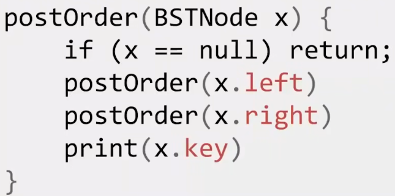
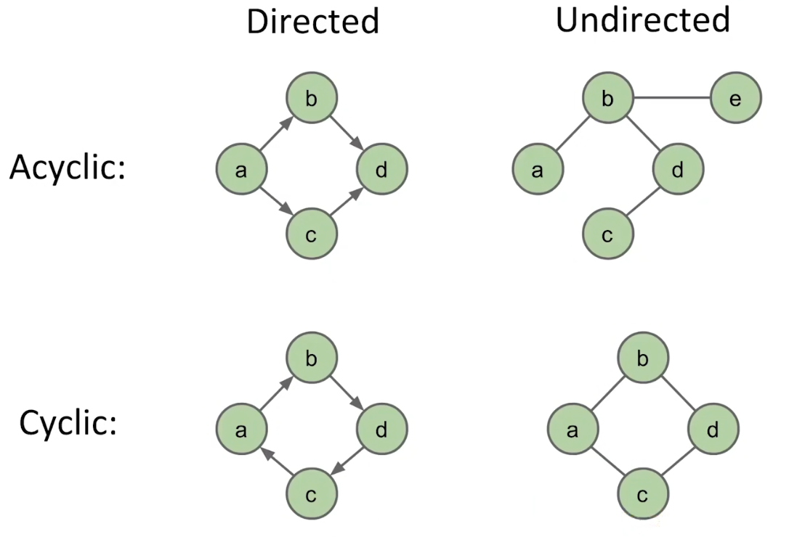
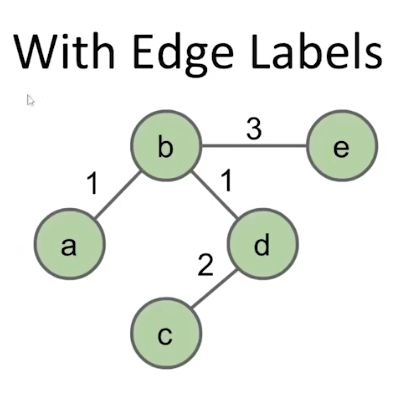

# Tree and Graph Traversals

## Tree Traversals

### Preorder Traversals

前序遍历（Preorder Traversals）先访问节点本身然后访问它的子节点。



```cpp
Queue<Node*> Preorder() {
    Queue<Node*> order;
    if(root == nullptr) {
        return order;
    }
    Stack<Node*> stack;
    stack.Push(root);
    while(!stack.Empty()) {
        Node *top = stack.Top();
        order.Push(top);
        stack.Pop();
        if(top.Right) {
            stack.Push(stack.Right);
        }
        if(top.Left) {
            stack.Push(stack.Left);
        }
    }
    return order;
}
```

### Inorder Traversals

中序遍历（Inorder Traversals）先访问左子树再访问节点最后访问右子树。



```cpp
Queue<Node*> Inorder() {
    Queue<Node*> order;
    if(root == nullptr) {
        return order;
    }
    Stack<Node*> stack;
    stack.Push(root);
    while(!stack.Empty()) {
        Node *current = stack.Top();
        if(current.Left != nullptr) {
            stack.Push(current.Left);
        } else {
            order.Push(current);
            stack.Pop();
            if(current.Right != nullptr) {
                order.Push(current.Right);
            }
        }
    }
    return order;
}
```

### Postorder Traversals

后序遍历（Postorder Traversals）先访问节点的两个子树然后才是节点。



```cpp
void Postorder() {
    Queue<Node*> order;
    if(root == nullptr) {
        return order;
    }
    Stack<Node*> stack;
    stack.Push(root);
    Node *prev = nullptr;
    while(!stack.Empty()) {
        Node *current = stack.Top();
        if (prev == nullptr || prev.left == current
            || prev.right == current) {
            if(current.Left != nullptr) {
                stack.Push(current.Left);
            } else if(current.Right != nullptr) {
                stack.Push(current.Right);
            } else {
                order.Push(current);
                stack.Pop();
            }
        } else if(prev == current.Left) {
            if(current.Right != nullptr) {
                stack.Push(current.Right);
            } else {
                order.Push(current);
                stack.Pop();
            }
        } else if(prev == current.Right) {
            order.Push(current);
            stack.Pop();
        }
        prev = current;
    }
}
```

`Preorder`、`Inorder`、`Postorder`都是深度优先搜索（Depth First Search，DFS）。

所以它们也称为`DFS Preorder`、`DFS Inorder`、`DFS Postorder`。

## Graph

图（Graph）由两个部分组成：
* 节点（也叫顶点）。
* 连接节点的边（edge）。

*NOTE：当两个节点之间只有一条可以连通的通路时，它是树，否则它是图。*

图的类型有很多种。





存在许多图的经典问题：

|Problem|Description|
|-|-|
|s-t Path|节点`s`和`t`之间是否存在一条通路？|
|Connectivity|是否存在一条通路能够抵达所有节点？|
|Biconnectivity|在连通图中是否存在一个节点，它被删除将导致图失去连通性？|
|Shortest s-t Path|求出`s`到`t`的最短路径。|
|Cycle Detection|图中是否存在环？|
|Euler Tour|是否存一个环，它只通过每一条边一次？|
|Hamilton Tour|是否存一个环，它只通过每一个节点一次？|
|Planarity|图是否被表示到平面上的时候没有交叉的边？|
|Isomorphism|两个图是否是同构的（本质上是一个图）？|

### Depth First Search

其中s-t Path问题可以通过遍历（BFS、DFS）解决。

DFS指通过edges，我们进入得尽可能深。

```cpp
bool IsConnect(Node *begin,Node* end) {
    begin.Mark();
    Vector<Node*> neighbor = GetPath(begin);
    for(size_t i = 0;i != neighor.Count(); ++i) {
        if(neighor[i] == end) {
            return true;
        }
        if(!neighor[i].Marked()) {
            if(IsConnect(neighbor[i],end)) {
                return true;
            }
        }
    }
    return false;
}
```

### Breadth First Search

BFS与DFS相反，需要尽可能避免深入。

```cpp
bool IsConnect(Node *begin,Node* end) {
    Queue<Node*> queue;
    queue.Push(begin);
    while(!queue.Empty()) {
        Node *current = queue.Front();
        if(current == end) {
            return true;
        }
        queue.Pop();
        Vector<Node*> neighbor = GetPath(current);
        for(size_t i = 0;i != neighor.Count(); ++i) {
            queue.Push(neighbor[i]);
        }
    }
    return false;
}
```