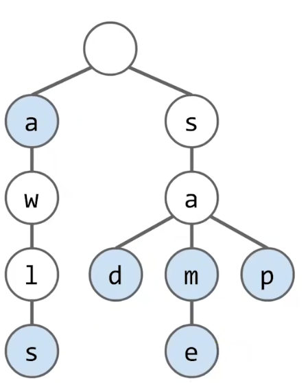

# Tries

trie是一种特殊的tree，它的节点只存储key的一个byte。

这样有相同前缀的key将会共享一部分内存，同时保留快速的查找和插入能力。

为了区分是否遇到了一个完整的key，我们需要给节点设置颜色，蓝色代表从根节点到该节点是一个完整的key。

最简单的实现方法是在Node中，存储所有可能出现的byte的Slot。

|Code|Images|
|-|-|
|||

## Hash Table Based Trie & BST Based Trie

当然也可以使用Hash Table（或者其他map）代替节点中的大数组。

*NOTE：这种方式称为横向压缩。*

|Hash Table|BST|
|-|-|
|||

## Prefix Match

Trie能够高效地支持前缀匹配操作。

---

另请参阅：
* [Tree Index](../../CMU%2015-445/Tree%20Indexs/Note.md)